Metryka testowania algorytmu


```python
import pandas as pd
import numpy as np
pd.options.display.max_columns = 300 # 20

# ctr+i
```

# Pobranie danych

## Kamienie milowe df


```python
kamienie_milowe_df = pd.read_csv("../1 Pozyskanie i transformacja danych/2021-06-30_KAMIENIE_MILOWE.csv")
kamienie_milowe_df[:3]
```


<div>
<style scoped>
    .dataframe tbody tr th:only-of-type {
        vertical-align: middle;
    }

    .dataframe tbody tr th {
        vertical-align: top;
    }

    .dataframe thead th {
        text-align: right;
    }
</style>
<table border="1" class="dataframe">
  <thead>
    <tr style="text-align: right;">
      <th></th>
      <th>events_id</th>
      <th>Kamien_Milowy_Profil_Wydarzenia</th>
      <th>A1_categories_name</th>
      <th>A2_freq_label</th>
      <th>A3_Nazwa miejscowości</th>
      <th>A3_Rodzaj</th>
      <th>A3_Gmina</th>
      <th>A3_Powiat</th>
      <th>A3_Województwo</th>
      <th>A3_wielkosc_miejscowosci</th>
      <th>A4_event_czas_transmisji</th>
      <th>A5_size_label</th>
      <th>A6_planned_amount</th>
      <th>A6_obtained_amount</th>
      <th>B1_dorosly</th>
      <th>B1_dziecko-mlodziez</th>
      <th>B2_event_local</th>
      <th>B2_event_global</th>
      <th>B2_czas_trwania</th>
      <th>B2_kategoria_Inny</th>
      <th>B2_kategoria_Wystawa</th>
      <th>B2_kategoria_Spektakl_teatralny</th>
      <th>B2_kategoria_Koncert</th>
      <th>B2_kategoria_Festiwal</th>
      <th>B2_kategoria_Konferencja</th>
      <th>B2_kategoria_Sport</th>
      <th>B2_kategoria_Festiwal_muzyczny</th>
      <th>B2_kategoria_Targi_szkolenia</th>
      <th>B2_kategoria_Festiwal_filmowy</th>
      <th>B3_ave_hour_visit_events_mean_mean</th>
      <th>B3_ave_hour_visit_events_min_mean</th>
      <th>B3_ave_hour_visit_events_max_mean</th>
      <th>B4_czestotliwosc_odwiedzania_eventow</th>
      <th>B5_zasobnosc_portfela_klienta_max</th>
      <th>B5_zasobnosc_portfela_klienta_min</th>
      <th>B5_zasobnosc_portfela_klienta_sum</th>
      <th>B5_zasobnosc_portfela_klienta_mean</th>
      <th>C1_ticket_count_sum_event_users</th>
      <th>C1_ticket_count_OD_event_users</th>
      <th>C1_ticket_count_DO_event_users</th>
      <th>C2_global_ticket_count_sum_event_users</th>
      <th>C2_global_ticket_count_OD_event_users</th>
      <th>C2_global_ticket_count_DO_event_users</th>
      <th>C3_revenue_sum</th>
      <th>C3_revenue_min</th>
      <th>C3_revenue_max</th>
      <th>C3_revenue_mean</th>
      <th>C4_cena_rp_do_cena_rw</th>
      <th>C4_ilosc_rp_do_ilosc_rw</th>
      <th>D_ticket_price_sum</th>
      <th>D_ticket_count</th>
      <th>D_wielkosc_do_ilosci_uczestnikow</th>
      <th>D_wydarzenia_live_tylko_offline</th>
      <th>D_wydarzenia_live_tylko_online</th>
      <th>D_wydarzenia_live_online_i_offline</th>
      <th>D_wydarzenia_zruznicowane_w_udzialne_online_i_offline</th>
      <th>E_sum_cen_biletow_z_rynku_w</th>
      <th>E_srednia_cena_biletow_z_rynku_w</th>
      <th>E_liczba_biletow_z_rynku_w</th>
      <th>E_dostepne_sektory</th>
    </tr>
  </thead>
  <tbody>
    <tr>
      <th>0</th>
      <td>248895</td>
      <td>małe</td>
      <td>Wystawa</td>
      <td>jednorazowe</td>
      <td>wrocław</td>
      <td>miasto</td>
      <td>Wrocław</td>
      <td>Wrocław</td>
      <td>dolnośląskie</td>
      <td>Duże</td>
      <td>krótkotrwały do 2-3h</td>
      <td>do 100</td>
      <td>3571.0</td>
      <td>250.0</td>
      <td>0</td>
      <td>1</td>
      <td>NaN</td>
      <td>NaN</td>
      <td>NaN</td>
      <td>NaN</td>
      <td>NaN</td>
      <td>NaN</td>
      <td>NaN</td>
      <td>NaN</td>
      <td>NaN</td>
      <td>NaN</td>
      <td>NaN</td>
      <td>NaN</td>
      <td>NaN</td>
      <td>NaN</td>
      <td>NaN</td>
      <td>NaN</td>
      <td>NaN</td>
      <td>NaN</td>
      <td>NaN</td>
      <td>NaN</td>
      <td>NaN</td>
      <td>7623.0</td>
      <td>1.0</td>
      <td>98.0</td>
      <td>0.0</td>
      <td>0.0</td>
      <td>0.0</td>
      <td>267458.0</td>
      <td>30.0</td>
      <td>3612.0</td>
      <td>632.288416</td>
      <td>inf</td>
      <td>inf</td>
      <td>250.0</td>
      <td>7.0</td>
      <td>35.714286</td>
      <td>35.714286</td>
      <td>0</td>
      <td>0</td>
      <td>0</td>
      <td>0.0</td>
      <td>0.0</td>
      <td>0.0</td>
      <td>event bez numerowanych miejsc</td>
    </tr>
    <tr>
      <th>1</th>
      <td>248896</td>
      <td>małe</td>
      <td>Wystawa</td>
      <td>jednorazowe</td>
      <td>wrocław</td>
      <td>miasto</td>
      <td>Wrocław</td>
      <td>Wrocław</td>
      <td>dolnośląskie</td>
      <td>Duże</td>
      <td>krótkotrwały do 2-3h</td>
      <td>do 100</td>
      <td>2964.0</td>
      <td>978.0</td>
      <td>0</td>
      <td>1</td>
      <td>NaN</td>
      <td>NaN</td>
      <td>NaN</td>
      <td>NaN</td>
      <td>NaN</td>
      <td>NaN</td>
      <td>NaN</td>
      <td>NaN</td>
      <td>NaN</td>
      <td>NaN</td>
      <td>NaN</td>
      <td>NaN</td>
      <td>NaN</td>
      <td>14.0</td>
      <td>14.0</td>
      <td>14.0</td>
      <td>NaN</td>
      <td>216.0</td>
      <td>216.0</td>
      <td>2592.0</td>
      <td>216.0</td>
      <td>7623.0</td>
      <td>1.0</td>
      <td>98.0</td>
      <td>0.0</td>
      <td>0.0</td>
      <td>0.0</td>
      <td>267458.0</td>
      <td>30.0</td>
      <td>3612.0</td>
      <td>632.288416</td>
      <td>inf</td>
      <td>inf</td>
      <td>978.0</td>
      <td>33.0</td>
      <td>29.636364</td>
      <td>29.636364</td>
      <td>0</td>
      <td>0</td>
      <td>0</td>
      <td>0.0</td>
      <td>0.0</td>
      <td>0.0</td>
      <td>event bez numerowanych miejsc</td>
    </tr>
    <tr>
      <th>2</th>
      <td>248897</td>
      <td>małe</td>
      <td>Wystawa</td>
      <td>cykliczne co 6mc</td>
      <td>wrocław</td>
      <td>miasto</td>
      <td>Wrocław</td>
      <td>Wrocław</td>
      <td>dolnośląskie</td>
      <td>Duże</td>
      <td>krótkotrwały do 2-3h</td>
      <td>do 100</td>
      <td>4000.0</td>
      <td>480.0</td>
      <td>0</td>
      <td>1</td>
      <td>NaN</td>
      <td>NaN</td>
      <td>NaN</td>
      <td>NaN</td>
      <td>NaN</td>
      <td>NaN</td>
      <td>NaN</td>
      <td>NaN</td>
      <td>NaN</td>
      <td>NaN</td>
      <td>NaN</td>
      <td>NaN</td>
      <td>NaN</td>
      <td>NaN</td>
      <td>NaN</td>
      <td>NaN</td>
      <td>NaN</td>
      <td>NaN</td>
      <td>NaN</td>
      <td>NaN</td>
      <td>NaN</td>
      <td>7623.0</td>
      <td>1.0</td>
      <td>98.0</td>
      <td>0.0</td>
      <td>0.0</td>
      <td>0.0</td>
      <td>267458.0</td>
      <td>30.0</td>
      <td>3612.0</td>
      <td>632.288416</td>
      <td>inf</td>
      <td>inf</td>
      <td>480.0</td>
      <td>12.0</td>
      <td>40.000000</td>
      <td>40.000000</td>
      <td>0</td>
      <td>0</td>
      <td>0</td>
      <td>0.0</td>
      <td>0.0</td>
      <td>0.0</td>
      <td>event bez numerowanych miejsc</td>
    </tr>
  </tbody>
</table>
</div>


## Events


```python
events = pd.read_csv("../0 Przegląd danych/events_last_36m.csv", 
                     sep=",",
                     encoding="utf-8", 
                     low_memory=False,
                    usecols=["id","title","user_id","start_date","city"]
                    )
events.columns = ["events_id","title","user_id","events_start_date","city"]
events[:3]
```


<div>
<style scoped>
    .dataframe tbody tr th:only-of-type {
        vertical-align: middle;
    }

    .dataframe tbody tr th {
        vertical-align: top;
    }

    .dataframe thead th {
        text-align: right;
    }
</style>
<table border="1" class="dataframe">
  <thead>
    <tr style="text-align: right;">
      <th></th>
      <th>events_id</th>
      <th>title</th>
      <th>user_id</th>
      <th>events_start_date</th>
      <th>city</th>
    </tr>
  </thead>
  <tbody>
    <tr>
      <th>0</th>
      <td>201396</td>
      <td>COPPELIA - BOLSHOI BALLET</td>
      <td>151</td>
      <td>2018-06-10 17:00:00 +0200</td>
      <td>Warszawa</td>
    </tr>
    <tr>
      <th>1</th>
      <td>225215</td>
      <td>Wystawa średniowieczna</td>
      <td>1962</td>
      <td>2018-10-12 20:00:00 +0200</td>
      <td>Warszawa</td>
    </tr>
    <tr>
      <th>2</th>
      <td>226967</td>
      <td>Rambo 8</td>
      <td>4</td>
      <td>2018-10-25 01:00:00 +0200</td>
      <td>Kraków</td>
    </tr>
  </tbody>
</table>
</div>


## dostępne miejsca i sprzedaż


```python
## dostępne miejsca i sprzedaż

events_tickets_halls = pd.read_pickle("../1 Pozyskanie i transformacja danych/A_pkt6_B_sprzedaz.pickle")
events_tickets_halls = events_tickets_halls.rename(columns={"available":"seat_available"})
view = [
    "events_id",
    "seat_available",
    "ticket_price_mean"
]
events_tickets_halls = events_tickets_halls[view]
events_tickets_halls = events_tickets_halls.dropna()
events_tickets_halls[:3]
```


<div>
<style scoped>
    .dataframe tbody tr th:only-of-type {
        vertical-align: middle;
    }

    .dataframe tbody tr th {
        vertical-align: top;
    }

    .dataframe thead th {
        text-align: right;
    }
</style>
<table border="1" class="dataframe">
  <thead>
    <tr style="text-align: right;">
      <th></th>
      <th>events_id</th>
      <th>seat_available</th>
      <th>ticket_price_mean</th>
    </tr>
  </thead>
  <tbody>
    <tr>
      <th>0</th>
      <td>201396</td>
      <td>185.0</td>
      <td>40.747664</td>
    </tr>
    <tr>
      <th>3</th>
      <td>230444</td>
      <td>68.0</td>
      <td>23.888889</td>
    </tr>
    <tr>
      <th>4</th>
      <td>231806</td>
      <td>196.0</td>
      <td>75.000000</td>
    </tr>
  </tbody>
</table>
</div>


```python

```

## Połączenie niezbędnych cech


```python
df = kamienie_milowe_df.merge(events[["events_id","title","user_id","events_start_date","city"]], left_on="events_id", right_on="events_id", how="left")
df[:3]
```


<div>
<style scoped>
    .dataframe tbody tr th:only-of-type {
        vertical-align: middle;
    }

    .dataframe tbody tr th {
        vertical-align: top;
    }

    .dataframe thead th {
        text-align: right;
    }
</style>
<table border="1" class="dataframe">
  <thead>
    <tr style="text-align: right;">
      <th></th>
      <th>events_id</th>
      <th>Kamien_Milowy_Profil_Wydarzenia</th>
      <th>A1_categories_name</th>
      <th>A2_freq_label</th>
      <th>A3_Nazwa miejscowości</th>
      <th>A3_Rodzaj</th>
      <th>A3_Gmina</th>
      <th>A3_Powiat</th>
      <th>A3_Województwo</th>
      <th>A3_wielkosc_miejscowosci</th>
      <th>A4_event_czas_transmisji</th>
      <th>A5_size_label</th>
      <th>A6_planned_amount</th>
      <th>A6_obtained_amount</th>
      <th>B1_dorosly</th>
      <th>B1_dziecko-mlodziez</th>
      <th>B2_event_local</th>
      <th>B2_event_global</th>
      <th>B2_czas_trwania</th>
      <th>B2_kategoria_Inny</th>
      <th>B2_kategoria_Wystawa</th>
      <th>B2_kategoria_Spektakl_teatralny</th>
      <th>B2_kategoria_Koncert</th>
      <th>B2_kategoria_Festiwal</th>
      <th>B2_kategoria_Konferencja</th>
      <th>B2_kategoria_Sport</th>
      <th>B2_kategoria_Festiwal_muzyczny</th>
      <th>B2_kategoria_Targi_szkolenia</th>
      <th>B2_kategoria_Festiwal_filmowy</th>
      <th>B3_ave_hour_visit_events_mean_mean</th>
      <th>B3_ave_hour_visit_events_min_mean</th>
      <th>B3_ave_hour_visit_events_max_mean</th>
      <th>B4_czestotliwosc_odwiedzania_eventow</th>
      <th>B5_zasobnosc_portfela_klienta_max</th>
      <th>B5_zasobnosc_portfela_klienta_min</th>
      <th>B5_zasobnosc_portfela_klienta_sum</th>
      <th>B5_zasobnosc_portfela_klienta_mean</th>
      <th>C1_ticket_count_sum_event_users</th>
      <th>C1_ticket_count_OD_event_users</th>
      <th>C1_ticket_count_DO_event_users</th>
      <th>C2_global_ticket_count_sum_event_users</th>
      <th>C2_global_ticket_count_OD_event_users</th>
      <th>C2_global_ticket_count_DO_event_users</th>
      <th>C3_revenue_sum</th>
      <th>C3_revenue_min</th>
      <th>C3_revenue_max</th>
      <th>C3_revenue_mean</th>
      <th>C4_cena_rp_do_cena_rw</th>
      <th>C4_ilosc_rp_do_ilosc_rw</th>
      <th>D_ticket_price_sum</th>
      <th>D_ticket_count</th>
      <th>D_wielkosc_do_ilosci_uczestnikow</th>
      <th>D_wydarzenia_live_tylko_offline</th>
      <th>D_wydarzenia_live_tylko_online</th>
      <th>D_wydarzenia_live_online_i_offline</th>
      <th>D_wydarzenia_zruznicowane_w_udzialne_online_i_offline</th>
      <th>E_sum_cen_biletow_z_rynku_w</th>
      <th>E_srednia_cena_biletow_z_rynku_w</th>
      <th>E_liczba_biletow_z_rynku_w</th>
      <th>E_dostepne_sektory</th>
      <th>title</th>
      <th>user_id</th>
      <th>events_start_date</th>
      <th>city</th>
    </tr>
  </thead>
  <tbody>
    <tr>
      <th>0</th>
      <td>248895</td>
      <td>małe</td>
      <td>Wystawa</td>
      <td>jednorazowe</td>
      <td>wrocław</td>
      <td>miasto</td>
      <td>Wrocław</td>
      <td>Wrocław</td>
      <td>dolnośląskie</td>
      <td>Duże</td>
      <td>krótkotrwały do 2-3h</td>
      <td>do 100</td>
      <td>3571.0</td>
      <td>250.0</td>
      <td>0</td>
      <td>1</td>
      <td>NaN</td>
      <td>NaN</td>
      <td>NaN</td>
      <td>NaN</td>
      <td>NaN</td>
      <td>NaN</td>
      <td>NaN</td>
      <td>NaN</td>
      <td>NaN</td>
      <td>NaN</td>
      <td>NaN</td>
      <td>NaN</td>
      <td>NaN</td>
      <td>NaN</td>
      <td>NaN</td>
      <td>NaN</td>
      <td>NaN</td>
      <td>NaN</td>
      <td>NaN</td>
      <td>NaN</td>
      <td>NaN</td>
      <td>7623.0</td>
      <td>1.0</td>
      <td>98.0</td>
      <td>0.0</td>
      <td>0.0</td>
      <td>0.0</td>
      <td>267458.0</td>
      <td>30.0</td>
      <td>3612.0</td>
      <td>632.288416</td>
      <td>inf</td>
      <td>inf</td>
      <td>250.0</td>
      <td>7.0</td>
      <td>35.714286</td>
      <td>35.714286</td>
      <td>0</td>
      <td>0</td>
      <td>0</td>
      <td>0.0</td>
      <td>0.0</td>
      <td>0.0</td>
      <td>event bez numerowanych miejsc</td>
      <td>Wystawa Dali Warhol</td>
      <td>2111</td>
      <td>2018-06-10 11:00:00 +0200</td>
      <td>Wrocław</td>
    </tr>
    <tr>
      <th>1</th>
      <td>248896</td>
      <td>małe</td>
      <td>Wystawa</td>
      <td>jednorazowe</td>
      <td>wrocław</td>
      <td>miasto</td>
      <td>Wrocław</td>
      <td>Wrocław</td>
      <td>dolnośląskie</td>
      <td>Duże</td>
      <td>krótkotrwały do 2-3h</td>
      <td>do 100</td>
      <td>2964.0</td>
      <td>978.0</td>
      <td>0</td>
      <td>1</td>
      <td>NaN</td>
      <td>NaN</td>
      <td>NaN</td>
      <td>NaN</td>
      <td>NaN</td>
      <td>NaN</td>
      <td>NaN</td>
      <td>NaN</td>
      <td>NaN</td>
      <td>NaN</td>
      <td>NaN</td>
      <td>NaN</td>
      <td>NaN</td>
      <td>14.0</td>
      <td>14.0</td>
      <td>14.0</td>
      <td>NaN</td>
      <td>216.0</td>
      <td>216.0</td>
      <td>2592.0</td>
      <td>216.0</td>
      <td>7623.0</td>
      <td>1.0</td>
      <td>98.0</td>
      <td>0.0</td>
      <td>0.0</td>
      <td>0.0</td>
      <td>267458.0</td>
      <td>30.0</td>
      <td>3612.0</td>
      <td>632.288416</td>
      <td>inf</td>
      <td>inf</td>
      <td>978.0</td>
      <td>33.0</td>
      <td>29.636364</td>
      <td>29.636364</td>
      <td>0</td>
      <td>0</td>
      <td>0</td>
      <td>0.0</td>
      <td>0.0</td>
      <td>0.0</td>
      <td>event bez numerowanych miejsc</td>
      <td>Wystawa Dali Warhol</td>
      <td>2111</td>
      <td>2018-06-10 12:00:00 +0200</td>
      <td>Wrocław</td>
    </tr>
    <tr>
      <th>2</th>
      <td>248897</td>
      <td>małe</td>
      <td>Wystawa</td>
      <td>cykliczne co 6mc</td>
      <td>wrocław</td>
      <td>miasto</td>
      <td>Wrocław</td>
      <td>Wrocław</td>
      <td>dolnośląskie</td>
      <td>Duże</td>
      <td>krótkotrwały do 2-3h</td>
      <td>do 100</td>
      <td>4000.0</td>
      <td>480.0</td>
      <td>0</td>
      <td>1</td>
      <td>NaN</td>
      <td>NaN</td>
      <td>NaN</td>
      <td>NaN</td>
      <td>NaN</td>
      <td>NaN</td>
      <td>NaN</td>
      <td>NaN</td>
      <td>NaN</td>
      <td>NaN</td>
      <td>NaN</td>
      <td>NaN</td>
      <td>NaN</td>
      <td>NaN</td>
      <td>NaN</td>
      <td>NaN</td>
      <td>NaN</td>
      <td>NaN</td>
      <td>NaN</td>
      <td>NaN</td>
      <td>NaN</td>
      <td>7623.0</td>
      <td>1.0</td>
      <td>98.0</td>
      <td>0.0</td>
      <td>0.0</td>
      <td>0.0</td>
      <td>267458.0</td>
      <td>30.0</td>
      <td>3612.0</td>
      <td>632.288416</td>
      <td>inf</td>
      <td>inf</td>
      <td>480.0</td>
      <td>12.0</td>
      <td>40.000000</td>
      <td>40.000000</td>
      <td>0</td>
      <td>0</td>
      <td>0</td>
      <td>0.0</td>
      <td>0.0</td>
      <td>0.0</td>
      <td>event bez numerowanych miejsc</td>
      <td>Wystawa Dali Warhol</td>
      <td>2111</td>
      <td>2018-06-10 13:00:00 +0200</td>
      <td>Wrocław</td>
    </tr>
  </tbody>
</table>
</div>


```python
df = df.merge(events_tickets_halls, left_on="events_id", right_on="events_id", how="left")
df[:3]
```


<div>
<style scoped>
    .dataframe tbody tr th:only-of-type {
        vertical-align: middle;
    }

    .dataframe tbody tr th {
        vertical-align: top;
    }

    .dataframe thead th {
        text-align: right;
    }
</style>
<table border="1" class="dataframe">
  <thead>
    <tr style="text-align: right;">
      <th></th>
      <th>events_id</th>
      <th>Kamien_Milowy_Profil_Wydarzenia</th>
      <th>A1_categories_name</th>
      <th>A2_freq_label</th>
      <th>A3_Nazwa miejscowości</th>
      <th>A3_Rodzaj</th>
      <th>A3_Gmina</th>
      <th>A3_Powiat</th>
      <th>A3_Województwo</th>
      <th>A3_wielkosc_miejscowosci</th>
      <th>A4_event_czas_transmisji</th>
      <th>A5_size_label</th>
      <th>A6_planned_amount</th>
      <th>A6_obtained_amount</th>
      <th>B1_dorosly</th>
      <th>B1_dziecko-mlodziez</th>
      <th>B2_event_local</th>
      <th>B2_event_global</th>
      <th>B2_czas_trwania</th>
      <th>B2_kategoria_Inny</th>
      <th>B2_kategoria_Wystawa</th>
      <th>B2_kategoria_Spektakl_teatralny</th>
      <th>B2_kategoria_Koncert</th>
      <th>B2_kategoria_Festiwal</th>
      <th>B2_kategoria_Konferencja</th>
      <th>B2_kategoria_Sport</th>
      <th>B2_kategoria_Festiwal_muzyczny</th>
      <th>B2_kategoria_Targi_szkolenia</th>
      <th>B2_kategoria_Festiwal_filmowy</th>
      <th>B3_ave_hour_visit_events_mean_mean</th>
      <th>B3_ave_hour_visit_events_min_mean</th>
      <th>B3_ave_hour_visit_events_max_mean</th>
      <th>B4_czestotliwosc_odwiedzania_eventow</th>
      <th>B5_zasobnosc_portfela_klienta_max</th>
      <th>B5_zasobnosc_portfela_klienta_min</th>
      <th>B5_zasobnosc_portfela_klienta_sum</th>
      <th>B5_zasobnosc_portfela_klienta_mean</th>
      <th>C1_ticket_count_sum_event_users</th>
      <th>C1_ticket_count_OD_event_users</th>
      <th>C1_ticket_count_DO_event_users</th>
      <th>C2_global_ticket_count_sum_event_users</th>
      <th>C2_global_ticket_count_OD_event_users</th>
      <th>C2_global_ticket_count_DO_event_users</th>
      <th>C3_revenue_sum</th>
      <th>C3_revenue_min</th>
      <th>C3_revenue_max</th>
      <th>C3_revenue_mean</th>
      <th>C4_cena_rp_do_cena_rw</th>
      <th>C4_ilosc_rp_do_ilosc_rw</th>
      <th>D_ticket_price_sum</th>
      <th>D_ticket_count</th>
      <th>D_wielkosc_do_ilosci_uczestnikow</th>
      <th>D_wydarzenia_live_tylko_offline</th>
      <th>D_wydarzenia_live_tylko_online</th>
      <th>D_wydarzenia_live_online_i_offline</th>
      <th>D_wydarzenia_zruznicowane_w_udzialne_online_i_offline</th>
      <th>E_sum_cen_biletow_z_rynku_w</th>
      <th>E_srednia_cena_biletow_z_rynku_w</th>
      <th>E_liczba_biletow_z_rynku_w</th>
      <th>E_dostepne_sektory</th>
      <th>title</th>
      <th>user_id</th>
      <th>events_start_date</th>
      <th>city</th>
      <th>seat_available</th>
      <th>ticket_price_mean</th>
    </tr>
  </thead>
  <tbody>
    <tr>
      <th>0</th>
      <td>248895</td>
      <td>małe</td>
      <td>Wystawa</td>
      <td>jednorazowe</td>
      <td>wrocław</td>
      <td>miasto</td>
      <td>Wrocław</td>
      <td>Wrocław</td>
      <td>dolnośląskie</td>
      <td>Duże</td>
      <td>krótkotrwały do 2-3h</td>
      <td>do 100</td>
      <td>3571.0</td>
      <td>250.0</td>
      <td>0</td>
      <td>1</td>
      <td>NaN</td>
      <td>NaN</td>
      <td>NaN</td>
      <td>NaN</td>
      <td>NaN</td>
      <td>NaN</td>
      <td>NaN</td>
      <td>NaN</td>
      <td>NaN</td>
      <td>NaN</td>
      <td>NaN</td>
      <td>NaN</td>
      <td>NaN</td>
      <td>NaN</td>
      <td>NaN</td>
      <td>NaN</td>
      <td>NaN</td>
      <td>NaN</td>
      <td>NaN</td>
      <td>NaN</td>
      <td>NaN</td>
      <td>7623.0</td>
      <td>1.0</td>
      <td>98.0</td>
      <td>0.0</td>
      <td>0.0</td>
      <td>0.0</td>
      <td>267458.0</td>
      <td>30.0</td>
      <td>3612.0</td>
      <td>632.288416</td>
      <td>inf</td>
      <td>inf</td>
      <td>250.0</td>
      <td>7.0</td>
      <td>35.714286</td>
      <td>35.714286</td>
      <td>0</td>
      <td>0</td>
      <td>0</td>
      <td>0.0</td>
      <td>0.0</td>
      <td>0.0</td>
      <td>event bez numerowanych miejsc</td>
      <td>Wystawa Dali Warhol</td>
      <td>2111</td>
      <td>2018-06-10 11:00:00 +0200</td>
      <td>Wrocław</td>
      <td>100.0</td>
      <td>35.714286</td>
    </tr>
    <tr>
      <th>1</th>
      <td>248896</td>
      <td>małe</td>
      <td>Wystawa</td>
      <td>jednorazowe</td>
      <td>wrocław</td>
      <td>miasto</td>
      <td>Wrocław</td>
      <td>Wrocław</td>
      <td>dolnośląskie</td>
      <td>Duże</td>
      <td>krótkotrwały do 2-3h</td>
      <td>do 100</td>
      <td>2964.0</td>
      <td>978.0</td>
      <td>0</td>
      <td>1</td>
      <td>NaN</td>
      <td>NaN</td>
      <td>NaN</td>
      <td>NaN</td>
      <td>NaN</td>
      <td>NaN</td>
      <td>NaN</td>
      <td>NaN</td>
      <td>NaN</td>
      <td>NaN</td>
      <td>NaN</td>
      <td>NaN</td>
      <td>NaN</td>
      <td>14.0</td>
      <td>14.0</td>
      <td>14.0</td>
      <td>NaN</td>
      <td>216.0</td>
      <td>216.0</td>
      <td>2592.0</td>
      <td>216.0</td>
      <td>7623.0</td>
      <td>1.0</td>
      <td>98.0</td>
      <td>0.0</td>
      <td>0.0</td>
      <td>0.0</td>
      <td>267458.0</td>
      <td>30.0</td>
      <td>3612.0</td>
      <td>632.288416</td>
      <td>inf</td>
      <td>inf</td>
      <td>978.0</td>
      <td>33.0</td>
      <td>29.636364</td>
      <td>29.636364</td>
      <td>0</td>
      <td>0</td>
      <td>0</td>
      <td>0.0</td>
      <td>0.0</td>
      <td>0.0</td>
      <td>event bez numerowanych miejsc</td>
      <td>Wystawa Dali Warhol</td>
      <td>2111</td>
      <td>2018-06-10 12:00:00 +0200</td>
      <td>Wrocław</td>
      <td>100.0</td>
      <td>29.636364</td>
    </tr>
    <tr>
      <th>2</th>
      <td>248897</td>
      <td>małe</td>
      <td>Wystawa</td>
      <td>cykliczne co 6mc</td>
      <td>wrocław</td>
      <td>miasto</td>
      <td>Wrocław</td>
      <td>Wrocław</td>
      <td>dolnośląskie</td>
      <td>Duże</td>
      <td>krótkotrwały do 2-3h</td>
      <td>do 100</td>
      <td>4000.0</td>
      <td>480.0</td>
      <td>0</td>
      <td>1</td>
      <td>NaN</td>
      <td>NaN</td>
      <td>NaN</td>
      <td>NaN</td>
      <td>NaN</td>
      <td>NaN</td>
      <td>NaN</td>
      <td>NaN</td>
      <td>NaN</td>
      <td>NaN</td>
      <td>NaN</td>
      <td>NaN</td>
      <td>NaN</td>
      <td>NaN</td>
      <td>NaN</td>
      <td>NaN</td>
      <td>NaN</td>
      <td>NaN</td>
      <td>NaN</td>
      <td>NaN</td>
      <td>NaN</td>
      <td>7623.0</td>
      <td>1.0</td>
      <td>98.0</td>
      <td>0.0</td>
      <td>0.0</td>
      <td>0.0</td>
      <td>267458.0</td>
      <td>30.0</td>
      <td>3612.0</td>
      <td>632.288416</td>
      <td>inf</td>
      <td>inf</td>
      <td>480.0</td>
      <td>12.0</td>
      <td>40.000000</td>
      <td>40.000000</td>
      <td>0</td>
      <td>0</td>
      <td>0</td>
      <td>0.0</td>
      <td>0.0</td>
      <td>0.0</td>
      <td>event bez numerowanych miejsc</td>
      <td>Wystawa Dali Warhol</td>
      <td>2111</td>
      <td>2018-06-10 13:00:00 +0200</td>
      <td>Wrocław</td>
      <td>100.0</td>
      <td>40.000000</td>
    </tr>
  </tbody>
</table>
</div>


```python
df["events_start_date"] = pd.to_datetime(df["events_start_date"], format='%Y-%m-%d %H:%M',utc=True, errors='coerce')
```

# Wartości brakujące


```python
df.info()
```

    <class 'pandas.core.frame.DataFrame'>
    Int64Index: 1600 entries, 0 to 1599
    Data columns (total 66 columns):
     #   Column                                                 Non-Null Count  Dtype              
    ---  ------                                                 --------------  -----              
     0   events_id                                              1600 non-null   int64              
     1   Kamien_Milowy_Profil_Wydarzenia                        1600 non-null   object             
     2   A1_categories_name                                     1600 non-null   object             
     3   A2_freq_label                                          1600 non-null   object             
     4   A3_Nazwa miejscowości                                  1546 non-null   object             
     5   A3_Rodzaj                                              1546 non-null   object             
     6   A3_Gmina                                               1546 non-null   object             
     7   A3_Powiat                                              1546 non-null   object             
     8   A3_Województwo                                         1546 non-null   object             
     9   A3_wielkosc_miejscowosci                               1554 non-null   object             
     10  A4_event_czas_transmisji                               1600 non-null   object             
     11  A5_size_label                                          1600 non-null   object             
     12  A6_planned_amount                                      1600 non-null   float64            
     13  A6_obtained_amount                                     1600 non-null   float64            
     14  B1_dorosly                                             1600 non-null   int64              
     15  B1_dziecko-mlodziez                                    1600 non-null   int64              
     16  B2_event_local                                         56 non-null     float64            
     17  B2_event_global                                        56 non-null     float64            
     18  B2_czas_trwania                                        56 non-null     float64            
     19  B2_kategoria_Inny                                      56 non-null     float64            
     20  B2_kategoria_Wystawa                                   56 non-null     float64            
     21  B2_kategoria_Spektakl_teatralny                        56 non-null     float64            
     22  B2_kategoria_Koncert                                   56 non-null     float64            
     23  B2_kategoria_Festiwal                                  56 non-null     float64            
     24  B2_kategoria_Konferencja                               56 non-null     float64            
     25  B2_kategoria_Sport                                     56 non-null     float64            
     26  B2_kategoria_Festiwal_muzyczny                         56 non-null     float64            
     27  B2_kategoria_Targi_szkolenia                           56 non-null     float64            
     28  B2_kategoria_Festiwal_filmowy                          56 non-null     float64            
     29  B3_ave_hour_visit_events_mean_mean                     1190 non-null   float64            
     30  B3_ave_hour_visit_events_min_mean                      1190 non-null   float64            
     31  B3_ave_hour_visit_events_max_mean                      1190 non-null   float64            
     32  B4_czestotliwosc_odwiedzania_eventow                   1185 non-null   float64            
     33  B5_zasobnosc_portfela_klienta_max                      1190 non-null   float64            
     34  B5_zasobnosc_portfela_klienta_min                      1190 non-null   float64            
     35  B5_zasobnosc_portfela_klienta_sum                      1190 non-null   float64            
     36  B5_zasobnosc_portfela_klienta_mean                     1190 non-null   float64            
     37  C1_ticket_count_sum_event_users                        913 non-null    float64            
     38  C1_ticket_count_OD_event_users                         913 non-null    float64            
     39  C1_ticket_count_DO_event_users                         913 non-null    float64            
     40  C2_global_ticket_count_sum_event_users                 913 non-null    float64            
     41  C2_global_ticket_count_OD_event_users                  913 non-null    float64            
     42  C2_global_ticket_count_DO_event_users                  913 non-null    float64            
     43  C3_revenue_sum                                         1600 non-null   float64            
     44  C3_revenue_min                                         1600 non-null   float64            
     45  C3_revenue_max                                         1600 non-null   float64            
     46  C3_revenue_mean                                        1600 non-null   float64            
     47  C4_cena_rp_do_cena_rw                                  1573 non-null   float64            
     48  C4_ilosc_rp_do_ilosc_rw                                1600 non-null   float64            
     49  D_ticket_price_sum                                     1600 non-null   float64            
     50  D_ticket_count                                         1600 non-null   float64            
     51  D_wielkosc_do_ilosci_uczestnikow                       1600 non-null   float64            
     52  D_wydarzenia_live_tylko_offline                        1600 non-null   float64            
     53  D_wydarzenia_live_tylko_online                         1600 non-null   int64              
     54  D_wydarzenia_live_online_i_offline                     1600 non-null   int64              
     55  D_wydarzenia_zruznicowane_w_udzialne_online_i_offline  1600 non-null   int64              
     56  E_sum_cen_biletow_z_rynku_w                            1600 non-null   float64            
     57  E_srednia_cena_biletow_z_rynku_w                       1600 non-null   float64            
     58  E_liczba_biletow_z_rynku_w                             1600 non-null   float64            
     59  E_dostepne_sektory                                     1600 non-null   object             
     60  title                                                  1600 non-null   object             
     61  user_id                                                1600 non-null   int64              
     62  events_start_date                                      1600 non-null   datetime64[ns, UTC]
     63  city                                                   1600 non-null   object             
     64  seat_available                                         1600 non-null   float64            
     65  ticket_price_mean                                      1600 non-null   float64            
    dtypes: datetime64[ns, UTC](1), float64(44), int64(7), object(14)
    memory usage: 837.5+ KB
    

> Skoro wszystkie wydarzenia mają przypisaną kategorie to dlaczego dla aż 1600-56 mamy brakujące wartości ? 
* może przez wcześniejsze filtrowanie tylko wydarzeń dla których mamy zarejestrowaną sprzedaż na RW, jeżeli tak to dlaczego rynku wtórnego jest 1600 wartości 


```python

```

# Utworzenie nowych cech

## Dzień w roku


```python
df["Date"] = pd.to_datetime(df["events_start_date"].dt.date, format='%Y-%m-%d')
df["Time"] = df["events_start_date"].dt.hour
df["Day"] = df["events_start_date"].dt.day
df["Week"] = df["events_start_date"].dt.week
df["Month"] = df["events_start_date"].dt.month
df["day_of_week"] = df["events_start_date"].dt.day_name()
df["Is_weekend"] = df["events_start_date"].dt.dayofweek.apply(lambda x: "Weekend" if x in [5,6] else "BusinessDay")
df[:3]
```

    <ipython-input-10-94578ae69849>:4: FutureWarning: Series.dt.weekofyear and Series.dt.week have been deprecated.  Please use Series.dt.isocalendar().week instead.
      df["Week"] = df["events_start_date"].dt.week
    


<div>
<style scoped>
    .dataframe tbody tr th:only-of-type {
        vertical-align: middle;
    }

    .dataframe tbody tr th {
        vertical-align: top;
    }

    .dataframe thead th {
        text-align: right;
    }
</style>
<table border="1" class="dataframe">
  <thead>
    <tr style="text-align: right;">
      <th></th>
      <th>events_id</th>
      <th>Kamien_Milowy_Profil_Wydarzenia</th>
      <th>A1_categories_name</th>
      <th>A2_freq_label</th>
      <th>A3_Nazwa miejscowości</th>
      <th>A3_Rodzaj</th>
      <th>A3_Gmina</th>
      <th>A3_Powiat</th>
      <th>A3_Województwo</th>
      <th>A3_wielkosc_miejscowosci</th>
      <th>A4_event_czas_transmisji</th>
      <th>A5_size_label</th>
      <th>A6_planned_amount</th>
      <th>A6_obtained_amount</th>
      <th>B1_dorosly</th>
      <th>B1_dziecko-mlodziez</th>
      <th>B2_event_local</th>
      <th>B2_event_global</th>
      <th>B2_czas_trwania</th>
      <th>B2_kategoria_Inny</th>
      <th>B2_kategoria_Wystawa</th>
      <th>B2_kategoria_Spektakl_teatralny</th>
      <th>B2_kategoria_Koncert</th>
      <th>B2_kategoria_Festiwal</th>
      <th>B2_kategoria_Konferencja</th>
      <th>B2_kategoria_Sport</th>
      <th>B2_kategoria_Festiwal_muzyczny</th>
      <th>B2_kategoria_Targi_szkolenia</th>
      <th>B2_kategoria_Festiwal_filmowy</th>
      <th>B3_ave_hour_visit_events_mean_mean</th>
      <th>B3_ave_hour_visit_events_min_mean</th>
      <th>B3_ave_hour_visit_events_max_mean</th>
      <th>B4_czestotliwosc_odwiedzania_eventow</th>
      <th>B5_zasobnosc_portfela_klienta_max</th>
      <th>B5_zasobnosc_portfela_klienta_min</th>
      <th>B5_zasobnosc_portfela_klienta_sum</th>
      <th>B5_zasobnosc_portfela_klienta_mean</th>
      <th>C1_ticket_count_sum_event_users</th>
      <th>C1_ticket_count_OD_event_users</th>
      <th>C1_ticket_count_DO_event_users</th>
      <th>C2_global_ticket_count_sum_event_users</th>
      <th>C2_global_ticket_count_OD_event_users</th>
      <th>C2_global_ticket_count_DO_event_users</th>
      <th>C3_revenue_sum</th>
      <th>C3_revenue_min</th>
      <th>C3_revenue_max</th>
      <th>C3_revenue_mean</th>
      <th>C4_cena_rp_do_cena_rw</th>
      <th>C4_ilosc_rp_do_ilosc_rw</th>
      <th>D_ticket_price_sum</th>
      <th>D_ticket_count</th>
      <th>D_wielkosc_do_ilosci_uczestnikow</th>
      <th>D_wydarzenia_live_tylko_offline</th>
      <th>D_wydarzenia_live_tylko_online</th>
      <th>D_wydarzenia_live_online_i_offline</th>
      <th>D_wydarzenia_zruznicowane_w_udzialne_online_i_offline</th>
      <th>E_sum_cen_biletow_z_rynku_w</th>
      <th>E_srednia_cena_biletow_z_rynku_w</th>
      <th>E_liczba_biletow_z_rynku_w</th>
      <th>E_dostepne_sektory</th>
      <th>title</th>
      <th>user_id</th>
      <th>events_start_date</th>
      <th>city</th>
      <th>seat_available</th>
      <th>ticket_price_mean</th>
      <th>Date</th>
      <th>Time</th>
      <th>Day</th>
      <th>Week</th>
      <th>Month</th>
      <th>day_of_week</th>
      <th>Is_weekend</th>
    </tr>
  </thead>
  <tbody>
    <tr>
      <th>0</th>
      <td>248895</td>
      <td>małe</td>
      <td>Wystawa</td>
      <td>jednorazowe</td>
      <td>wrocław</td>
      <td>miasto</td>
      <td>Wrocław</td>
      <td>Wrocław</td>
      <td>dolnośląskie</td>
      <td>Duże</td>
      <td>krótkotrwały do 2-3h</td>
      <td>do 100</td>
      <td>3571.0</td>
      <td>250.0</td>
      <td>0</td>
      <td>1</td>
      <td>NaN</td>
      <td>NaN</td>
      <td>NaN</td>
      <td>NaN</td>
      <td>NaN</td>
      <td>NaN</td>
      <td>NaN</td>
      <td>NaN</td>
      <td>NaN</td>
      <td>NaN</td>
      <td>NaN</td>
      <td>NaN</td>
      <td>NaN</td>
      <td>NaN</td>
      <td>NaN</td>
      <td>NaN</td>
      <td>NaN</td>
      <td>NaN</td>
      <td>NaN</td>
      <td>NaN</td>
      <td>NaN</td>
      <td>7623.0</td>
      <td>1.0</td>
      <td>98.0</td>
      <td>0.0</td>
      <td>0.0</td>
      <td>0.0</td>
      <td>267458.0</td>
      <td>30.0</td>
      <td>3612.0</td>
      <td>632.288416</td>
      <td>inf</td>
      <td>inf</td>
      <td>250.0</td>
      <td>7.0</td>
      <td>35.714286</td>
      <td>35.714286</td>
      <td>0</td>
      <td>0</td>
      <td>0</td>
      <td>0.0</td>
      <td>0.0</td>
      <td>0.0</td>
      <td>event bez numerowanych miejsc</td>
      <td>Wystawa Dali Warhol</td>
      <td>2111</td>
      <td>2018-06-10 09:00:00+00:00</td>
      <td>Wrocław</td>
      <td>100.0</td>
      <td>35.714286</td>
      <td>2018-06-10</td>
      <td>9</td>
      <td>10</td>
      <td>23</td>
      <td>6</td>
      <td>Sunday</td>
      <td>Weekend</td>
    </tr>
    <tr>
      <th>1</th>
      <td>248896</td>
      <td>małe</td>
      <td>Wystawa</td>
      <td>jednorazowe</td>
      <td>wrocław</td>
      <td>miasto</td>
      <td>Wrocław</td>
      <td>Wrocław</td>
      <td>dolnośląskie</td>
      <td>Duże</td>
      <td>krótkotrwały do 2-3h</td>
      <td>do 100</td>
      <td>2964.0</td>
      <td>978.0</td>
      <td>0</td>
      <td>1</td>
      <td>NaN</td>
      <td>NaN</td>
      <td>NaN</td>
      <td>NaN</td>
      <td>NaN</td>
      <td>NaN</td>
      <td>NaN</td>
      <td>NaN</td>
      <td>NaN</td>
      <td>NaN</td>
      <td>NaN</td>
      <td>NaN</td>
      <td>NaN</td>
      <td>14.0</td>
      <td>14.0</td>
      <td>14.0</td>
      <td>NaN</td>
      <td>216.0</td>
      <td>216.0</td>
      <td>2592.0</td>
      <td>216.0</td>
      <td>7623.0</td>
      <td>1.0</td>
      <td>98.0</td>
      <td>0.0</td>
      <td>0.0</td>
      <td>0.0</td>
      <td>267458.0</td>
      <td>30.0</td>
      <td>3612.0</td>
      <td>632.288416</td>
      <td>inf</td>
      <td>inf</td>
      <td>978.0</td>
      <td>33.0</td>
      <td>29.636364</td>
      <td>29.636364</td>
      <td>0</td>
      <td>0</td>
      <td>0</td>
      <td>0.0</td>
      <td>0.0</td>
      <td>0.0</td>
      <td>event bez numerowanych miejsc</td>
      <td>Wystawa Dali Warhol</td>
      <td>2111</td>
      <td>2018-06-10 10:00:00+00:00</td>
      <td>Wrocław</td>
      <td>100.0</td>
      <td>29.636364</td>
      <td>2018-06-10</td>
      <td>10</td>
      <td>10</td>
      <td>23</td>
      <td>6</td>
      <td>Sunday</td>
      <td>Weekend</td>
    </tr>
    <tr>
      <th>2</th>
      <td>248897</td>
      <td>małe</td>
      <td>Wystawa</td>
      <td>cykliczne co 6mc</td>
      <td>wrocław</td>
      <td>miasto</td>
      <td>Wrocław</td>
      <td>Wrocław</td>
      <td>dolnośląskie</td>
      <td>Duże</td>
      <td>krótkotrwały do 2-3h</td>
      <td>do 100</td>
      <td>4000.0</td>
      <td>480.0</td>
      <td>0</td>
      <td>1</td>
      <td>NaN</td>
      <td>NaN</td>
      <td>NaN</td>
      <td>NaN</td>
      <td>NaN</td>
      <td>NaN</td>
      <td>NaN</td>
      <td>NaN</td>
      <td>NaN</td>
      <td>NaN</td>
      <td>NaN</td>
      <td>NaN</td>
      <td>NaN</td>
      <td>NaN</td>
      <td>NaN</td>
      <td>NaN</td>
      <td>NaN</td>
      <td>NaN</td>
      <td>NaN</td>
      <td>NaN</td>
      <td>NaN</td>
      <td>7623.0</td>
      <td>1.0</td>
      <td>98.0</td>
      <td>0.0</td>
      <td>0.0</td>
      <td>0.0</td>
      <td>267458.0</td>
      <td>30.0</td>
      <td>3612.0</td>
      <td>632.288416</td>
      <td>inf</td>
      <td>inf</td>
      <td>480.0</td>
      <td>12.0</td>
      <td>40.000000</td>
      <td>40.000000</td>
      <td>0</td>
      <td>0</td>
      <td>0</td>
      <td>0.0</td>
      <td>0.0</td>
      <td>0.0</td>
      <td>event bez numerowanych miejsc</td>
      <td>Wystawa Dali Warhol</td>
      <td>2111</td>
      <td>2018-06-10 11:00:00+00:00</td>
      <td>Wrocław</td>
      <td>100.0</td>
      <td>40.000000</td>
      <td>2018-06-10</td>
      <td>11</td>
      <td>10</td>
      <td>23</td>
      <td>6</td>
      <td>Sunday</td>
      <td>Weekend</td>
    </tr>
  </tbody>
</table>
</div>


## Święto - Special data


```python
from pandas.tseries.holiday import *
from pandas.tseries.offsets import CustomBusinessDay

start = '2018-01-01'
end =  '2021-12-31'

class FrBusinessCalendar(AbstractHolidayCalendar):
# """ Custom Holiday calendar """
  rules = [
      Holiday('Nowy Rok', month=1, day=1),
      Holiday('Trzech Króli', month=1, day=6),
      Holiday('Dzień Babci', month=1, day=21),
      Holiday('Dzień Dziadka', month=1, day=22),
      Holiday('Walentynki', month=2, day=14),
      Holiday('Dzień Kobiet', month=3, day=8),
      Holiday('Dzień Mężczyzn', month=3, day=10),
      Holiday('Dzień św. Patryka', month=3, day=17),
      Holiday('Prima aprilis', month=4, day=1),
      Holiday('Święto Pracy', month=5, day=1),
      Holiday('Majówka', month=5, day=1),
      Holiday('Dzień Flagi Rzeczypospolitej Polskiej', month=5, day=2),
      Holiday('Rocznicę uchwalenia Konstytucji 3 maja', month=5, day=3),
      Holiday('Święto Wojska Polskiego', month=5, day=8),
      Holiday('Dzień Matki', month=5, day=26),
      Holiday('Dzień Dziecka', month=6, day=1),
      Holiday('Dzień Ojca', month=6, day=23),
      Holiday('Dzień Niepodległości (Independence Day)', month=7, day=4),
      Holiday('Wniebowzięcie NMP', month=8, day=15),
      Holiday('Dzień Chłopaka', month=9, day=30),
      Holiday('Dzień Nauczyciela', month=10, day=14),
      Holiday('Halloween', month=10, day=31),
      Holiday('Narodowe Święto Niepodległości', month=11, day=11),
      Holiday('Święto Dziękczynienia (Thanksgiving)', month=11, day=1, offset=DateOffset(weekday=TH(4))), # dni od daty do 3 czwartku
      Holiday('Black Friday', month=11, day=1, offset=pd.DateOffset(weekday=FR(4))),  # dni od daty do 3 piątku
      Holiday("Cyber Monday", month=11, day=1, offset=[pd.DateOffset(weekday=SA(4)), pd.DateOffset(2)]), # lista dni do dodania (dni od daty do 4 soboty, 2 dni)
      Holiday("Wszystkich Świętych", month=11, day=1),
      Holiday("Andrzejki", month=11, day=30),
      Holiday("Barbórka ", month=12, day=4),
      Holiday("Mikołaj ", month=12, day=6),
      Holiday('Boże Narodzenie', month=12, day=25),
      Holiday('Sylwester', month=12, day=31)
  ]

cal = FrBusinessCalendar()
holidays = cal.holidays(start=start, end=end, return_name=True)
holidays = holidays.reset_index(name='Okazja').rename(columns={'index':'Date'}).sort_index(ascending=True) # df  okazja + nazwa
holidays[:3]
```


<div>
<style scoped>
    .dataframe tbody tr th:only-of-type {
        vertical-align: middle;
    }

    .dataframe tbody tr th {
        vertical-align: top;
    }

    .dataframe thead th {
        text-align: right;
    }
</style>
<table border="1" class="dataframe">
  <thead>
    <tr style="text-align: right;">
      <th></th>
      <th>Date</th>
      <th>Okazja</th>
    </tr>
  </thead>
  <tbody>
    <tr>
      <th>0</th>
      <td>2018-01-01</td>
      <td>Nowy Rok</td>
    </tr>
    <tr>
      <th>1</th>
      <td>2018-01-06</td>
      <td>Trzech Króli</td>
    </tr>
    <tr>
      <th>2</th>
      <td>2018-01-21</td>
      <td>Dzień Babci</td>
    </tr>
  </tbody>
</table>
</div>


```python
df = df.merge(holidays, left_on="Date",right_on="Date", how="left")
df[:3]
```


<div>
<style scoped>
    .dataframe tbody tr th:only-of-type {
        vertical-align: middle;
    }

    .dataframe tbody tr th {
        vertical-align: top;
    }

    .dataframe thead th {
        text-align: right;
    }
</style>
<table border="1" class="dataframe">
  <thead>
    <tr style="text-align: right;">
      <th></th>
      <th>events_id</th>
      <th>Kamien_Milowy_Profil_Wydarzenia</th>
      <th>A1_categories_name</th>
      <th>A2_freq_label</th>
      <th>A3_Nazwa miejscowości</th>
      <th>A3_Rodzaj</th>
      <th>A3_Gmina</th>
      <th>A3_Powiat</th>
      <th>A3_Województwo</th>
      <th>A3_wielkosc_miejscowosci</th>
      <th>A4_event_czas_transmisji</th>
      <th>A5_size_label</th>
      <th>A6_planned_amount</th>
      <th>A6_obtained_amount</th>
      <th>B1_dorosly</th>
      <th>B1_dziecko-mlodziez</th>
      <th>B2_event_local</th>
      <th>B2_event_global</th>
      <th>B2_czas_trwania</th>
      <th>B2_kategoria_Inny</th>
      <th>B2_kategoria_Wystawa</th>
      <th>B2_kategoria_Spektakl_teatralny</th>
      <th>B2_kategoria_Koncert</th>
      <th>B2_kategoria_Festiwal</th>
      <th>B2_kategoria_Konferencja</th>
      <th>B2_kategoria_Sport</th>
      <th>B2_kategoria_Festiwal_muzyczny</th>
      <th>B2_kategoria_Targi_szkolenia</th>
      <th>B2_kategoria_Festiwal_filmowy</th>
      <th>B3_ave_hour_visit_events_mean_mean</th>
      <th>B3_ave_hour_visit_events_min_mean</th>
      <th>B3_ave_hour_visit_events_max_mean</th>
      <th>B4_czestotliwosc_odwiedzania_eventow</th>
      <th>B5_zasobnosc_portfela_klienta_max</th>
      <th>B5_zasobnosc_portfela_klienta_min</th>
      <th>B5_zasobnosc_portfela_klienta_sum</th>
      <th>B5_zasobnosc_portfela_klienta_mean</th>
      <th>C1_ticket_count_sum_event_users</th>
      <th>C1_ticket_count_OD_event_users</th>
      <th>C1_ticket_count_DO_event_users</th>
      <th>C2_global_ticket_count_sum_event_users</th>
      <th>C2_global_ticket_count_OD_event_users</th>
      <th>C2_global_ticket_count_DO_event_users</th>
      <th>C3_revenue_sum</th>
      <th>C3_revenue_min</th>
      <th>C3_revenue_max</th>
      <th>C3_revenue_mean</th>
      <th>C4_cena_rp_do_cena_rw</th>
      <th>C4_ilosc_rp_do_ilosc_rw</th>
      <th>D_ticket_price_sum</th>
      <th>D_ticket_count</th>
      <th>D_wielkosc_do_ilosci_uczestnikow</th>
      <th>D_wydarzenia_live_tylko_offline</th>
      <th>D_wydarzenia_live_tylko_online</th>
      <th>D_wydarzenia_live_online_i_offline</th>
      <th>D_wydarzenia_zruznicowane_w_udzialne_online_i_offline</th>
      <th>E_sum_cen_biletow_z_rynku_w</th>
      <th>E_srednia_cena_biletow_z_rynku_w</th>
      <th>E_liczba_biletow_z_rynku_w</th>
      <th>E_dostepne_sektory</th>
      <th>title</th>
      <th>user_id</th>
      <th>events_start_date</th>
      <th>city</th>
      <th>seat_available</th>
      <th>ticket_price_mean</th>
      <th>Date</th>
      <th>Time</th>
      <th>Day</th>
      <th>Week</th>
      <th>Month</th>
      <th>day_of_week</th>
      <th>Is_weekend</th>
      <th>Okazja</th>
    </tr>
  </thead>
  <tbody>
    <tr>
      <th>0</th>
      <td>248895</td>
      <td>małe</td>
      <td>Wystawa</td>
      <td>jednorazowe</td>
      <td>wrocław</td>
      <td>miasto</td>
      <td>Wrocław</td>
      <td>Wrocław</td>
      <td>dolnośląskie</td>
      <td>Duże</td>
      <td>krótkotrwały do 2-3h</td>
      <td>do 100</td>
      <td>3571.0</td>
      <td>250.0</td>
      <td>0</td>
      <td>1</td>
      <td>NaN</td>
      <td>NaN</td>
      <td>NaN</td>
      <td>NaN</td>
      <td>NaN</td>
      <td>NaN</td>
      <td>NaN</td>
      <td>NaN</td>
      <td>NaN</td>
      <td>NaN</td>
      <td>NaN</td>
      <td>NaN</td>
      <td>NaN</td>
      <td>NaN</td>
      <td>NaN</td>
      <td>NaN</td>
      <td>NaN</td>
      <td>NaN</td>
      <td>NaN</td>
      <td>NaN</td>
      <td>NaN</td>
      <td>7623.0</td>
      <td>1.0</td>
      <td>98.0</td>
      <td>0.0</td>
      <td>0.0</td>
      <td>0.0</td>
      <td>267458.0</td>
      <td>30.0</td>
      <td>3612.0</td>
      <td>632.288416</td>
      <td>inf</td>
      <td>inf</td>
      <td>250.0</td>
      <td>7.0</td>
      <td>35.714286</td>
      <td>35.714286</td>
      <td>0</td>
      <td>0</td>
      <td>0</td>
      <td>0.0</td>
      <td>0.0</td>
      <td>0.0</td>
      <td>event bez numerowanych miejsc</td>
      <td>Wystawa Dali Warhol</td>
      <td>2111</td>
      <td>2018-06-10 09:00:00+00:00</td>
      <td>Wrocław</td>
      <td>100.0</td>
      <td>35.714286</td>
      <td>2018-06-10</td>
      <td>9</td>
      <td>10</td>
      <td>23</td>
      <td>6</td>
      <td>Sunday</td>
      <td>Weekend</td>
      <td>NaN</td>
    </tr>
    <tr>
      <th>1</th>
      <td>248896</td>
      <td>małe</td>
      <td>Wystawa</td>
      <td>jednorazowe</td>
      <td>wrocław</td>
      <td>miasto</td>
      <td>Wrocław</td>
      <td>Wrocław</td>
      <td>dolnośląskie</td>
      <td>Duże</td>
      <td>krótkotrwały do 2-3h</td>
      <td>do 100</td>
      <td>2964.0</td>
      <td>978.0</td>
      <td>0</td>
      <td>1</td>
      <td>NaN</td>
      <td>NaN</td>
      <td>NaN</td>
      <td>NaN</td>
      <td>NaN</td>
      <td>NaN</td>
      <td>NaN</td>
      <td>NaN</td>
      <td>NaN</td>
      <td>NaN</td>
      <td>NaN</td>
      <td>NaN</td>
      <td>NaN</td>
      <td>14.0</td>
      <td>14.0</td>
      <td>14.0</td>
      <td>NaN</td>
      <td>216.0</td>
      <td>216.0</td>
      <td>2592.0</td>
      <td>216.0</td>
      <td>7623.0</td>
      <td>1.0</td>
      <td>98.0</td>
      <td>0.0</td>
      <td>0.0</td>
      <td>0.0</td>
      <td>267458.0</td>
      <td>30.0</td>
      <td>3612.0</td>
      <td>632.288416</td>
      <td>inf</td>
      <td>inf</td>
      <td>978.0</td>
      <td>33.0</td>
      <td>29.636364</td>
      <td>29.636364</td>
      <td>0</td>
      <td>0</td>
      <td>0</td>
      <td>0.0</td>
      <td>0.0</td>
      <td>0.0</td>
      <td>event bez numerowanych miejsc</td>
      <td>Wystawa Dali Warhol</td>
      <td>2111</td>
      <td>2018-06-10 10:00:00+00:00</td>
      <td>Wrocław</td>
      <td>100.0</td>
      <td>29.636364</td>
      <td>2018-06-10</td>
      <td>10</td>
      <td>10</td>
      <td>23</td>
      <td>6</td>
      <td>Sunday</td>
      <td>Weekend</td>
      <td>NaN</td>
    </tr>
    <tr>
      <th>2</th>
      <td>248897</td>
      <td>małe</td>
      <td>Wystawa</td>
      <td>cykliczne co 6mc</td>
      <td>wrocław</td>
      <td>miasto</td>
      <td>Wrocław</td>
      <td>Wrocław</td>
      <td>dolnośląskie</td>
      <td>Duże</td>
      <td>krótkotrwały do 2-3h</td>
      <td>do 100</td>
      <td>4000.0</td>
      <td>480.0</td>
      <td>0</td>
      <td>1</td>
      <td>NaN</td>
      <td>NaN</td>
      <td>NaN</td>
      <td>NaN</td>
      <td>NaN</td>
      <td>NaN</td>
      <td>NaN</td>
      <td>NaN</td>
      <td>NaN</td>
      <td>NaN</td>
      <td>NaN</td>
      <td>NaN</td>
      <td>NaN</td>
      <td>NaN</td>
      <td>NaN</td>
      <td>NaN</td>
      <td>NaN</td>
      <td>NaN</td>
      <td>NaN</td>
      <td>NaN</td>
      <td>NaN</td>
      <td>7623.0</td>
      <td>1.0</td>
      <td>98.0</td>
      <td>0.0</td>
      <td>0.0</td>
      <td>0.0</td>
      <td>267458.0</td>
      <td>30.0</td>
      <td>3612.0</td>
      <td>632.288416</td>
      <td>inf</td>
      <td>inf</td>
      <td>480.0</td>
      <td>12.0</td>
      <td>40.000000</td>
      <td>40.000000</td>
      <td>0</td>
      <td>0</td>
      <td>0</td>
      <td>0.0</td>
      <td>0.0</td>
      <td>0.0</td>
      <td>event bez numerowanych miejsc</td>
      <td>Wystawa Dali Warhol</td>
      <td>2111</td>
      <td>2018-06-10 11:00:00+00:00</td>
      <td>Wrocław</td>
      <td>100.0</td>
      <td>40.000000</td>
      <td>2018-06-10</td>
      <td>11</td>
      <td>10</td>
      <td>23</td>
      <td>6</td>
      <td>Sunday</td>
      <td>Weekend</td>
      <td>NaN</td>
    </tr>
  </tbody>
</table>
</div>


## Wakacje, ferie zimowe


```python
# Wygenerowanie listy terminów 

# Zdefiniowanie terminów wakacji i feri
vacation_summer_start = '06-15'
vacation_summern_end = '08-31'
vacation_winter_start = '01-15'
vacation_winter_end = '02-27'

# Zdefiniowanie terminu 
year_from = 2018
year_to = 2021

vacation_summer = list()
vacation_winter = list()

# Wygenerowanie datetime dla zdefioniowanych lat oraz okresów wakacji, ferii
for year in range(year_from,year_to+1):
    vacation_summer += [x for x in pd.date_range(start=f'{year}-{vacation_summer_start}', end=f"{year}-{vacation_summern_end}", freq="D")]
    vacation_winter += [x for x in pd.date_range(start=f'{year}-{vacation_winter_start}', end=f"{year}-{vacation_winter_end}", freq="D")]

print("vacation_summer","od",min(vacation_summer),'do',max(vacation_summer),"ilość dni:", len(vacation_summer))
print("vacation_winter","od",min(vacation_winter),'do', max(vacation_winter),"ilość dni:", len(vacation_winter))
```

    vacation_summer od 2018-06-15 00:00:00 do 2021-08-31 00:00:00 ilość dni: 312
    vacation_winter od 2018-01-15 00:00:00 do 2021-02-27 00:00:00 ilość dni: 176
    


```python
def get_vacation(x):
    if x in vacation_summer:
        return 'ferie letnie'
    elif x in vacation_winter:
        return 'ferie zimowe'
    else:
        return np.nan
    
df["Vacation"] = df.Date.apply(lambda x: get_vacation(x))  #data format 2018-06-10, w tabeli . 
df[:3]
```


<div>
<style scoped>
    .dataframe tbody tr th:only-of-type {
        vertical-align: middle;
    }

    .dataframe tbody tr th {
        vertical-align: top;
    }

    .dataframe thead th {
        text-align: right;
    }
</style>
<table border="1" class="dataframe">
  <thead>
    <tr style="text-align: right;">
      <th></th>
      <th>events_id</th>
      <th>Kamien_Milowy_Profil_Wydarzenia</th>
      <th>A1_categories_name</th>
      <th>A2_freq_label</th>
      <th>A3_Nazwa miejscowości</th>
      <th>A3_Rodzaj</th>
      <th>A3_Gmina</th>
      <th>A3_Powiat</th>
      <th>A3_Województwo</th>
      <th>A3_wielkosc_miejscowosci</th>
      <th>A4_event_czas_transmisji</th>
      <th>A5_size_label</th>
      <th>A6_planned_amount</th>
      <th>A6_obtained_amount</th>
      <th>B1_dorosly</th>
      <th>B1_dziecko-mlodziez</th>
      <th>B2_event_local</th>
      <th>B2_event_global</th>
      <th>B2_czas_trwania</th>
      <th>B2_kategoria_Inny</th>
      <th>B2_kategoria_Wystawa</th>
      <th>B2_kategoria_Spektakl_teatralny</th>
      <th>B2_kategoria_Koncert</th>
      <th>B2_kategoria_Festiwal</th>
      <th>B2_kategoria_Konferencja</th>
      <th>B2_kategoria_Sport</th>
      <th>B2_kategoria_Festiwal_muzyczny</th>
      <th>B2_kategoria_Targi_szkolenia</th>
      <th>B2_kategoria_Festiwal_filmowy</th>
      <th>B3_ave_hour_visit_events_mean_mean</th>
      <th>B3_ave_hour_visit_events_min_mean</th>
      <th>B3_ave_hour_visit_events_max_mean</th>
      <th>B4_czestotliwosc_odwiedzania_eventow</th>
      <th>B5_zasobnosc_portfela_klienta_max</th>
      <th>B5_zasobnosc_portfela_klienta_min</th>
      <th>B5_zasobnosc_portfela_klienta_sum</th>
      <th>B5_zasobnosc_portfela_klienta_mean</th>
      <th>C1_ticket_count_sum_event_users</th>
      <th>C1_ticket_count_OD_event_users</th>
      <th>C1_ticket_count_DO_event_users</th>
      <th>C2_global_ticket_count_sum_event_users</th>
      <th>C2_global_ticket_count_OD_event_users</th>
      <th>C2_global_ticket_count_DO_event_users</th>
      <th>C3_revenue_sum</th>
      <th>C3_revenue_min</th>
      <th>C3_revenue_max</th>
      <th>C3_revenue_mean</th>
      <th>C4_cena_rp_do_cena_rw</th>
      <th>C4_ilosc_rp_do_ilosc_rw</th>
      <th>D_ticket_price_sum</th>
      <th>D_ticket_count</th>
      <th>D_wielkosc_do_ilosci_uczestnikow</th>
      <th>D_wydarzenia_live_tylko_offline</th>
      <th>D_wydarzenia_live_tylko_online</th>
      <th>D_wydarzenia_live_online_i_offline</th>
      <th>D_wydarzenia_zruznicowane_w_udzialne_online_i_offline</th>
      <th>E_sum_cen_biletow_z_rynku_w</th>
      <th>E_srednia_cena_biletow_z_rynku_w</th>
      <th>E_liczba_biletow_z_rynku_w</th>
      <th>E_dostepne_sektory</th>
      <th>title</th>
      <th>user_id</th>
      <th>events_start_date</th>
      <th>city</th>
      <th>seat_available</th>
      <th>ticket_price_mean</th>
      <th>Date</th>
      <th>Time</th>
      <th>Day</th>
      <th>Week</th>
      <th>Month</th>
      <th>day_of_week</th>
      <th>Is_weekend</th>
      <th>Okazja</th>
      <th>Vacation</th>
    </tr>
  </thead>
  <tbody>
    <tr>
      <th>0</th>
      <td>248895</td>
      <td>małe</td>
      <td>Wystawa</td>
      <td>jednorazowe</td>
      <td>wrocław</td>
      <td>miasto</td>
      <td>Wrocław</td>
      <td>Wrocław</td>
      <td>dolnośląskie</td>
      <td>Duże</td>
      <td>krótkotrwały do 2-3h</td>
      <td>do 100</td>
      <td>3571.0</td>
      <td>250.0</td>
      <td>0</td>
      <td>1</td>
      <td>NaN</td>
      <td>NaN</td>
      <td>NaN</td>
      <td>NaN</td>
      <td>NaN</td>
      <td>NaN</td>
      <td>NaN</td>
      <td>NaN</td>
      <td>NaN</td>
      <td>NaN</td>
      <td>NaN</td>
      <td>NaN</td>
      <td>NaN</td>
      <td>NaN</td>
      <td>NaN</td>
      <td>NaN</td>
      <td>NaN</td>
      <td>NaN</td>
      <td>NaN</td>
      <td>NaN</td>
      <td>NaN</td>
      <td>7623.0</td>
      <td>1.0</td>
      <td>98.0</td>
      <td>0.0</td>
      <td>0.0</td>
      <td>0.0</td>
      <td>267458.0</td>
      <td>30.0</td>
      <td>3612.0</td>
      <td>632.288416</td>
      <td>inf</td>
      <td>inf</td>
      <td>250.0</td>
      <td>7.0</td>
      <td>35.714286</td>
      <td>35.714286</td>
      <td>0</td>
      <td>0</td>
      <td>0</td>
      <td>0.0</td>
      <td>0.0</td>
      <td>0.0</td>
      <td>event bez numerowanych miejsc</td>
      <td>Wystawa Dali Warhol</td>
      <td>2111</td>
      <td>2018-06-10 09:00:00+00:00</td>
      <td>Wrocław</td>
      <td>100.0</td>
      <td>35.714286</td>
      <td>2018-06-10</td>
      <td>9</td>
      <td>10</td>
      <td>23</td>
      <td>6</td>
      <td>Sunday</td>
      <td>Weekend</td>
      <td>NaN</td>
      <td>NaN</td>
    </tr>
    <tr>
      <th>1</th>
      <td>248896</td>
      <td>małe</td>
      <td>Wystawa</td>
      <td>jednorazowe</td>
      <td>wrocław</td>
      <td>miasto</td>
      <td>Wrocław</td>
      <td>Wrocław</td>
      <td>dolnośląskie</td>
      <td>Duże</td>
      <td>krótkotrwały do 2-3h</td>
      <td>do 100</td>
      <td>2964.0</td>
      <td>978.0</td>
      <td>0</td>
      <td>1</td>
      <td>NaN</td>
      <td>NaN</td>
      <td>NaN</td>
      <td>NaN</td>
      <td>NaN</td>
      <td>NaN</td>
      <td>NaN</td>
      <td>NaN</td>
      <td>NaN</td>
      <td>NaN</td>
      <td>NaN</td>
      <td>NaN</td>
      <td>NaN</td>
      <td>14.0</td>
      <td>14.0</td>
      <td>14.0</td>
      <td>NaN</td>
      <td>216.0</td>
      <td>216.0</td>
      <td>2592.0</td>
      <td>216.0</td>
      <td>7623.0</td>
      <td>1.0</td>
      <td>98.0</td>
      <td>0.0</td>
      <td>0.0</td>
      <td>0.0</td>
      <td>267458.0</td>
      <td>30.0</td>
      <td>3612.0</td>
      <td>632.288416</td>
      <td>inf</td>
      <td>inf</td>
      <td>978.0</td>
      <td>33.0</td>
      <td>29.636364</td>
      <td>29.636364</td>
      <td>0</td>
      <td>0</td>
      <td>0</td>
      <td>0.0</td>
      <td>0.0</td>
      <td>0.0</td>
      <td>event bez numerowanych miejsc</td>
      <td>Wystawa Dali Warhol</td>
      <td>2111</td>
      <td>2018-06-10 10:00:00+00:00</td>
      <td>Wrocław</td>
      <td>100.0</td>
      <td>29.636364</td>
      <td>2018-06-10</td>
      <td>10</td>
      <td>10</td>
      <td>23</td>
      <td>6</td>
      <td>Sunday</td>
      <td>Weekend</td>
      <td>NaN</td>
      <td>NaN</td>
    </tr>
    <tr>
      <th>2</th>
      <td>248897</td>
      <td>małe</td>
      <td>Wystawa</td>
      <td>cykliczne co 6mc</td>
      <td>wrocław</td>
      <td>miasto</td>
      <td>Wrocław</td>
      <td>Wrocław</td>
      <td>dolnośląskie</td>
      <td>Duże</td>
      <td>krótkotrwały do 2-3h</td>
      <td>do 100</td>
      <td>4000.0</td>
      <td>480.0</td>
      <td>0</td>
      <td>1</td>
      <td>NaN</td>
      <td>NaN</td>
      <td>NaN</td>
      <td>NaN</td>
      <td>NaN</td>
      <td>NaN</td>
      <td>NaN</td>
      <td>NaN</td>
      <td>NaN</td>
      <td>NaN</td>
      <td>NaN</td>
      <td>NaN</td>
      <td>NaN</td>
      <td>NaN</td>
      <td>NaN</td>
      <td>NaN</td>
      <td>NaN</td>
      <td>NaN</td>
      <td>NaN</td>
      <td>NaN</td>
      <td>NaN</td>
      <td>7623.0</td>
      <td>1.0</td>
      <td>98.0</td>
      <td>0.0</td>
      <td>0.0</td>
      <td>0.0</td>
      <td>267458.0</td>
      <td>30.0</td>
      <td>3612.0</td>
      <td>632.288416</td>
      <td>inf</td>
      <td>inf</td>
      <td>480.0</td>
      <td>12.0</td>
      <td>40.000000</td>
      <td>40.000000</td>
      <td>0</td>
      <td>0</td>
      <td>0</td>
      <td>0.0</td>
      <td>0.0</td>
      <td>0.0</td>
      <td>event bez numerowanych miejsc</td>
      <td>Wystawa Dali Warhol</td>
      <td>2111</td>
      <td>2018-06-10 11:00:00+00:00</td>
      <td>Wrocław</td>
      <td>100.0</td>
      <td>40.000000</td>
      <td>2018-06-10</td>
      <td>11</td>
      <td>10</td>
      <td>23</td>
      <td>6</td>
      <td>Sunday</td>
      <td>Weekend</td>
      <td>NaN</td>
      <td>NaN</td>
    </tr>
  </tbody>
</table>
</div>


## ilość dostępnych miesc per użytkonik mean max


```python
user_group = df.groupby("user_id", as_index=False)["seat_available"].agg(["mean","max"])
user_group = user_group.reset_index()
user_group.columns = ["user_id","seat_available_mean","seat_available_max"]
print(user_group.shape)
user_group[:3]
```

    (159, 3)
    


<div>
<style scoped>
    .dataframe tbody tr th:only-of-type {
        vertical-align: middle;
    }

    .dataframe tbody tr th {
        vertical-align: top;
    }

    .dataframe thead th {
        text-align: right;
    }
</style>
<table border="1" class="dataframe">
  <thead>
    <tr style="text-align: right;">
      <th></th>
      <th>user_id</th>
      <th>seat_available_mean</th>
      <th>seat_available_max</th>
    </tr>
  </thead>
  <tbody>
    <tr>
      <th>0</th>
      <td>8</td>
      <td>16.605263</td>
      <td>44.0</td>
    </tr>
    <tr>
      <th>1</th>
      <td>45</td>
      <td>104.000000</td>
      <td>198.0</td>
    </tr>
    <tr>
      <th>2</th>
      <td>46</td>
      <td>19.982456</td>
      <td>71.0</td>
    </tr>
  </tbody>
</table>
</div>


```python
user_group["is_identical"] = user_group.apply(lambda x: True if x["seat_available_mean"] == x["seat_available_max"] else False,axis="columns")
print("Ilość identycznych mean , max ", user_group["is_identical"].sum(), " z ", user_group.shape[0] )
user_group[:3]
```

    Ilość identycznych mean , max  78  z  159
    


<div>
<style scoped>
    .dataframe tbody tr th:only-of-type {
        vertical-align: middle;
    }

    .dataframe tbody tr th {
        vertical-align: top;
    }

    .dataframe thead th {
        text-align: right;
    }
</style>
<table border="1" class="dataframe">
  <thead>
    <tr style="text-align: right;">
      <th></th>
      <th>user_id</th>
      <th>seat_available_mean</th>
      <th>seat_available_max</th>
      <th>is_identical</th>
    </tr>
  </thead>
  <tbody>
    <tr>
      <th>0</th>
      <td>8</td>
      <td>16.605263</td>
      <td>44.0</td>
      <td>False</td>
    </tr>
    <tr>
      <th>1</th>
      <td>45</td>
      <td>104.000000</td>
      <td>198.0</td>
      <td>False</td>
    </tr>
    <tr>
      <th>2</th>
      <td>46</td>
      <td>19.982456</td>
      <td>71.0</td>
      <td>False</td>
    </tr>
  </tbody>
</table>
</div>


```python
user_group["seat_available_mean"].hist()
```


    <AxesSubplot:>


    
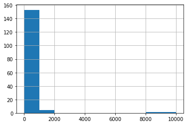
    


```python
user_group["seat_available_max"].hist()
```


    <AxesSubplot:>


    
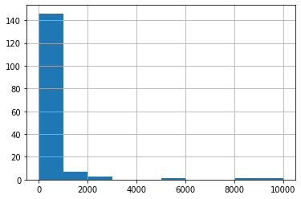
    


Połącznie z events


```python
df = df.merge(user_group[["user_id","seat_available_mean","seat_available_max"]],
         left_on="user_id", 
         right_on="user_id",
         how='left')
df[:3]
         
```


<div>
<style scoped>
    .dataframe tbody tr th:only-of-type {
        vertical-align: middle;
    }

    .dataframe tbody tr th {
        vertical-align: top;
    }

    .dataframe thead th {
        text-align: right;
    }
</style>
<table border="1" class="dataframe">
  <thead>
    <tr style="text-align: right;">
      <th></th>
      <th>events_id</th>
      <th>Kamien_Milowy_Profil_Wydarzenia</th>
      <th>A1_categories_name</th>
      <th>A2_freq_label</th>
      <th>A3_Nazwa miejscowości</th>
      <th>A3_Rodzaj</th>
      <th>A3_Gmina</th>
      <th>A3_Powiat</th>
      <th>A3_Województwo</th>
      <th>A3_wielkosc_miejscowosci</th>
      <th>A4_event_czas_transmisji</th>
      <th>A5_size_label</th>
      <th>A6_planned_amount</th>
      <th>A6_obtained_amount</th>
      <th>B1_dorosly</th>
      <th>B1_dziecko-mlodziez</th>
      <th>B2_event_local</th>
      <th>B2_event_global</th>
      <th>B2_czas_trwania</th>
      <th>B2_kategoria_Inny</th>
      <th>B2_kategoria_Wystawa</th>
      <th>B2_kategoria_Spektakl_teatralny</th>
      <th>B2_kategoria_Koncert</th>
      <th>B2_kategoria_Festiwal</th>
      <th>B2_kategoria_Konferencja</th>
      <th>B2_kategoria_Sport</th>
      <th>B2_kategoria_Festiwal_muzyczny</th>
      <th>B2_kategoria_Targi_szkolenia</th>
      <th>B2_kategoria_Festiwal_filmowy</th>
      <th>B3_ave_hour_visit_events_mean_mean</th>
      <th>B3_ave_hour_visit_events_min_mean</th>
      <th>B3_ave_hour_visit_events_max_mean</th>
      <th>B4_czestotliwosc_odwiedzania_eventow</th>
      <th>B5_zasobnosc_portfela_klienta_max</th>
      <th>B5_zasobnosc_portfela_klienta_min</th>
      <th>B5_zasobnosc_portfela_klienta_sum</th>
      <th>B5_zasobnosc_portfela_klienta_mean</th>
      <th>C1_ticket_count_sum_event_users</th>
      <th>C1_ticket_count_OD_event_users</th>
      <th>C1_ticket_count_DO_event_users</th>
      <th>C2_global_ticket_count_sum_event_users</th>
      <th>C2_global_ticket_count_OD_event_users</th>
      <th>C2_global_ticket_count_DO_event_users</th>
      <th>C3_revenue_sum</th>
      <th>C3_revenue_min</th>
      <th>C3_revenue_max</th>
      <th>C3_revenue_mean</th>
      <th>C4_cena_rp_do_cena_rw</th>
      <th>C4_ilosc_rp_do_ilosc_rw</th>
      <th>D_ticket_price_sum</th>
      <th>D_ticket_count</th>
      <th>D_wielkosc_do_ilosci_uczestnikow</th>
      <th>D_wydarzenia_live_tylko_offline</th>
      <th>D_wydarzenia_live_tylko_online</th>
      <th>D_wydarzenia_live_online_i_offline</th>
      <th>D_wydarzenia_zruznicowane_w_udzialne_online_i_offline</th>
      <th>E_sum_cen_biletow_z_rynku_w</th>
      <th>E_srednia_cena_biletow_z_rynku_w</th>
      <th>E_liczba_biletow_z_rynku_w</th>
      <th>E_dostepne_sektory</th>
      <th>title</th>
      <th>user_id</th>
      <th>events_start_date</th>
      <th>city</th>
      <th>seat_available</th>
      <th>ticket_price_mean</th>
      <th>Date</th>
      <th>Time</th>
      <th>Day</th>
      <th>Week</th>
      <th>Month</th>
      <th>day_of_week</th>
      <th>Is_weekend</th>
      <th>Okazja</th>
      <th>Vacation</th>
      <th>seat_available_mean</th>
      <th>seat_available_max</th>
    </tr>
  </thead>
  <tbody>
    <tr>
      <th>0</th>
      <td>248895</td>
      <td>małe</td>
      <td>Wystawa</td>
      <td>jednorazowe</td>
      <td>wrocław</td>
      <td>miasto</td>
      <td>Wrocław</td>
      <td>Wrocław</td>
      <td>dolnośląskie</td>
      <td>Duże</td>
      <td>krótkotrwały do 2-3h</td>
      <td>do 100</td>
      <td>3571.0</td>
      <td>250.0</td>
      <td>0</td>
      <td>1</td>
      <td>NaN</td>
      <td>NaN</td>
      <td>NaN</td>
      <td>NaN</td>
      <td>NaN</td>
      <td>NaN</td>
      <td>NaN</td>
      <td>NaN</td>
      <td>NaN</td>
      <td>NaN</td>
      <td>NaN</td>
      <td>NaN</td>
      <td>NaN</td>
      <td>NaN</td>
      <td>NaN</td>
      <td>NaN</td>
      <td>NaN</td>
      <td>NaN</td>
      <td>NaN</td>
      <td>NaN</td>
      <td>NaN</td>
      <td>7623.0</td>
      <td>1.0</td>
      <td>98.0</td>
      <td>0.0</td>
      <td>0.0</td>
      <td>0.0</td>
      <td>267458.0</td>
      <td>30.0</td>
      <td>3612.0</td>
      <td>632.288416</td>
      <td>inf</td>
      <td>inf</td>
      <td>250.0</td>
      <td>7.0</td>
      <td>35.714286</td>
      <td>35.714286</td>
      <td>0</td>
      <td>0</td>
      <td>0</td>
      <td>0.0</td>
      <td>0.0</td>
      <td>0.0</td>
      <td>event bez numerowanych miejsc</td>
      <td>Wystawa Dali Warhol</td>
      <td>2111</td>
      <td>2018-06-10 09:00:00+00:00</td>
      <td>Wrocław</td>
      <td>100.0</td>
      <td>35.714286</td>
      <td>2018-06-10</td>
      <td>9</td>
      <td>10</td>
      <td>23</td>
      <td>6</td>
      <td>Sunday</td>
      <td>Weekend</td>
      <td>NaN</td>
      <td>NaN</td>
      <td>100.0</td>
      <td>100.0</td>
    </tr>
    <tr>
      <th>1</th>
      <td>248896</td>
      <td>małe</td>
      <td>Wystawa</td>
      <td>jednorazowe</td>
      <td>wrocław</td>
      <td>miasto</td>
      <td>Wrocław</td>
      <td>Wrocław</td>
      <td>dolnośląskie</td>
      <td>Duże</td>
      <td>krótkotrwały do 2-3h</td>
      <td>do 100</td>
      <td>2964.0</td>
      <td>978.0</td>
      <td>0</td>
      <td>1</td>
      <td>NaN</td>
      <td>NaN</td>
      <td>NaN</td>
      <td>NaN</td>
      <td>NaN</td>
      <td>NaN</td>
      <td>NaN</td>
      <td>NaN</td>
      <td>NaN</td>
      <td>NaN</td>
      <td>NaN</td>
      <td>NaN</td>
      <td>NaN</td>
      <td>14.0</td>
      <td>14.0</td>
      <td>14.0</td>
      <td>NaN</td>
      <td>216.0</td>
      <td>216.0</td>
      <td>2592.0</td>
      <td>216.0</td>
      <td>7623.0</td>
      <td>1.0</td>
      <td>98.0</td>
      <td>0.0</td>
      <td>0.0</td>
      <td>0.0</td>
      <td>267458.0</td>
      <td>30.0</td>
      <td>3612.0</td>
      <td>632.288416</td>
      <td>inf</td>
      <td>inf</td>
      <td>978.0</td>
      <td>33.0</td>
      <td>29.636364</td>
      <td>29.636364</td>
      <td>0</td>
      <td>0</td>
      <td>0</td>
      <td>0.0</td>
      <td>0.0</td>
      <td>0.0</td>
      <td>event bez numerowanych miejsc</td>
      <td>Wystawa Dali Warhol</td>
      <td>2111</td>
      <td>2018-06-10 10:00:00+00:00</td>
      <td>Wrocław</td>
      <td>100.0</td>
      <td>29.636364</td>
      <td>2018-06-10</td>
      <td>10</td>
      <td>10</td>
      <td>23</td>
      <td>6</td>
      <td>Sunday</td>
      <td>Weekend</td>
      <td>NaN</td>
      <td>NaN</td>
      <td>100.0</td>
      <td>100.0</td>
    </tr>
    <tr>
      <th>2</th>
      <td>248897</td>
      <td>małe</td>
      <td>Wystawa</td>
      <td>cykliczne co 6mc</td>
      <td>wrocław</td>
      <td>miasto</td>
      <td>Wrocław</td>
      <td>Wrocław</td>
      <td>dolnośląskie</td>
      <td>Duże</td>
      <td>krótkotrwały do 2-3h</td>
      <td>do 100</td>
      <td>4000.0</td>
      <td>480.0</td>
      <td>0</td>
      <td>1</td>
      <td>NaN</td>
      <td>NaN</td>
      <td>NaN</td>
      <td>NaN</td>
      <td>NaN</td>
      <td>NaN</td>
      <td>NaN</td>
      <td>NaN</td>
      <td>NaN</td>
      <td>NaN</td>
      <td>NaN</td>
      <td>NaN</td>
      <td>NaN</td>
      <td>NaN</td>
      <td>NaN</td>
      <td>NaN</td>
      <td>NaN</td>
      <td>NaN</td>
      <td>NaN</td>
      <td>NaN</td>
      <td>NaN</td>
      <td>7623.0</td>
      <td>1.0</td>
      <td>98.0</td>
      <td>0.0</td>
      <td>0.0</td>
      <td>0.0</td>
      <td>267458.0</td>
      <td>30.0</td>
      <td>3612.0</td>
      <td>632.288416</td>
      <td>inf</td>
      <td>inf</td>
      <td>480.0</td>
      <td>12.0</td>
      <td>40.000000</td>
      <td>40.000000</td>
      <td>0</td>
      <td>0</td>
      <td>0</td>
      <td>0.0</td>
      <td>0.0</td>
      <td>0.0</td>
      <td>event bez numerowanych miejsc</td>
      <td>Wystawa Dali Warhol</td>
      <td>2111</td>
      <td>2018-06-10 11:00:00+00:00</td>
      <td>Wrocław</td>
      <td>100.0</td>
      <td>40.000000</td>
      <td>2018-06-10</td>
      <td>11</td>
      <td>10</td>
      <td>23</td>
      <td>6</td>
      <td>Sunday</td>
      <td>Weekend</td>
      <td>NaN</td>
      <td>NaN</td>
      <td>100.0</td>
      <td>100.0</td>
    </tr>
  </tbody>
</table>
</div>


## Modyfikacja

### Filtr

usunąć wydarzenia z 0 dla E_srednia_cena_biletow_z_rynku_w 


```python
df.shape
```


    (1600, 77)


```python
df_filtr = df[df.E_srednia_cena_biletow_z_rynku_w != 0]
df_filtr.shape
```


    (912, 77)


> Czy wszystkie y A i B mają być na zdefiniowanym filtrze ?

> > zastosować go dopiero w pliku danego Y teraz jest nie potrzebny (teraz może nam tylko zakłamać inne Y) 


```python
# df = df_filtr.copy()  # jeżeli tak nadpisać df
```


```python
df.shape
```


    (1600, 77)


### seat_available_mod


```python
df["seat_available_mod"] = df.apply(lambda x: max(x["seat_available_max"],x["seat_available"]) if x["seat_available"] < 30 else x["seat_available"] ,axis=1)
df[:3]
```


<div>
<style scoped>
    .dataframe tbody tr th:only-of-type {
        vertical-align: middle;
    }

    .dataframe tbody tr th {
        vertical-align: top;
    }

    .dataframe thead th {
        text-align: right;
    }
</style>
<table border="1" class="dataframe">
  <thead>
    <tr style="text-align: right;">
      <th></th>
      <th>events_id</th>
      <th>Kamien_Milowy_Profil_Wydarzenia</th>
      <th>A1_categories_name</th>
      <th>A2_freq_label</th>
      <th>A3_Nazwa miejscowości</th>
      <th>A3_Rodzaj</th>
      <th>A3_Gmina</th>
      <th>A3_Powiat</th>
      <th>A3_Województwo</th>
      <th>A3_wielkosc_miejscowosci</th>
      <th>A4_event_czas_transmisji</th>
      <th>A5_size_label</th>
      <th>A6_planned_amount</th>
      <th>A6_obtained_amount</th>
      <th>B1_dorosly</th>
      <th>B1_dziecko-mlodziez</th>
      <th>B2_event_local</th>
      <th>B2_event_global</th>
      <th>B2_czas_trwania</th>
      <th>B2_kategoria_Inny</th>
      <th>B2_kategoria_Wystawa</th>
      <th>B2_kategoria_Spektakl_teatralny</th>
      <th>B2_kategoria_Koncert</th>
      <th>B2_kategoria_Festiwal</th>
      <th>B2_kategoria_Konferencja</th>
      <th>B2_kategoria_Sport</th>
      <th>B2_kategoria_Festiwal_muzyczny</th>
      <th>B2_kategoria_Targi_szkolenia</th>
      <th>B2_kategoria_Festiwal_filmowy</th>
      <th>B3_ave_hour_visit_events_mean_mean</th>
      <th>B3_ave_hour_visit_events_min_mean</th>
      <th>B3_ave_hour_visit_events_max_mean</th>
      <th>B4_czestotliwosc_odwiedzania_eventow</th>
      <th>B5_zasobnosc_portfela_klienta_max</th>
      <th>B5_zasobnosc_portfela_klienta_min</th>
      <th>B5_zasobnosc_portfela_klienta_sum</th>
      <th>B5_zasobnosc_portfela_klienta_mean</th>
      <th>C1_ticket_count_sum_event_users</th>
      <th>C1_ticket_count_OD_event_users</th>
      <th>C1_ticket_count_DO_event_users</th>
      <th>C2_global_ticket_count_sum_event_users</th>
      <th>C2_global_ticket_count_OD_event_users</th>
      <th>C2_global_ticket_count_DO_event_users</th>
      <th>C3_revenue_sum</th>
      <th>C3_revenue_min</th>
      <th>C3_revenue_max</th>
      <th>C3_revenue_mean</th>
      <th>C4_cena_rp_do_cena_rw</th>
      <th>C4_ilosc_rp_do_ilosc_rw</th>
      <th>D_ticket_price_sum</th>
      <th>D_ticket_count</th>
      <th>D_wielkosc_do_ilosci_uczestnikow</th>
      <th>D_wydarzenia_live_tylko_offline</th>
      <th>D_wydarzenia_live_tylko_online</th>
      <th>D_wydarzenia_live_online_i_offline</th>
      <th>D_wydarzenia_zruznicowane_w_udzialne_online_i_offline</th>
      <th>E_sum_cen_biletow_z_rynku_w</th>
      <th>E_srednia_cena_biletow_z_rynku_w</th>
      <th>E_liczba_biletow_z_rynku_w</th>
      <th>E_dostepne_sektory</th>
      <th>title</th>
      <th>user_id</th>
      <th>events_start_date</th>
      <th>city</th>
      <th>seat_available</th>
      <th>ticket_price_mean</th>
      <th>Date</th>
      <th>Time</th>
      <th>Day</th>
      <th>Week</th>
      <th>Month</th>
      <th>day_of_week</th>
      <th>Is_weekend</th>
      <th>Okazja</th>
      <th>Vacation</th>
      <th>seat_available_mean</th>
      <th>seat_available_max</th>
      <th>seat_available_mod</th>
    </tr>
  </thead>
  <tbody>
    <tr>
      <th>0</th>
      <td>248895</td>
      <td>małe</td>
      <td>Wystawa</td>
      <td>jednorazowe</td>
      <td>wrocław</td>
      <td>miasto</td>
      <td>Wrocław</td>
      <td>Wrocław</td>
      <td>dolnośląskie</td>
      <td>Duże</td>
      <td>krótkotrwały do 2-3h</td>
      <td>do 100</td>
      <td>3571.0</td>
      <td>250.0</td>
      <td>0</td>
      <td>1</td>
      <td>NaN</td>
      <td>NaN</td>
      <td>NaN</td>
      <td>NaN</td>
      <td>NaN</td>
      <td>NaN</td>
      <td>NaN</td>
      <td>NaN</td>
      <td>NaN</td>
      <td>NaN</td>
      <td>NaN</td>
      <td>NaN</td>
      <td>NaN</td>
      <td>NaN</td>
      <td>NaN</td>
      <td>NaN</td>
      <td>NaN</td>
      <td>NaN</td>
      <td>NaN</td>
      <td>NaN</td>
      <td>NaN</td>
      <td>7623.0</td>
      <td>1.0</td>
      <td>98.0</td>
      <td>0.0</td>
      <td>0.0</td>
      <td>0.0</td>
      <td>267458.0</td>
      <td>30.0</td>
      <td>3612.0</td>
      <td>632.288416</td>
      <td>inf</td>
      <td>inf</td>
      <td>250.0</td>
      <td>7.0</td>
      <td>35.714286</td>
      <td>35.714286</td>
      <td>0</td>
      <td>0</td>
      <td>0</td>
      <td>0.0</td>
      <td>0.0</td>
      <td>0.0</td>
      <td>event bez numerowanych miejsc</td>
      <td>Wystawa Dali Warhol</td>
      <td>2111</td>
      <td>2018-06-10 09:00:00+00:00</td>
      <td>Wrocław</td>
      <td>100.0</td>
      <td>35.714286</td>
      <td>2018-06-10</td>
      <td>9</td>
      <td>10</td>
      <td>23</td>
      <td>6</td>
      <td>Sunday</td>
      <td>Weekend</td>
      <td>NaN</td>
      <td>NaN</td>
      <td>100.0</td>
      <td>100.0</td>
      <td>100.0</td>
    </tr>
    <tr>
      <th>1</th>
      <td>248896</td>
      <td>małe</td>
      <td>Wystawa</td>
      <td>jednorazowe</td>
      <td>wrocław</td>
      <td>miasto</td>
      <td>Wrocław</td>
      <td>Wrocław</td>
      <td>dolnośląskie</td>
      <td>Duże</td>
      <td>krótkotrwały do 2-3h</td>
      <td>do 100</td>
      <td>2964.0</td>
      <td>978.0</td>
      <td>0</td>
      <td>1</td>
      <td>NaN</td>
      <td>NaN</td>
      <td>NaN</td>
      <td>NaN</td>
      <td>NaN</td>
      <td>NaN</td>
      <td>NaN</td>
      <td>NaN</td>
      <td>NaN</td>
      <td>NaN</td>
      <td>NaN</td>
      <td>NaN</td>
      <td>NaN</td>
      <td>14.0</td>
      <td>14.0</td>
      <td>14.0</td>
      <td>NaN</td>
      <td>216.0</td>
      <td>216.0</td>
      <td>2592.0</td>
      <td>216.0</td>
      <td>7623.0</td>
      <td>1.0</td>
      <td>98.0</td>
      <td>0.0</td>
      <td>0.0</td>
      <td>0.0</td>
      <td>267458.0</td>
      <td>30.0</td>
      <td>3612.0</td>
      <td>632.288416</td>
      <td>inf</td>
      <td>inf</td>
      <td>978.0</td>
      <td>33.0</td>
      <td>29.636364</td>
      <td>29.636364</td>
      <td>0</td>
      <td>0</td>
      <td>0</td>
      <td>0.0</td>
      <td>0.0</td>
      <td>0.0</td>
      <td>event bez numerowanych miejsc</td>
      <td>Wystawa Dali Warhol</td>
      <td>2111</td>
      <td>2018-06-10 10:00:00+00:00</td>
      <td>Wrocław</td>
      <td>100.0</td>
      <td>29.636364</td>
      <td>2018-06-10</td>
      <td>10</td>
      <td>10</td>
      <td>23</td>
      <td>6</td>
      <td>Sunday</td>
      <td>Weekend</td>
      <td>NaN</td>
      <td>NaN</td>
      <td>100.0</td>
      <td>100.0</td>
      <td>100.0</td>
    </tr>
    <tr>
      <th>2</th>
      <td>248897</td>
      <td>małe</td>
      <td>Wystawa</td>
      <td>cykliczne co 6mc</td>
      <td>wrocław</td>
      <td>miasto</td>
      <td>Wrocław</td>
      <td>Wrocław</td>
      <td>dolnośląskie</td>
      <td>Duże</td>
      <td>krótkotrwały do 2-3h</td>
      <td>do 100</td>
      <td>4000.0</td>
      <td>480.0</td>
      <td>0</td>
      <td>1</td>
      <td>NaN</td>
      <td>NaN</td>
      <td>NaN</td>
      <td>NaN</td>
      <td>NaN</td>
      <td>NaN</td>
      <td>NaN</td>
      <td>NaN</td>
      <td>NaN</td>
      <td>NaN</td>
      <td>NaN</td>
      <td>NaN</td>
      <td>NaN</td>
      <td>NaN</td>
      <td>NaN</td>
      <td>NaN</td>
      <td>NaN</td>
      <td>NaN</td>
      <td>NaN</td>
      <td>NaN</td>
      <td>NaN</td>
      <td>7623.0</td>
      <td>1.0</td>
      <td>98.0</td>
      <td>0.0</td>
      <td>0.0</td>
      <td>0.0</td>
      <td>267458.0</td>
      <td>30.0</td>
      <td>3612.0</td>
      <td>632.288416</td>
      <td>inf</td>
      <td>inf</td>
      <td>480.0</td>
      <td>12.0</td>
      <td>40.000000</td>
      <td>40.000000</td>
      <td>0</td>
      <td>0</td>
      <td>0</td>
      <td>0.0</td>
      <td>0.0</td>
      <td>0.0</td>
      <td>event bez numerowanych miejsc</td>
      <td>Wystawa Dali Warhol</td>
      <td>2111</td>
      <td>2018-06-10 11:00:00+00:00</td>
      <td>Wrocław</td>
      <td>100.0</td>
      <td>40.000000</td>
      <td>2018-06-10</td>
      <td>11</td>
      <td>10</td>
      <td>23</td>
      <td>6</td>
      <td>Sunday</td>
      <td>Weekend</td>
      <td>NaN</td>
      <td>NaN</td>
      <td>100.0</td>
      <td>100.0</td>
      <td>100.0</td>
    </tr>
  </tbody>
</table>
</div>


```python
df["seat_available"].hist(bins=50)
```


    <AxesSubplot:>


    
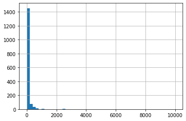
    


```python
df["seat_available_mod"].hist(bins=50)
```


    <AxesSubplot:>


    
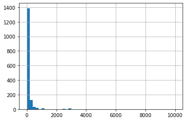
    


### D_ticket_count_mod


```python
df["D_ticket_count_mod"] = df.apply(lambda x: max(x["D_ticket_count"],x["E_liczba_biletow_z_rynku_w"]) ,axis=1)
df[:3]
```


<div>
<style scoped>
    .dataframe tbody tr th:only-of-type {
        vertical-align: middle;
    }

    .dataframe tbody tr th {
        vertical-align: top;
    }

    .dataframe thead th {
        text-align: right;
    }
</style>
<table border="1" class="dataframe">
  <thead>
    <tr style="text-align: right;">
      <th></th>
      <th>events_id</th>
      <th>Kamien_Milowy_Profil_Wydarzenia</th>
      <th>A1_categories_name</th>
      <th>A2_freq_label</th>
      <th>A3_Nazwa miejscowości</th>
      <th>A3_Rodzaj</th>
      <th>A3_Gmina</th>
      <th>A3_Powiat</th>
      <th>A3_Województwo</th>
      <th>A3_wielkosc_miejscowosci</th>
      <th>A4_event_czas_transmisji</th>
      <th>A5_size_label</th>
      <th>A6_planned_amount</th>
      <th>A6_obtained_amount</th>
      <th>B1_dorosly</th>
      <th>B1_dziecko-mlodziez</th>
      <th>B2_event_local</th>
      <th>B2_event_global</th>
      <th>B2_czas_trwania</th>
      <th>B2_kategoria_Inny</th>
      <th>B2_kategoria_Wystawa</th>
      <th>B2_kategoria_Spektakl_teatralny</th>
      <th>B2_kategoria_Koncert</th>
      <th>B2_kategoria_Festiwal</th>
      <th>B2_kategoria_Konferencja</th>
      <th>B2_kategoria_Sport</th>
      <th>B2_kategoria_Festiwal_muzyczny</th>
      <th>B2_kategoria_Targi_szkolenia</th>
      <th>B2_kategoria_Festiwal_filmowy</th>
      <th>B3_ave_hour_visit_events_mean_mean</th>
      <th>B3_ave_hour_visit_events_min_mean</th>
      <th>B3_ave_hour_visit_events_max_mean</th>
      <th>B4_czestotliwosc_odwiedzania_eventow</th>
      <th>B5_zasobnosc_portfela_klienta_max</th>
      <th>B5_zasobnosc_portfela_klienta_min</th>
      <th>B5_zasobnosc_portfela_klienta_sum</th>
      <th>B5_zasobnosc_portfela_klienta_mean</th>
      <th>C1_ticket_count_sum_event_users</th>
      <th>C1_ticket_count_OD_event_users</th>
      <th>C1_ticket_count_DO_event_users</th>
      <th>C2_global_ticket_count_sum_event_users</th>
      <th>C2_global_ticket_count_OD_event_users</th>
      <th>C2_global_ticket_count_DO_event_users</th>
      <th>C3_revenue_sum</th>
      <th>C3_revenue_min</th>
      <th>C3_revenue_max</th>
      <th>C3_revenue_mean</th>
      <th>C4_cena_rp_do_cena_rw</th>
      <th>C4_ilosc_rp_do_ilosc_rw</th>
      <th>D_ticket_price_sum</th>
      <th>D_ticket_count</th>
      <th>D_wielkosc_do_ilosci_uczestnikow</th>
      <th>D_wydarzenia_live_tylko_offline</th>
      <th>D_wydarzenia_live_tylko_online</th>
      <th>D_wydarzenia_live_online_i_offline</th>
      <th>D_wydarzenia_zruznicowane_w_udzialne_online_i_offline</th>
      <th>E_sum_cen_biletow_z_rynku_w</th>
      <th>E_srednia_cena_biletow_z_rynku_w</th>
      <th>E_liczba_biletow_z_rynku_w</th>
      <th>E_dostepne_sektory</th>
      <th>title</th>
      <th>user_id</th>
      <th>events_start_date</th>
      <th>city</th>
      <th>seat_available</th>
      <th>ticket_price_mean</th>
      <th>Date</th>
      <th>Time</th>
      <th>Day</th>
      <th>Week</th>
      <th>Month</th>
      <th>day_of_week</th>
      <th>Is_weekend</th>
      <th>Okazja</th>
      <th>Vacation</th>
      <th>seat_available_mean</th>
      <th>seat_available_max</th>
      <th>seat_available_mod</th>
      <th>D_ticket_count_mod</th>
    </tr>
  </thead>
  <tbody>
    <tr>
      <th>0</th>
      <td>248895</td>
      <td>małe</td>
      <td>Wystawa</td>
      <td>jednorazowe</td>
      <td>wrocław</td>
      <td>miasto</td>
      <td>Wrocław</td>
      <td>Wrocław</td>
      <td>dolnośląskie</td>
      <td>Duże</td>
      <td>krótkotrwały do 2-3h</td>
      <td>do 100</td>
      <td>3571.0</td>
      <td>250.0</td>
      <td>0</td>
      <td>1</td>
      <td>NaN</td>
      <td>NaN</td>
      <td>NaN</td>
      <td>NaN</td>
      <td>NaN</td>
      <td>NaN</td>
      <td>NaN</td>
      <td>NaN</td>
      <td>NaN</td>
      <td>NaN</td>
      <td>NaN</td>
      <td>NaN</td>
      <td>NaN</td>
      <td>NaN</td>
      <td>NaN</td>
      <td>NaN</td>
      <td>NaN</td>
      <td>NaN</td>
      <td>NaN</td>
      <td>NaN</td>
      <td>NaN</td>
      <td>7623.0</td>
      <td>1.0</td>
      <td>98.0</td>
      <td>0.0</td>
      <td>0.0</td>
      <td>0.0</td>
      <td>267458.0</td>
      <td>30.0</td>
      <td>3612.0</td>
      <td>632.288416</td>
      <td>inf</td>
      <td>inf</td>
      <td>250.0</td>
      <td>7.0</td>
      <td>35.714286</td>
      <td>35.714286</td>
      <td>0</td>
      <td>0</td>
      <td>0</td>
      <td>0.0</td>
      <td>0.0</td>
      <td>0.0</td>
      <td>event bez numerowanych miejsc</td>
      <td>Wystawa Dali Warhol</td>
      <td>2111</td>
      <td>2018-06-10 09:00:00+00:00</td>
      <td>Wrocław</td>
      <td>100.0</td>
      <td>35.714286</td>
      <td>2018-06-10</td>
      <td>9</td>
      <td>10</td>
      <td>23</td>
      <td>6</td>
      <td>Sunday</td>
      <td>Weekend</td>
      <td>NaN</td>
      <td>NaN</td>
      <td>100.0</td>
      <td>100.0</td>
      <td>100.0</td>
      <td>7.0</td>
    </tr>
    <tr>
      <th>1</th>
      <td>248896</td>
      <td>małe</td>
      <td>Wystawa</td>
      <td>jednorazowe</td>
      <td>wrocław</td>
      <td>miasto</td>
      <td>Wrocław</td>
      <td>Wrocław</td>
      <td>dolnośląskie</td>
      <td>Duże</td>
      <td>krótkotrwały do 2-3h</td>
      <td>do 100</td>
      <td>2964.0</td>
      <td>978.0</td>
      <td>0</td>
      <td>1</td>
      <td>NaN</td>
      <td>NaN</td>
      <td>NaN</td>
      <td>NaN</td>
      <td>NaN</td>
      <td>NaN</td>
      <td>NaN</td>
      <td>NaN</td>
      <td>NaN</td>
      <td>NaN</td>
      <td>NaN</td>
      <td>NaN</td>
      <td>NaN</td>
      <td>14.0</td>
      <td>14.0</td>
      <td>14.0</td>
      <td>NaN</td>
      <td>216.0</td>
      <td>216.0</td>
      <td>2592.0</td>
      <td>216.0</td>
      <td>7623.0</td>
      <td>1.0</td>
      <td>98.0</td>
      <td>0.0</td>
      <td>0.0</td>
      <td>0.0</td>
      <td>267458.0</td>
      <td>30.0</td>
      <td>3612.0</td>
      <td>632.288416</td>
      <td>inf</td>
      <td>inf</td>
      <td>978.0</td>
      <td>33.0</td>
      <td>29.636364</td>
      <td>29.636364</td>
      <td>0</td>
      <td>0</td>
      <td>0</td>
      <td>0.0</td>
      <td>0.0</td>
      <td>0.0</td>
      <td>event bez numerowanych miejsc</td>
      <td>Wystawa Dali Warhol</td>
      <td>2111</td>
      <td>2018-06-10 10:00:00+00:00</td>
      <td>Wrocław</td>
      <td>100.0</td>
      <td>29.636364</td>
      <td>2018-06-10</td>
      <td>10</td>
      <td>10</td>
      <td>23</td>
      <td>6</td>
      <td>Sunday</td>
      <td>Weekend</td>
      <td>NaN</td>
      <td>NaN</td>
      <td>100.0</td>
      <td>100.0</td>
      <td>100.0</td>
      <td>33.0</td>
    </tr>
    <tr>
      <th>2</th>
      <td>248897</td>
      <td>małe</td>
      <td>Wystawa</td>
      <td>cykliczne co 6mc</td>
      <td>wrocław</td>
      <td>miasto</td>
      <td>Wrocław</td>
      <td>Wrocław</td>
      <td>dolnośląskie</td>
      <td>Duże</td>
      <td>krótkotrwały do 2-3h</td>
      <td>do 100</td>
      <td>4000.0</td>
      <td>480.0</td>
      <td>0</td>
      <td>1</td>
      <td>NaN</td>
      <td>NaN</td>
      <td>NaN</td>
      <td>NaN</td>
      <td>NaN</td>
      <td>NaN</td>
      <td>NaN</td>
      <td>NaN</td>
      <td>NaN</td>
      <td>NaN</td>
      <td>NaN</td>
      <td>NaN</td>
      <td>NaN</td>
      <td>NaN</td>
      <td>NaN</td>
      <td>NaN</td>
      <td>NaN</td>
      <td>NaN</td>
      <td>NaN</td>
      <td>NaN</td>
      <td>NaN</td>
      <td>7623.0</td>
      <td>1.0</td>
      <td>98.0</td>
      <td>0.0</td>
      <td>0.0</td>
      <td>0.0</td>
      <td>267458.0</td>
      <td>30.0</td>
      <td>3612.0</td>
      <td>632.288416</td>
      <td>inf</td>
      <td>inf</td>
      <td>480.0</td>
      <td>12.0</td>
      <td>40.000000</td>
      <td>40.000000</td>
      <td>0</td>
      <td>0</td>
      <td>0</td>
      <td>0.0</td>
      <td>0.0</td>
      <td>0.0</td>
      <td>event bez numerowanych miejsc</td>
      <td>Wystawa Dali Warhol</td>
      <td>2111</td>
      <td>2018-06-10 11:00:00+00:00</td>
      <td>Wrocław</td>
      <td>100.0</td>
      <td>40.000000</td>
      <td>2018-06-10</td>
      <td>11</td>
      <td>10</td>
      <td>23</td>
      <td>6</td>
      <td>Sunday</td>
      <td>Weekend</td>
      <td>NaN</td>
      <td>NaN</td>
      <td>100.0</td>
      <td>100.0</td>
      <td>100.0</td>
      <td>12.0</td>
    </tr>
  </tbody>
</table>
</div>


```python
df["D_ticket_count"].hist(bins=150)
```


    <AxesSubplot:>


    
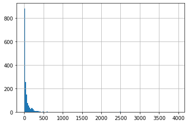
    


```python
df["D_ticket_count_mod"].hist(bins=50)
```


    <AxesSubplot:>


    
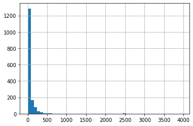
    


### seat_available_mod_(z ticket)


```python
df["seat_available_mod_2"] = df.apply(lambda x: max(x["D_ticket_count_mod"],x["seat_available_mod"]) ,axis=1 )
df[:3]
```


<div>
<style scoped>
    .dataframe tbody tr th:only-of-type {
        vertical-align: middle;
    }

    .dataframe tbody tr th {
        vertical-align: top;
    }

    .dataframe thead th {
        text-align: right;
    }
</style>
<table border="1" class="dataframe">
  <thead>
    <tr style="text-align: right;">
      <th></th>
      <th>events_id</th>
      <th>Kamien_Milowy_Profil_Wydarzenia</th>
      <th>A1_categories_name</th>
      <th>A2_freq_label</th>
      <th>A3_Nazwa miejscowości</th>
      <th>A3_Rodzaj</th>
      <th>A3_Gmina</th>
      <th>A3_Powiat</th>
      <th>A3_Województwo</th>
      <th>A3_wielkosc_miejscowosci</th>
      <th>A4_event_czas_transmisji</th>
      <th>A5_size_label</th>
      <th>A6_planned_amount</th>
      <th>A6_obtained_amount</th>
      <th>B1_dorosly</th>
      <th>B1_dziecko-mlodziez</th>
      <th>B2_event_local</th>
      <th>B2_event_global</th>
      <th>B2_czas_trwania</th>
      <th>B2_kategoria_Inny</th>
      <th>B2_kategoria_Wystawa</th>
      <th>B2_kategoria_Spektakl_teatralny</th>
      <th>B2_kategoria_Koncert</th>
      <th>B2_kategoria_Festiwal</th>
      <th>B2_kategoria_Konferencja</th>
      <th>B2_kategoria_Sport</th>
      <th>B2_kategoria_Festiwal_muzyczny</th>
      <th>B2_kategoria_Targi_szkolenia</th>
      <th>B2_kategoria_Festiwal_filmowy</th>
      <th>B3_ave_hour_visit_events_mean_mean</th>
      <th>B3_ave_hour_visit_events_min_mean</th>
      <th>B3_ave_hour_visit_events_max_mean</th>
      <th>B4_czestotliwosc_odwiedzania_eventow</th>
      <th>B5_zasobnosc_portfela_klienta_max</th>
      <th>B5_zasobnosc_portfela_klienta_min</th>
      <th>B5_zasobnosc_portfela_klienta_sum</th>
      <th>B5_zasobnosc_portfela_klienta_mean</th>
      <th>C1_ticket_count_sum_event_users</th>
      <th>C1_ticket_count_OD_event_users</th>
      <th>C1_ticket_count_DO_event_users</th>
      <th>C2_global_ticket_count_sum_event_users</th>
      <th>C2_global_ticket_count_OD_event_users</th>
      <th>C2_global_ticket_count_DO_event_users</th>
      <th>C3_revenue_sum</th>
      <th>C3_revenue_min</th>
      <th>C3_revenue_max</th>
      <th>C3_revenue_mean</th>
      <th>C4_cena_rp_do_cena_rw</th>
      <th>C4_ilosc_rp_do_ilosc_rw</th>
      <th>D_ticket_price_sum</th>
      <th>D_ticket_count</th>
      <th>D_wielkosc_do_ilosci_uczestnikow</th>
      <th>D_wydarzenia_live_tylko_offline</th>
      <th>D_wydarzenia_live_tylko_online</th>
      <th>D_wydarzenia_live_online_i_offline</th>
      <th>D_wydarzenia_zruznicowane_w_udzialne_online_i_offline</th>
      <th>E_sum_cen_biletow_z_rynku_w</th>
      <th>E_srednia_cena_biletow_z_rynku_w</th>
      <th>E_liczba_biletow_z_rynku_w</th>
      <th>E_dostepne_sektory</th>
      <th>title</th>
      <th>user_id</th>
      <th>events_start_date</th>
      <th>city</th>
      <th>seat_available</th>
      <th>ticket_price_mean</th>
      <th>Date</th>
      <th>Time</th>
      <th>Day</th>
      <th>Week</th>
      <th>Month</th>
      <th>day_of_week</th>
      <th>Is_weekend</th>
      <th>Okazja</th>
      <th>Vacation</th>
      <th>seat_available_mean</th>
      <th>seat_available_max</th>
      <th>seat_available_mod</th>
      <th>D_ticket_count_mod</th>
      <th>seat_available_mod_2</th>
    </tr>
  </thead>
  <tbody>
    <tr>
      <th>0</th>
      <td>248895</td>
      <td>małe</td>
      <td>Wystawa</td>
      <td>jednorazowe</td>
      <td>wrocław</td>
      <td>miasto</td>
      <td>Wrocław</td>
      <td>Wrocław</td>
      <td>dolnośląskie</td>
      <td>Duże</td>
      <td>krótkotrwały do 2-3h</td>
      <td>do 100</td>
      <td>3571.0</td>
      <td>250.0</td>
      <td>0</td>
      <td>1</td>
      <td>NaN</td>
      <td>NaN</td>
      <td>NaN</td>
      <td>NaN</td>
      <td>NaN</td>
      <td>NaN</td>
      <td>NaN</td>
      <td>NaN</td>
      <td>NaN</td>
      <td>NaN</td>
      <td>NaN</td>
      <td>NaN</td>
      <td>NaN</td>
      <td>NaN</td>
      <td>NaN</td>
      <td>NaN</td>
      <td>NaN</td>
      <td>NaN</td>
      <td>NaN</td>
      <td>NaN</td>
      <td>NaN</td>
      <td>7623.0</td>
      <td>1.0</td>
      <td>98.0</td>
      <td>0.0</td>
      <td>0.0</td>
      <td>0.0</td>
      <td>267458.0</td>
      <td>30.0</td>
      <td>3612.0</td>
      <td>632.288416</td>
      <td>inf</td>
      <td>inf</td>
      <td>250.0</td>
      <td>7.0</td>
      <td>35.714286</td>
      <td>35.714286</td>
      <td>0</td>
      <td>0</td>
      <td>0</td>
      <td>0.0</td>
      <td>0.0</td>
      <td>0.0</td>
      <td>event bez numerowanych miejsc</td>
      <td>Wystawa Dali Warhol</td>
      <td>2111</td>
      <td>2018-06-10 09:00:00+00:00</td>
      <td>Wrocław</td>
      <td>100.0</td>
      <td>35.714286</td>
      <td>2018-06-10</td>
      <td>9</td>
      <td>10</td>
      <td>23</td>
      <td>6</td>
      <td>Sunday</td>
      <td>Weekend</td>
      <td>NaN</td>
      <td>NaN</td>
      <td>100.0</td>
      <td>100.0</td>
      <td>100.0</td>
      <td>7.0</td>
      <td>100.0</td>
    </tr>
    <tr>
      <th>1</th>
      <td>248896</td>
      <td>małe</td>
      <td>Wystawa</td>
      <td>jednorazowe</td>
      <td>wrocław</td>
      <td>miasto</td>
      <td>Wrocław</td>
      <td>Wrocław</td>
      <td>dolnośląskie</td>
      <td>Duże</td>
      <td>krótkotrwały do 2-3h</td>
      <td>do 100</td>
      <td>2964.0</td>
      <td>978.0</td>
      <td>0</td>
      <td>1</td>
      <td>NaN</td>
      <td>NaN</td>
      <td>NaN</td>
      <td>NaN</td>
      <td>NaN</td>
      <td>NaN</td>
      <td>NaN</td>
      <td>NaN</td>
      <td>NaN</td>
      <td>NaN</td>
      <td>NaN</td>
      <td>NaN</td>
      <td>NaN</td>
      <td>14.0</td>
      <td>14.0</td>
      <td>14.0</td>
      <td>NaN</td>
      <td>216.0</td>
      <td>216.0</td>
      <td>2592.0</td>
      <td>216.0</td>
      <td>7623.0</td>
      <td>1.0</td>
      <td>98.0</td>
      <td>0.0</td>
      <td>0.0</td>
      <td>0.0</td>
      <td>267458.0</td>
      <td>30.0</td>
      <td>3612.0</td>
      <td>632.288416</td>
      <td>inf</td>
      <td>inf</td>
      <td>978.0</td>
      <td>33.0</td>
      <td>29.636364</td>
      <td>29.636364</td>
      <td>0</td>
      <td>0</td>
      <td>0</td>
      <td>0.0</td>
      <td>0.0</td>
      <td>0.0</td>
      <td>event bez numerowanych miejsc</td>
      <td>Wystawa Dali Warhol</td>
      <td>2111</td>
      <td>2018-06-10 10:00:00+00:00</td>
      <td>Wrocław</td>
      <td>100.0</td>
      <td>29.636364</td>
      <td>2018-06-10</td>
      <td>10</td>
      <td>10</td>
      <td>23</td>
      <td>6</td>
      <td>Sunday</td>
      <td>Weekend</td>
      <td>NaN</td>
      <td>NaN</td>
      <td>100.0</td>
      <td>100.0</td>
      <td>100.0</td>
      <td>33.0</td>
      <td>100.0</td>
    </tr>
    <tr>
      <th>2</th>
      <td>248897</td>
      <td>małe</td>
      <td>Wystawa</td>
      <td>cykliczne co 6mc</td>
      <td>wrocław</td>
      <td>miasto</td>
      <td>Wrocław</td>
      <td>Wrocław</td>
      <td>dolnośląskie</td>
      <td>Duże</td>
      <td>krótkotrwały do 2-3h</td>
      <td>do 100</td>
      <td>4000.0</td>
      <td>480.0</td>
      <td>0</td>
      <td>1</td>
      <td>NaN</td>
      <td>NaN</td>
      <td>NaN</td>
      <td>NaN</td>
      <td>NaN</td>
      <td>NaN</td>
      <td>NaN</td>
      <td>NaN</td>
      <td>NaN</td>
      <td>NaN</td>
      <td>NaN</td>
      <td>NaN</td>
      <td>NaN</td>
      <td>NaN</td>
      <td>NaN</td>
      <td>NaN</td>
      <td>NaN</td>
      <td>NaN</td>
      <td>NaN</td>
      <td>NaN</td>
      <td>NaN</td>
      <td>7623.0</td>
      <td>1.0</td>
      <td>98.0</td>
      <td>0.0</td>
      <td>0.0</td>
      <td>0.0</td>
      <td>267458.0</td>
      <td>30.0</td>
      <td>3612.0</td>
      <td>632.288416</td>
      <td>inf</td>
      <td>inf</td>
      <td>480.0</td>
      <td>12.0</td>
      <td>40.000000</td>
      <td>40.000000</td>
      <td>0</td>
      <td>0</td>
      <td>0</td>
      <td>0.0</td>
      <td>0.0</td>
      <td>0.0</td>
      <td>event bez numerowanych miejsc</td>
      <td>Wystawa Dali Warhol</td>
      <td>2111</td>
      <td>2018-06-10 11:00:00+00:00</td>
      <td>Wrocław</td>
      <td>100.0</td>
      <td>40.000000</td>
      <td>2018-06-10</td>
      <td>11</td>
      <td>10</td>
      <td>23</td>
      <td>6</td>
      <td>Sunday</td>
      <td>Weekend</td>
      <td>NaN</td>
      <td>NaN</td>
      <td>100.0</td>
      <td>100.0</td>
      <td>100.0</td>
      <td>12.0</td>
      <td>100.0</td>
    </tr>
  </tbody>
</table>
</div>


```python
df["seat_available"].hist(bins=50)
```


    <AxesSubplot:>


    

    


```python
df["seat_available_mod"].hist(bins=50)
```


    <AxesSubplot:>


    

    


```python
df["seat_available_mod_2"].hist(bins=50)
```


    <AxesSubplot:>


    
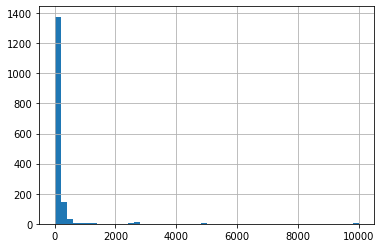
    


```python
(df["seat_available"] < 30).sum()
```


    391


```python
(df["seat_available_mod"] < 30).sum()
```


    42


```python
(df["seat_available_mod_2"] < 30).sum()
```


    30


```python
(df["seat_available_mod_2"] < 50).sum()
```


    241


```python
(df["seat_available_mod_2"] < 100).sum()
```


    584


## Ręczna weryfikacja


```python
podglad = df[["title","user_id","events_start_date","city","seat_available","seat_available_mean","seat_available_mod","D_ticket_count","D_ticket_count_mod","seat_available_mod_2"]]
podglad[450:475]
```


<div>
<style scoped>
    .dataframe tbody tr th:only-of-type {
        vertical-align: middle;
    }

    .dataframe tbody tr th {
        vertical-align: top;
    }

    .dataframe thead th {
        text-align: right;
    }
</style>
<table border="1" class="dataframe">
  <thead>
    <tr style="text-align: right;">
      <th></th>
      <th>title</th>
      <th>user_id</th>
      <th>events_start_date</th>
      <th>city</th>
      <th>seat_available</th>
      <th>seat_available_mean</th>
      <th>seat_available_mod</th>
      <th>D_ticket_count</th>
      <th>D_ticket_count_mod</th>
      <th>seat_available_mod_2</th>
    </tr>
  </thead>
  <tbody>
    <tr>
      <th>450</th>
      <td>GENESIS 2.0</td>
      <td>2250</td>
      <td>2018-07-06 17:00:00+00:00</td>
      <td>Supraśl</td>
      <td>100.0</td>
      <td>54.284211</td>
      <td>100.0</td>
      <td>15.0</td>
      <td>15.0</td>
      <td>100.0</td>
    </tr>
    <tr>
      <th>451</th>
      <td>TEATR WIERSZALIN – WZIOŁOWSTĄPIENIE</td>
      <td>2250</td>
      <td>2018-07-07 17:00:00+00:00</td>
      <td>Supraśl</td>
      <td>70.0</td>
      <td>54.284211</td>
      <td>70.0</td>
      <td>58.0</td>
      <td>58.0</td>
      <td>70.0</td>
    </tr>
    <tr>
      <th>452</th>
      <td>TEATR WIERSZALIN – WZIOŁOWSTĄPIENIE</td>
      <td>2250</td>
      <td>2018-07-08 17:00:00+00:00</td>
      <td>Supraśl</td>
      <td>58.0</td>
      <td>54.284211</td>
      <td>58.0</td>
      <td>58.0</td>
      <td>58.0</td>
      <td>58.0</td>
    </tr>
    <tr>
      <th>453</th>
      <td>WARSZTATY TKACKIE</td>
      <td>2250</td>
      <td>2018-07-10 08:00:00+00:00</td>
      <td>Supraśl</td>
      <td>10.0</td>
      <td>54.284211</td>
      <td>130.0</td>
      <td>3.0</td>
      <td>3.0</td>
      <td>130.0</td>
    </tr>
    <tr>
      <th>454</th>
      <td>TEATR WIERSZALIN – WZIOŁOWSTĄPIENIE</td>
      <td>2250</td>
      <td>2018-07-10 17:00:00+00:00</td>
      <td>Supraśl</td>
      <td>63.0</td>
      <td>54.284211</td>
      <td>63.0</td>
      <td>63.0</td>
      <td>63.0</td>
      <td>63.0</td>
    </tr>
    <tr>
      <th>455</th>
      <td>WAKACJE Z MONIKĄ</td>
      <td>2250</td>
      <td>2018-07-11 17:00:00+00:00</td>
      <td>Supraśl</td>
      <td>100.0</td>
      <td>54.284211</td>
      <td>100.0</td>
      <td>15.0</td>
      <td>15.0</td>
      <td>100.0</td>
    </tr>
    <tr>
      <th>456</th>
      <td>TAM, GDZIE ROSNĄ POZIOMKI</td>
      <td>2250</td>
      <td>2018-07-12 17:00:00+00:00</td>
      <td>Supraśl</td>
      <td>100.0</td>
      <td>54.284211</td>
      <td>100.0</td>
      <td>28.0</td>
      <td>28.0</td>
      <td>100.0</td>
    </tr>
    <tr>
      <th>457</th>
      <td>OPOWIEŚCI ŚWINKI</td>
      <td>2250</td>
      <td>2018-07-13 09:00:00+00:00</td>
      <td>Supraśl</td>
      <td>100.0</td>
      <td>54.284211</td>
      <td>100.0</td>
      <td>48.0</td>
      <td>48.0</td>
      <td>100.0</td>
    </tr>
    <tr>
      <th>458</th>
      <td>ZIOŁA OJCA GABRIELA</td>
      <td>2250</td>
      <td>2018-07-14 08:00:00+00:00</td>
      <td>Supraśl</td>
      <td>30.0</td>
      <td>54.284211</td>
      <td>30.0</td>
      <td>8.0</td>
      <td>8.0</td>
      <td>30.0</td>
    </tr>
    <tr>
      <th>459</th>
      <td>JACEK KLEYFF Z ZESPOŁEM</td>
      <td>2250</td>
      <td>2018-07-14 17:00:00+00:00</td>
      <td>Supraśl</td>
      <td>50.0</td>
      <td>54.284211</td>
      <td>50.0</td>
      <td>65.0</td>
      <td>65.0</td>
      <td>65.0</td>
    </tr>
    <tr>
      <th>460</th>
      <td>PERSONA</td>
      <td>2250</td>
      <td>2018-07-14 17:00:00+00:00</td>
      <td>Supraśl</td>
      <td>100.0</td>
      <td>54.284211</td>
      <td>100.0</td>
      <td>20.0</td>
      <td>20.0</td>
      <td>100.0</td>
    </tr>
    <tr>
      <th>461</th>
      <td>SZEPTUCHY I PSYCHOLOGIA</td>
      <td>2250</td>
      <td>2018-07-15 13:00:00+00:00</td>
      <td>Supraśl</td>
      <td>100.0</td>
      <td>54.284211</td>
      <td>100.0</td>
      <td>42.0</td>
      <td>42.0</td>
      <td>100.0</td>
    </tr>
    <tr>
      <th>462</th>
      <td>JESIENNA SONATA</td>
      <td>2250</td>
      <td>2018-07-15 17:00:00+00:00</td>
      <td>Supraśl</td>
      <td>100.0</td>
      <td>54.284211</td>
      <td>100.0</td>
      <td>20.0</td>
      <td>20.0</td>
      <td>100.0</td>
    </tr>
    <tr>
      <th>463</th>
      <td>TAM, GDZIE ROSNĄ POZIOMKI</td>
      <td>2250</td>
      <td>2018-07-16 17:00:00+00:00</td>
      <td>Supraśl</td>
      <td>100.0</td>
      <td>54.284211</td>
      <td>100.0</td>
      <td>10.0</td>
      <td>10.0</td>
      <td>100.0</td>
    </tr>
    <tr>
      <th>464</th>
      <td>PIEŚNI ZE WSCHODU</td>
      <td>2250</td>
      <td>2018-07-17 08:00:00+00:00</td>
      <td>Supraśl</td>
      <td>15.0</td>
      <td>54.284211</td>
      <td>130.0</td>
      <td>8.0</td>
      <td>8.0</td>
      <td>130.0</td>
    </tr>
    <tr>
      <th>465</th>
      <td>SARABANDA</td>
      <td>2250</td>
      <td>2018-07-18 17:00:00+00:00</td>
      <td>Supraśl</td>
      <td>100.0</td>
      <td>54.284211</td>
      <td>100.0</td>
      <td>14.0</td>
      <td>14.0</td>
      <td>100.0</td>
    </tr>
    <tr>
      <th>466</th>
      <td>PIEŚNI Z PODLASIA</td>
      <td>2250</td>
      <td>2018-07-19 16:00:00+00:00</td>
      <td>Supraśl</td>
      <td>120.0</td>
      <td>54.284211</td>
      <td>120.0</td>
      <td>16.0</td>
      <td>16.0</td>
      <td>120.0</td>
    </tr>
    <tr>
      <th>467</th>
      <td>POZNAJEMY SMAKI LATA</td>
      <td>2250</td>
      <td>2018-07-21 08:00:00+00:00</td>
      <td>Supraśl</td>
      <td>15.0</td>
      <td>54.284211</td>
      <td>130.0</td>
      <td>15.0</td>
      <td>15.0</td>
      <td>130.0</td>
    </tr>
    <tr>
      <th>468</th>
      <td>POZNAJEMY SMAKI LATA</td>
      <td>2250</td>
      <td>2018-07-21 10:00:00+00:00</td>
      <td>Supraśl</td>
      <td>15.0</td>
      <td>54.284211</td>
      <td>130.0</td>
      <td>15.0</td>
      <td>15.0</td>
      <td>130.0</td>
    </tr>
    <tr>
      <th>469</th>
      <td>TAM, GDZIE ROSNĄ GRZYBY</td>
      <td>2250</td>
      <td>2018-07-21 17:00:00+00:00</td>
      <td>Supraśl</td>
      <td>120.0</td>
      <td>54.284211</td>
      <td>120.0</td>
      <td>26.0</td>
      <td>26.0</td>
      <td>120.0</td>
    </tr>
    <tr>
      <th>470</th>
      <td>ROLNIK I SZEF KUCHNI</td>
      <td>2250</td>
      <td>2018-07-22 17:00:00+00:00</td>
      <td>Supraśl</td>
      <td>100.0</td>
      <td>54.284211</td>
      <td>100.0</td>
      <td>15.0</td>
      <td>15.0</td>
      <td>100.0</td>
    </tr>
    <tr>
      <th>471</th>
      <td>JEZIORO BODEŃSKIE</td>
      <td>2250</td>
      <td>2018-07-23 17:00:00+00:00</td>
      <td>Supraśl</td>
      <td>100.0</td>
      <td>54.284211</td>
      <td>100.0</td>
      <td>6.0</td>
      <td>6.0</td>
      <td>100.0</td>
    </tr>
    <tr>
      <th>472</th>
      <td>WARSZTATY TKACKIE</td>
      <td>2250</td>
      <td>2018-07-24 08:00:00+00:00</td>
      <td>Supraśl</td>
      <td>10.0</td>
      <td>54.284211</td>
      <td>130.0</td>
      <td>4.0</td>
      <td>4.0</td>
      <td>130.0</td>
    </tr>
    <tr>
      <th>473</th>
      <td>RAJD ROWEROWY LEKKI I KRASNY</td>
      <td>2250</td>
      <td>2018-07-25 08:00:00+00:00</td>
      <td>Supraśl</td>
      <td>30.0</td>
      <td>54.284211</td>
      <td>30.0</td>
      <td>6.0</td>
      <td>6.0</td>
      <td>30.0</td>
    </tr>
    <tr>
      <th>474</th>
      <td>QUARTER-TONE PIANO</td>
      <td>2250</td>
      <td>2018-07-26 17:00:00+00:00</td>
      <td>Supraśl</td>
      <td>100.0</td>
      <td>54.284211</td>
      <td>100.0</td>
      <td>25.0</td>
      <td>25.0</td>
      <td>100.0</td>
    </tr>
  </tbody>
</table>
</div>


### Podgląd wydarzeń małych


```python
podglad[podglad["seat_available"] < 30].sort_values("user_id")
```


<div>
<style scoped>
    .dataframe tbody tr th:only-of-type {
        vertical-align: middle;
    }

    .dataframe tbody tr th {
        vertical-align: top;
    }

    .dataframe thead th {
        text-align: right;
    }
</style>
<table border="1" class="dataframe">
  <thead>
    <tr style="text-align: right;">
      <th></th>
      <th>title</th>
      <th>user_id</th>
      <th>events_start_date</th>
      <th>city</th>
      <th>seat_available</th>
      <th>seat_available_mean</th>
      <th>seat_available_mod</th>
      <th>D_ticket_count</th>
      <th>D_ticket_count_mod</th>
      <th>seat_available_mod_2</th>
    </tr>
  </thead>
  <tbody>
    <tr>
      <th>594</th>
      <td>IKEBANA</td>
      <td>8</td>
      <td>2018-10-05 18:00:00+00:00</td>
      <td>Tarnów</td>
      <td>24.0</td>
      <td>16.605263</td>
      <td>44.0</td>
      <td>6.0</td>
      <td>6.0</td>
      <td>44.0</td>
    </tr>
    <tr>
      <th>836</th>
      <td>TRANS-ATLANTICO</td>
      <td>8</td>
      <td>2019-01-29 18:00:00+00:00</td>
      <td>Tarnów</td>
      <td>26.0</td>
      <td>16.605263</td>
      <td>44.0</td>
      <td>40.0</td>
      <td>40.0</td>
      <td>44.0</td>
    </tr>
    <tr>
      <th>864</th>
      <td>PORACHUNKI Z KATEM</td>
      <td>8</td>
      <td>2019-04-05 17:00:00+00:00</td>
      <td>Tarnów</td>
      <td>12.0</td>
      <td>16.605263</td>
      <td>44.0</td>
      <td>22.0</td>
      <td>22.0</td>
      <td>44.0</td>
    </tr>
    <tr>
      <th>865</th>
      <td>PORACHUNKI Z KATEM</td>
      <td>8</td>
      <td>2019-04-06 16:00:00+00:00</td>
      <td>Tarnów</td>
      <td>16.0</td>
      <td>16.605263</td>
      <td>44.0</td>
      <td>36.0</td>
      <td>36.0</td>
      <td>44.0</td>
    </tr>
    <tr>
      <th>613</th>
      <td>PORWANIE EUROPY / TALIA 2018</td>
      <td>8</td>
      <td>2018-09-27 15:00:00+00:00</td>
      <td>Tarnów</td>
      <td>1.0</td>
      <td>16.605263</td>
      <td>44.0</td>
      <td>2.0</td>
      <td>2.0</td>
      <td>44.0</td>
    </tr>
    <tr>
      <th>...</th>
      <td>...</td>
      <td>...</td>
      <td>...</td>
      <td>...</td>
      <td>...</td>
      <td>...</td>
      <td>...</td>
      <td>...</td>
      <td>...</td>
      <td>...</td>
    </tr>
    <tr>
      <th>1573</th>
      <td>Relaks dla dolnych pleców</td>
      <td>5218</td>
      <td>2021-05-22 22:00:00+00:00</td>
      <td>Kraków</td>
      <td>10.0</td>
      <td>10.000000</td>
      <td>10.0</td>
      <td>1.0</td>
      <td>1.0</td>
      <td>10.0</td>
    </tr>
    <tr>
      <th>1570</th>
      <td>Warsztaty ceramiki dla roślinoholików - donicz...</td>
      <td>6022</td>
      <td>2021-05-15 10:00:00+00:00</td>
      <td>Gdańsk</td>
      <td>7.0</td>
      <td>7.000000</td>
      <td>7.0</td>
      <td>3.0</td>
      <td>3.0</td>
      <td>7.0</td>
    </tr>
    <tr>
      <th>1564</th>
      <td>Warsztaty ceramiki dla roślinoholików - donicz...</td>
      <td>6022</td>
      <td>2021-04-11 09:00:00+00:00</td>
      <td>Sopot</td>
      <td>7.0</td>
      <td>7.000000</td>
      <td>7.0</td>
      <td>3.0</td>
      <td>3.0</td>
      <td>7.0</td>
    </tr>
    <tr>
      <th>1586</th>
      <td>Warsztaty ceramiki w rytmie slow</td>
      <td>6022</td>
      <td>2021-05-26 15:00:00+00:00</td>
      <td>Gdańsk</td>
      <td>7.0</td>
      <td>7.000000</td>
      <td>7.0</td>
      <td>1.0</td>
      <td>1.0</td>
      <td>7.0</td>
    </tr>
    <tr>
      <th>1565</th>
      <td>Warsztaty ceramiki dla roślinoholików - donicz...</td>
      <td>6022</td>
      <td>2021-04-11 11:00:00+00:00</td>
      <td>Sopot</td>
      <td>7.0</td>
      <td>7.000000</td>
      <td>7.0</td>
      <td>4.0</td>
      <td>4.0</td>
      <td>7.0</td>
    </tr>
  </tbody>
</table>
<p>391 rows × 10 columns</p>
</div>


```python
podglad[podglad["seat_available"] < 30]["user_id"].nunique() #ilość unikalnych organizatorow
```


    66


```python
print("liczba eventów zorganizowanych przez organizatorów z top10: ",podglad[podglad["seat_available"] < 30]["user_id"].value_counts()[:10].sum())
podglad[podglad["seat_available"] < 30]["user_id"].value_counts()[:10] #rozkład unikalnych organizatorow top5
```

    liczba eventów zorganizowanych przez organizatorów z top10:  236
    


    46      44
    2864    34
    2250    33
    8       31
    1491    27
    986     17
    2007    14
    2029    12
    2405    12
    1739    12
    Name: user_id, dtype: int64


```python
#lista top 10 użytkowników
list(podglad[podglad["seat_available"] < 30]["user_id"].value_counts().index[:10])
```


    [46, 2864, 2250, 8, 1491, 986, 2007, 2029, 2405, 1739]


### Podgląd wydarzeń dużych


```python
podglad["seat_available"].hist(bins=100,xrot=90)
```


    <AxesSubplot:>


    
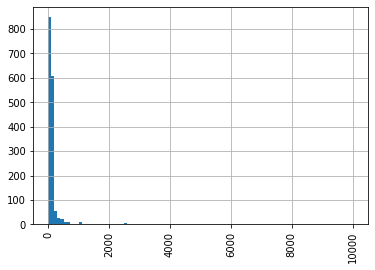
    


```python
podglad["seat_available"].plot(kind='hist', range=[0,500])
```


    <AxesSubplot:ylabel='Frequency'>


    
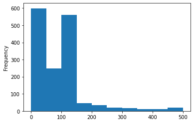
    


```python
f_duze = podglad["seat_available"] > 150
podglad[f_duze].sort_values("user_id")
```


<div>
<style scoped>
    .dataframe tbody tr th:only-of-type {
        vertical-align: middle;
    }

    .dataframe tbody tr th {
        vertical-align: top;
    }

    .dataframe thead th {
        text-align: right;
    }
</style>
<table border="1" class="dataframe">
  <thead>
    <tr style="text-align: right;">
      <th></th>
      <th>title</th>
      <th>user_id</th>
      <th>events_start_date</th>
      <th>city</th>
      <th>seat_available</th>
      <th>seat_available_mean</th>
      <th>seat_available_mod</th>
      <th>D_ticket_count</th>
      <th>D_ticket_count_mod</th>
      <th>seat_available_mod_2</th>
    </tr>
  </thead>
  <tbody>
    <tr>
      <th>1267</th>
      <td>Widowisko teatralne</td>
      <td>45</td>
      <td>2019-11-14 13:00:00+00:00</td>
      <td>Słupca</td>
      <td>198.0</td>
      <td>104.000000</td>
      <td>198.0</td>
      <td>1.0</td>
      <td>1.0</td>
      <td>198.0</td>
    </tr>
    <tr>
      <th>803</th>
      <td>Kapitan Nemo. 20 tysięcy mil podmorskiej żeglugi</td>
      <td>61</td>
      <td>2019-04-08 07:00:00+00:00</td>
      <td>Łódź</td>
      <td>172.0</td>
      <td>118.000000</td>
      <td>172.0</td>
      <td>19.0</td>
      <td>19.0</td>
      <td>172.0</td>
    </tr>
    <tr>
      <th>804</th>
      <td>Kapitan Nemo. 20 tysięcy mil podmorskiej żeglugi</td>
      <td>61</td>
      <td>2019-04-12 07:00:00+00:00</td>
      <td>Łódź</td>
      <td>170.0</td>
      <td>118.000000</td>
      <td>170.0</td>
      <td>21.0</td>
      <td>21.0</td>
      <td>170.0</td>
    </tr>
    <tr>
      <th>737</th>
      <td>Sylwester z Ambrożym K.</td>
      <td>89</td>
      <td>2018-12-31 20:00:00+00:00</td>
      <td>Kraków</td>
      <td>263.0</td>
      <td>66.181818</td>
      <td>263.0</td>
      <td>37.0</td>
      <td>37.0</td>
      <td>263.0</td>
    </tr>
    <tr>
      <th>1270</th>
      <td>Czwartek: 17. Krakowski Festiwal Górski (5.12....</td>
      <td>238</td>
      <td>2019-12-05 22:00:00+00:00</td>
      <td>Kraków</td>
      <td>421.0</td>
      <td>777.777778</td>
      <td>421.0</td>
      <td>207.0</td>
      <td>207.0</td>
      <td>421.0</td>
    </tr>
    <tr>
      <th>...</th>
      <td>...</td>
      <td>...</td>
      <td>...</td>
      <td>...</td>
      <td>...</td>
      <td>...</td>
      <td>...</td>
      <td>...</td>
      <td>...</td>
      <td>...</td>
    </tr>
    <tr>
      <th>1592</th>
      <td>Znicz Pruszków vs Górnik Polkowice</td>
      <td>3885</td>
      <td>2021-05-26 13:00:00+00:00</td>
      <td>Pruszków</td>
      <td>400.0</td>
      <td>414.285714</td>
      <td>400.0</td>
      <td>32.0</td>
      <td>32.0</td>
      <td>400.0</td>
    </tr>
    <tr>
      <th>1599</th>
      <td>Znicz Pruszków vs KKS 1925 Kalisz</td>
      <td>3885</td>
      <td>2021-06-05 12:00:00+00:00</td>
      <td>Pruszków</td>
      <td>400.0</td>
      <td>414.285714</td>
      <td>400.0</td>
      <td>92.0</td>
      <td>92.0</td>
      <td>400.0</td>
    </tr>
    <tr>
      <th>1454</th>
      <td>Mistrzostwa Polski - Akrobatyka Powietrzna - N...</td>
      <td>3971</td>
      <td>2020-09-27 20:00:00+00:00</td>
      <td>Lublin</td>
      <td>250.0</td>
      <td>250.000000</td>
      <td>250.0</td>
      <td>166.0</td>
      <td>166.0</td>
      <td>250.0</td>
    </tr>
    <tr>
      <th>1453</th>
      <td>Mistrzostwa Polski - Akrobatyka Powietrzna - S...</td>
      <td>3971</td>
      <td>2020-09-26 20:00:00+00:00</td>
      <td>Lublin</td>
      <td>250.0</td>
      <td>250.000000</td>
      <td>250.0</td>
      <td>215.0</td>
      <td>215.0</td>
      <td>250.0</td>
    </tr>
    <tr>
      <th>1525</th>
      <td>Król Pragnie Twego Piękna</td>
      <td>5030</td>
      <td>2021-05-15 05:00:00+00:00</td>
      <td>Warszawa</td>
      <td>1000.0</td>
      <td>1000.000000</td>
      <td>1000.0</td>
      <td>133.0</td>
      <td>133.0</td>
      <td>1000.0</td>
    </tr>
  </tbody>
</table>
<p>179 rows × 10 columns</p>
</div>


```python
podglad[f_duze]["user_id"].nunique() #ilość unikalnych organizatorow
```


    65


```python
podglad[f_duze]["user_id"].value_counts()[:5] #rozkład unikalnych organizatorow top5
```


    541     15
    298     14
    614     11
    1646     8
    385      7
    Name: user_id, dtype: int64


```python

```


```python

```

#> Za każdą poniższą poprawą sprawdzić rozkłady 

(ZROBIĆ METODĘ Z 4 WYKRESAMI) 

> > rozkład dostepnych miejsc

> > rozkkład sprzedanych miejsc

> > rozkład % sprzedanych miejsc w RP

> > rozkład % biletów które się pojawiły w RW


---------------


> Sprawdzic czy liczba dostepnych miejsc zgadza się eventem. Jeżli nie to korekta z ręki. 

> > wersja fast - wydarzenia najmniejsze i największe. priorytet (małe) - im wiecej tym lepiej

> > dużych powinno być wiecej 

> Sprawdzić ticet_count 
> > sprawdzić  sprawdzić rozkłąd jak sprzedaż wygladałą i czy jest to realne, normalne itd

> Sprawdzić ceny RP i RW 
> > czy ma to sens 

> > 0% (zmiana ceny)  na rynku wtórnym 

> B 
> > jezeli poprawimy A to możę się okazać ze mozemy mieć problem z 90% sprzedanymi biletami. 

> > syntetyczne: pomieszanie wielu możliwośći: ilosć dostępnych miejsc, cena biletu, ilość sprzedaży, itd trzeba z 

> > najlepiej zmieniać tylko liczbę dostepnych miejsc (nie tykać liczbę sprzedanych biletów!!!) 


```python

```


```python

```

## Model A1

Wniosek: Ilość sprzedanych biletów RP

Predykcja: __Procentowy stopień wyprzedania dostępnych biletów na RP__


```python

```


```python
# y = sprzedane bilety RP / dostępne miejsca
df["y_A1"] = df["D_ticket_count"] / df["seat_available"]
df["y_A1_mod"] = df["D_ticket_count_mod"] / df["seat_available_mod"]
df["y_A1_mod_2"] = df["D_ticket_count_mod"] / df["seat_available_mod_2"]

df.sample(3)
```


<div>
<style scoped>
    .dataframe tbody tr th:only-of-type {
        vertical-align: middle;
    }

    .dataframe tbody tr th {
        vertical-align: top;
    }

    .dataframe thead th {
        text-align: right;
    }
</style>
<table border="1" class="dataframe">
  <thead>
    <tr style="text-align: right;">
      <th></th>
      <th>events_id</th>
      <th>Kamien_Milowy_Profil_Wydarzenia</th>
      <th>A1_categories_name</th>
      <th>A2_freq_label</th>
      <th>A3_Nazwa miejscowości</th>
      <th>A3_Rodzaj</th>
      <th>A3_Gmina</th>
      <th>A3_Powiat</th>
      <th>A3_Województwo</th>
      <th>A3_wielkosc_miejscowosci</th>
      <th>A4_event_czas_transmisji</th>
      <th>A5_size_label</th>
      <th>A6_planned_amount</th>
      <th>A6_obtained_amount</th>
      <th>B1_dorosly</th>
      <th>B1_dziecko-mlodziez</th>
      <th>B2_event_local</th>
      <th>B2_event_global</th>
      <th>B2_czas_trwania</th>
      <th>B2_kategoria_Inny</th>
      <th>B2_kategoria_Wystawa</th>
      <th>B2_kategoria_Spektakl_teatralny</th>
      <th>B2_kategoria_Koncert</th>
      <th>B2_kategoria_Festiwal</th>
      <th>B2_kategoria_Konferencja</th>
      <th>B2_kategoria_Sport</th>
      <th>B2_kategoria_Festiwal_muzyczny</th>
      <th>B2_kategoria_Targi_szkolenia</th>
      <th>B2_kategoria_Festiwal_filmowy</th>
      <th>B3_ave_hour_visit_events_mean_mean</th>
      <th>B3_ave_hour_visit_events_min_mean</th>
      <th>B3_ave_hour_visit_events_max_mean</th>
      <th>B4_czestotliwosc_odwiedzania_eventow</th>
      <th>B5_zasobnosc_portfela_klienta_max</th>
      <th>B5_zasobnosc_portfela_klienta_min</th>
      <th>B5_zasobnosc_portfela_klienta_sum</th>
      <th>B5_zasobnosc_portfela_klienta_mean</th>
      <th>C1_ticket_count_sum_event_users</th>
      <th>C1_ticket_count_OD_event_users</th>
      <th>C1_ticket_count_DO_event_users</th>
      <th>C2_global_ticket_count_sum_event_users</th>
      <th>C2_global_ticket_count_OD_event_users</th>
      <th>C2_global_ticket_count_DO_event_users</th>
      <th>C3_revenue_sum</th>
      <th>C3_revenue_min</th>
      <th>C3_revenue_max</th>
      <th>C3_revenue_mean</th>
      <th>C4_cena_rp_do_cena_rw</th>
      <th>C4_ilosc_rp_do_ilosc_rw</th>
      <th>D_ticket_price_sum</th>
      <th>D_ticket_count</th>
      <th>D_wielkosc_do_ilosci_uczestnikow</th>
      <th>D_wydarzenia_live_tylko_offline</th>
      <th>D_wydarzenia_live_tylko_online</th>
      <th>D_wydarzenia_live_online_i_offline</th>
      <th>D_wydarzenia_zruznicowane_w_udzialne_online_i_offline</th>
      <th>E_sum_cen_biletow_z_rynku_w</th>
      <th>E_srednia_cena_biletow_z_rynku_w</th>
      <th>E_liczba_biletow_z_rynku_w</th>
      <th>E_dostepne_sektory</th>
      <th>title</th>
      <th>user_id</th>
      <th>events_start_date</th>
      <th>city</th>
      <th>seat_available</th>
      <th>ticket_price_mean</th>
      <th>Date</th>
      <th>Time</th>
      <th>Day</th>
      <th>Week</th>
      <th>Month</th>
      <th>day_of_week</th>
      <th>Is_weekend</th>
      <th>Okazja</th>
      <th>Vacation</th>
      <th>seat_available_mean</th>
      <th>seat_available_max</th>
      <th>seat_available_mod</th>
      <th>D_ticket_count_mod</th>
      <th>seat_available_mod_2</th>
      <th>y_A1</th>
      <th>y_A1_mod</th>
      <th>y_A1_mod_2</th>
    </tr>
  </thead>
  <tbody>
    <tr>
      <th>647</th>
      <td>313426</td>
      <td>małe</td>
      <td>Spektakl teatralny</td>
      <td>jednorazowe</td>
      <td>wrocław</td>
      <td>miasto</td>
      <td>Wrocław</td>
      <td>Wrocław</td>
      <td>dolnośląskie</td>
      <td>Duże</td>
      <td>krótkotrwały do 2-3h</td>
      <td>do 100</td>
      <td>1160.0</td>
      <td>40.0</td>
      <td>1</td>
      <td>0</td>
      <td>NaN</td>
      <td>NaN</td>
      <td>NaN</td>
      <td>NaN</td>
      <td>NaN</td>
      <td>NaN</td>
      <td>NaN</td>
      <td>NaN</td>
      <td>NaN</td>
      <td>NaN</td>
      <td>NaN</td>
      <td>NaN</td>
      <td>NaN</td>
      <td>18.014286</td>
      <td>7.6</td>
      <td>19.0</td>
      <td>2.0</td>
      <td>130.000000</td>
      <td>130.000000</td>
      <td>5070.0</td>
      <td>130.000000</td>
      <td>204.0</td>
      <td>2.0</td>
      <td>49.0</td>
      <td>0.0</td>
      <td>0.0</td>
      <td>0.0</td>
      <td>4080.00</td>
      <td>40.0</td>
      <td>980.0</td>
      <td>510.000000</td>
      <td>inf</td>
      <td>inf</td>
      <td>40.0</td>
      <td>2.0</td>
      <td>20.0</td>
      <td>20.0</td>
      <td>0</td>
      <td>0</td>
      <td>0</td>
      <td>0.0</td>
      <td>0.0</td>
      <td>0.0</td>
      <td>event z jadną głowna salą</td>
      <td>#MeToo</td>
      <td>1376</td>
      <td>2018-11-18 19:00:00+00:00</td>
      <td>Wrocław</td>
      <td>58.0</td>
      <td>20.0</td>
      <td>2018-11-18</td>
      <td>19</td>
      <td>18</td>
      <td>46</td>
      <td>11</td>
      <td>Sunday</td>
      <td>Weekend</td>
      <td>NaN</td>
      <td>NaN</td>
      <td>28.625000</td>
      <td>58.0</td>
      <td>58.0</td>
      <td>2.0</td>
      <td>58.0</td>
      <td>0.034483</td>
      <td>0.034483</td>
      <td>0.034483</td>
    </tr>
    <tr>
      <th>25</th>
      <td>248929</td>
      <td>małe</td>
      <td>Wystawa</td>
      <td>cykliczne co 6mc</td>
      <td>wrocław</td>
      <td>miasto</td>
      <td>Wrocław</td>
      <td>Wrocław</td>
      <td>dolnośląskie</td>
      <td>Duże</td>
      <td>krótkotrwały do 2-3h</td>
      <td>do 100</td>
      <td>4560.0</td>
      <td>1140.0</td>
      <td>0</td>
      <td>1</td>
      <td>NaN</td>
      <td>NaN</td>
      <td>NaN</td>
      <td>NaN</td>
      <td>NaN</td>
      <td>NaN</td>
      <td>NaN</td>
      <td>NaN</td>
      <td>NaN</td>
      <td>NaN</td>
      <td>NaN</td>
      <td>NaN</td>
      <td>NaN</td>
      <td>NaN</td>
      <td>NaN</td>
      <td>NaN</td>
      <td>NaN</td>
      <td>NaN</td>
      <td>NaN</td>
      <td>NaN</td>
      <td>NaN</td>
      <td>7623.0</td>
      <td>1.0</td>
      <td>98.0</td>
      <td>0.0</td>
      <td>0.0</td>
      <td>0.0</td>
      <td>267458.00</td>
      <td>30.0</td>
      <td>3612.0</td>
      <td>632.288416</td>
      <td>inf</td>
      <td>inf</td>
      <td>1140.0</td>
      <td>25.0</td>
      <td>45.6</td>
      <td>45.6</td>
      <td>0</td>
      <td>0</td>
      <td>0</td>
      <td>0.0</td>
      <td>0.0</td>
      <td>0.0</td>
      <td>event bez numerowanych miejsc</td>
      <td>Wystawa Dali Warhol</td>
      <td>2111</td>
      <td>2018-06-24 11:00:00+00:00</td>
      <td>Wrocław</td>
      <td>100.0</td>
      <td>45.6</td>
      <td>2018-06-24</td>
      <td>11</td>
      <td>24</td>
      <td>25</td>
      <td>6</td>
      <td>Sunday</td>
      <td>Weekend</td>
      <td>NaN</td>
      <td>ferie letnie</td>
      <td>100.000000</td>
      <td>100.0</td>
      <td>100.0</td>
      <td>25.0</td>
      <td>100.0</td>
      <td>0.250000</td>
      <td>0.250000</td>
      <td>0.250000</td>
    </tr>
    <tr>
      <th>447</th>
      <td>267833</td>
      <td>małe</td>
      <td>Festiwal</td>
      <td>jednorazowe</td>
      <td>supraśl</td>
      <td>miasto</td>
      <td>Supraśl</td>
      <td>białostocki</td>
      <td>podlaskie</td>
      <td>Średnie</td>
      <td>krótkotrwały do 2-3h</td>
      <td>do 100</td>
      <td>2200.0</td>
      <td>1480.0</td>
      <td>1</td>
      <td>0</td>
      <td>NaN</td>
      <td>NaN</td>
      <td>NaN</td>
      <td>NaN</td>
      <td>NaN</td>
      <td>NaN</td>
      <td>NaN</td>
      <td>NaN</td>
      <td>NaN</td>
      <td>NaN</td>
      <td>NaN</td>
      <td>NaN</td>
      <td>NaN</td>
      <td>16.666667</td>
      <td>15.0</td>
      <td>17.0</td>
      <td>14.0</td>
      <td>93.333333</td>
      <td>93.333333</td>
      <td>1120.0</td>
      <td>93.333333</td>
      <td>NaN</td>
      <td>NaN</td>
      <td>NaN</td>
      <td>NaN</td>
      <td>NaN</td>
      <td>NaN</td>
      <td>64281.67</td>
      <td>25.0</td>
      <td>5320.0</td>
      <td>676.649158</td>
      <td>0.888889</td>
      <td>12.333333</td>
      <td>1480.0</td>
      <td>37.0</td>
      <td>40.0</td>
      <td>40.0</td>
      <td>0</td>
      <td>0</td>
      <td>0</td>
      <td>135.0</td>
      <td>45.0</td>
      <td>3.0</td>
      <td>event bez numerowanych miejsc</td>
      <td>TEATR WIERSZALIN - WYKŁAD</td>
      <td>2250</td>
      <td>2018-07-04 17:00:00+00:00</td>
      <td>Supraśl</td>
      <td>55.0</td>
      <td>40.0</td>
      <td>2018-07-04</td>
      <td>17</td>
      <td>4</td>
      <td>27</td>
      <td>7</td>
      <td>Wednesday</td>
      <td>BusinessDay</td>
      <td>Dzień Niepodległości (Independence Day)</td>
      <td>ferie letnie</td>
      <td>54.284211</td>
      <td>130.0</td>
      <td>55.0</td>
      <td>37.0</td>
      <td>55.0</td>
      <td>0.672727</td>
      <td>0.672727</td>
      <td>0.672727</td>
    </tr>
  </tbody>
</table>
</div>


```python
df["y_A1"].replace([np.inf,-np.inf],np.nan).hist(bins=50)
```


    <AxesSubplot:>


    
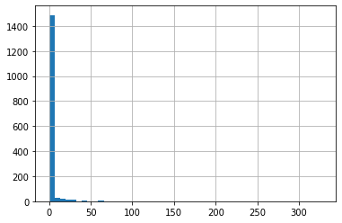
    


```python
df["y_A1_mod"].replace([np.inf,-np.inf],np.nan).hist(bins=50)
```


    <AxesSubplot:>


    
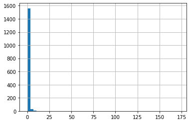
    


```python
df["y_A1_mod_2"].hist(bins=50)
```


    <AxesSubplot:>


    
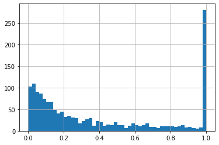
    


## Model A2

Wniosek: Ilość sprzedanych biletów RW

Predykcja: __Procentowy stopień pojawienia się biletów na RW__


```python
# y = sprzedane bilety RW / dostępne miejsca
df["y_A2"] = df["E_liczba_biletow_z_rynku_w"] / df["seat_available"]
df["y_A2_mod"] = df["E_liczba_biletow_z_rynku_w"] / df["seat_available_mod"]
df["y_A2_mod_2"] = df["E_liczba_biletow_z_rynku_w"] / df["seat_available_mod_2"]
df.sample(3)
```


<div>
<style scoped>
    .dataframe tbody tr th:only-of-type {
        vertical-align: middle;
    }

    .dataframe tbody tr th {
        vertical-align: top;
    }

    .dataframe thead th {
        text-align: right;
    }
</style>
<table border="1" class="dataframe">
  <thead>
    <tr style="text-align: right;">
      <th></th>
      <th>events_id</th>
      <th>Kamien_Milowy_Profil_Wydarzenia</th>
      <th>A1_categories_name</th>
      <th>A2_freq_label</th>
      <th>A3_Nazwa miejscowości</th>
      <th>A3_Rodzaj</th>
      <th>A3_Gmina</th>
      <th>A3_Powiat</th>
      <th>A3_Województwo</th>
      <th>A3_wielkosc_miejscowosci</th>
      <th>A4_event_czas_transmisji</th>
      <th>A5_size_label</th>
      <th>A6_planned_amount</th>
      <th>A6_obtained_amount</th>
      <th>B1_dorosly</th>
      <th>B1_dziecko-mlodziez</th>
      <th>B2_event_local</th>
      <th>B2_event_global</th>
      <th>B2_czas_trwania</th>
      <th>B2_kategoria_Inny</th>
      <th>B2_kategoria_Wystawa</th>
      <th>B2_kategoria_Spektakl_teatralny</th>
      <th>B2_kategoria_Koncert</th>
      <th>B2_kategoria_Festiwal</th>
      <th>B2_kategoria_Konferencja</th>
      <th>B2_kategoria_Sport</th>
      <th>B2_kategoria_Festiwal_muzyczny</th>
      <th>B2_kategoria_Targi_szkolenia</th>
      <th>B2_kategoria_Festiwal_filmowy</th>
      <th>B3_ave_hour_visit_events_mean_mean</th>
      <th>B3_ave_hour_visit_events_min_mean</th>
      <th>B3_ave_hour_visit_events_max_mean</th>
      <th>B4_czestotliwosc_odwiedzania_eventow</th>
      <th>B5_zasobnosc_portfela_klienta_max</th>
      <th>B5_zasobnosc_portfela_klienta_min</th>
      <th>B5_zasobnosc_portfela_klienta_sum</th>
      <th>B5_zasobnosc_portfela_klienta_mean</th>
      <th>C1_ticket_count_sum_event_users</th>
      <th>C1_ticket_count_OD_event_users</th>
      <th>C1_ticket_count_DO_event_users</th>
      <th>C2_global_ticket_count_sum_event_users</th>
      <th>C2_global_ticket_count_OD_event_users</th>
      <th>C2_global_ticket_count_DO_event_users</th>
      <th>C3_revenue_sum</th>
      <th>C3_revenue_min</th>
      <th>C3_revenue_max</th>
      <th>C3_revenue_mean</th>
      <th>C4_cena_rp_do_cena_rw</th>
      <th>C4_ilosc_rp_do_ilosc_rw</th>
      <th>D_ticket_price_sum</th>
      <th>D_ticket_count</th>
      <th>D_wielkosc_do_ilosci_uczestnikow</th>
      <th>D_wydarzenia_live_tylko_offline</th>
      <th>D_wydarzenia_live_tylko_online</th>
      <th>D_wydarzenia_live_online_i_offline</th>
      <th>D_wydarzenia_zruznicowane_w_udzialne_online_i_offline</th>
      <th>E_sum_cen_biletow_z_rynku_w</th>
      <th>E_srednia_cena_biletow_z_rynku_w</th>
      <th>E_liczba_biletow_z_rynku_w</th>
      <th>E_dostepne_sektory</th>
      <th>title</th>
      <th>user_id</th>
      <th>events_start_date</th>
      <th>city</th>
      <th>seat_available</th>
      <th>ticket_price_mean</th>
      <th>Date</th>
      <th>Time</th>
      <th>Day</th>
      <th>Week</th>
      <th>Month</th>
      <th>day_of_week</th>
      <th>Is_weekend</th>
      <th>Okazja</th>
      <th>Vacation</th>
      <th>seat_available_mean</th>
      <th>seat_available_max</th>
      <th>seat_available_mod</th>
      <th>D_ticket_count_mod</th>
      <th>seat_available_mod_2</th>
      <th>y_A1</th>
      <th>y_A1_mod</th>
      <th>y_A1_mod_2</th>
      <th>y_A2</th>
      <th>y_A2_mod</th>
      <th>y_A2_mod_2</th>
    </tr>
  </thead>
  <tbody>
    <tr>
      <th>9</th>
      <td>248905</td>
      <td>małe</td>
      <td>Wystawa</td>
      <td>cykliczne co 6mc</td>
      <td>wrocław</td>
      <td>miasto</td>
      <td>Wrocław</td>
      <td>Wrocław</td>
      <td>dolnośląskie</td>
      <td>Duże</td>
      <td>krótkotrwały do 2-3h</td>
      <td>do 100</td>
      <td>4067.0</td>
      <td>610.0</td>
      <td>0</td>
      <td>1</td>
      <td>NaN</td>
      <td>NaN</td>
      <td>NaN</td>
      <td>NaN</td>
      <td>NaN</td>
      <td>NaN</td>
      <td>NaN</td>
      <td>NaN</td>
      <td>NaN</td>
      <td>NaN</td>
      <td>NaN</td>
      <td>NaN</td>
      <td>NaN</td>
      <td>NaN</td>
      <td>NaN</td>
      <td>NaN</td>
      <td>NaN</td>
      <td>NaN</td>
      <td>NaN</td>
      <td>NaN</td>
      <td>NaN</td>
      <td>7623.0</td>
      <td>1.0</td>
      <td>98.0</td>
      <td>0.0</td>
      <td>0.0</td>
      <td>0.0</td>
      <td>267458.00</td>
      <td>30.0</td>
      <td>3612.0</td>
      <td>632.288416</td>
      <td>inf</td>
      <td>inf</td>
      <td>610.0</td>
      <td>15.0</td>
      <td>40.666667</td>
      <td>40.666667</td>
      <td>0</td>
      <td>0</td>
      <td>0</td>
      <td>0.0</td>
      <td>0.0</td>
      <td>0.0</td>
      <td>event bez numerowanych miejsc</td>
      <td>Wystawa Dali Warhol</td>
      <td>2111</td>
      <td>2018-06-16 11:00:00+00:00</td>
      <td>Wrocław</td>
      <td>100.0</td>
      <td>40.666667</td>
      <td>2018-06-16</td>
      <td>11</td>
      <td>16</td>
      <td>24</td>
      <td>6</td>
      <td>Saturday</td>
      <td>Weekend</td>
      <td>NaN</td>
      <td>ferie letnie</td>
      <td>100.000000</td>
      <td>100.0</td>
      <td>100.0</td>
      <td>15.0</td>
      <td>100.0</td>
      <td>0.150</td>
      <td>0.150</td>
      <td>0.150</td>
      <td>0.00</td>
      <td>0.00</td>
      <td>0.00</td>
    </tr>
    <tr>
      <th>853</th>
      <td>335704</td>
      <td>małe</td>
      <td>Koncert</td>
      <td>jednorazowe</td>
      <td>kraków</td>
      <td>miasto</td>
      <td>Kraków</td>
      <td>Kraków</td>
      <td>małopolskie</td>
      <td>Duże</td>
      <td>krótkotrwały do 2-3h</td>
      <td>do 300</td>
      <td>25565.0</td>
      <td>3170.0</td>
      <td>1</td>
      <td>0</td>
      <td>NaN</td>
      <td>NaN</td>
      <td>NaN</td>
      <td>NaN</td>
      <td>NaN</td>
      <td>NaN</td>
      <td>NaN</td>
      <td>NaN</td>
      <td>NaN</td>
      <td>NaN</td>
      <td>NaN</td>
      <td>NaN</td>
      <td>NaN</td>
      <td>15.0</td>
      <td>15.0</td>
      <td>15.0</td>
      <td>124.0</td>
      <td>39.642857</td>
      <td>39.642857</td>
      <td>7333.928571</td>
      <td>39.642857</td>
      <td>NaN</td>
      <td>NaN</td>
      <td>NaN</td>
      <td>NaN</td>
      <td>NaN</td>
      <td>NaN</td>
      <td>3170.00</td>
      <td>3170.0</td>
      <td>3170.0</td>
      <td>3170.000000</td>
      <td>inf</td>
      <td>inf</td>
      <td>3170.0</td>
      <td>124.0</td>
      <td>25.564516</td>
      <td>25.564516</td>
      <td>0</td>
      <td>0</td>
      <td>0</td>
      <td>0.0</td>
      <td>0.0</td>
      <td>0.0</td>
      <td>event bez numerowanych miejsc</td>
      <td>LOVE DRUG w/ Dave the Drummer</td>
      <td>2356</td>
      <td>2019-02-16 21:00:00+00:00</td>
      <td>Kraków</td>
      <td>1000.0</td>
      <td>25.564516</td>
      <td>2019-02-16</td>
      <td>21</td>
      <td>16</td>
      <td>7</td>
      <td>2</td>
      <td>Saturday</td>
      <td>Weekend</td>
      <td>NaN</td>
      <td>ferie zimowe</td>
      <td>1000.000000</td>
      <td>1000.0</td>
      <td>1000.0</td>
      <td>124.0</td>
      <td>1000.0</td>
      <td>0.124</td>
      <td>0.124</td>
      <td>0.124</td>
      <td>0.00</td>
      <td>0.00</td>
      <td>0.00</td>
    </tr>
    <tr>
      <th>1381</th>
      <td>412337</td>
      <td>małe</td>
      <td>Festiwal</td>
      <td>jednorazowe</td>
      <td>supraśl</td>
      <td>miasto</td>
      <td>Supraśl</td>
      <td>białostocki</td>
      <td>podlaskie</td>
      <td>Średnie</td>
      <td>krótkotrwały do 2-3h</td>
      <td>do 100</td>
      <td>618.0</td>
      <td>420.0</td>
      <td>1</td>
      <td>0</td>
      <td>NaN</td>
      <td>NaN</td>
      <td>NaN</td>
      <td>NaN</td>
      <td>NaN</td>
      <td>NaN</td>
      <td>NaN</td>
      <td>NaN</td>
      <td>NaN</td>
      <td>NaN</td>
      <td>NaN</td>
      <td>NaN</td>
      <td>NaN</td>
      <td>17.0</td>
      <td>17.0</td>
      <td>17.0</td>
      <td>11.0</td>
      <td>52.500000</td>
      <td>52.500000</td>
      <td>367.500000</td>
      <td>52.500000</td>
      <td>NaN</td>
      <td>NaN</td>
      <td>NaN</td>
      <td>NaN</td>
      <td>NaN</td>
      <td>NaN</td>
      <td>64281.67</td>
      <td>25.0</td>
      <td>5320.0</td>
      <td>676.649158</td>
      <td>0.823529</td>
      <td>11.333333</td>
      <td>420.0</td>
      <td>34.0</td>
      <td>12.352941</td>
      <td>12.352941</td>
      <td>0</td>
      <td>0</td>
      <td>0</td>
      <td>45.0</td>
      <td>15.0</td>
      <td>3.0</td>
      <td>event bez numerowanych miejsc</td>
      <td>Powitanie słońca</td>
      <td>2250</td>
      <td>2020-08-04 17:00:00+00:00</td>
      <td>Supraśl</td>
      <td>50.0</td>
      <td>12.352941</td>
      <td>2020-08-04</td>
      <td>17</td>
      <td>4</td>
      <td>32</td>
      <td>8</td>
      <td>Tuesday</td>
      <td>BusinessDay</td>
      <td>NaN</td>
      <td>ferie letnie</td>
      <td>54.284211</td>
      <td>130.0</td>
      <td>50.0</td>
      <td>34.0</td>
      <td>50.0</td>
      <td>0.680</td>
      <td>0.680</td>
      <td>0.680</td>
      <td>0.06</td>
      <td>0.06</td>
      <td>0.06</td>
    </tr>
  </tbody>
</table>
</div>


```python
df["y_A2"].replace([np.inf,-np.inf],np.nan).dropna().hist(bins=50)
```


    <AxesSubplot:>


    
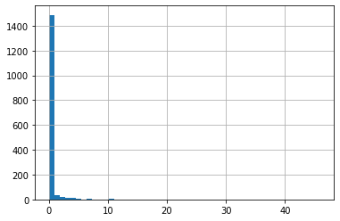
    


```python
df["y_A2_mod"].replace([np.inf,-np.inf],np.nan).dropna().hist(bins=50)
```


    <AxesSubplot:>


    
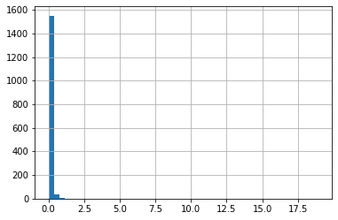
    


```python
df["y_A2_mod_2"].hist(bins=50)
```


    <AxesSubplot:>


    
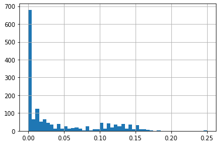
    


## Model A3

Wniosek: Cena biletów na  RW

Predykcja: __Procentowy zmiana ceny biletów na RW__


```python
# y = średnia cena biletów z RW / średnia cena biletów z RP
df["y_A3"] = df["E_srednia_cena_biletow_z_rynku_w"] / df["ticket_price_mean"]
df.sample(3)
```


<div>
<style scoped>
    .dataframe tbody tr th:only-of-type {
        vertical-align: middle;
    }

    .dataframe tbody tr th {
        vertical-align: top;
    }

    .dataframe thead th {
        text-align: right;
    }
</style>
<table border="1" class="dataframe">
  <thead>
    <tr style="text-align: right;">
      <th></th>
      <th>events_id</th>
      <th>Kamien_Milowy_Profil_Wydarzenia</th>
      <th>A1_categories_name</th>
      <th>A2_freq_label</th>
      <th>A3_Nazwa miejscowości</th>
      <th>A3_Rodzaj</th>
      <th>A3_Gmina</th>
      <th>A3_Powiat</th>
      <th>A3_Województwo</th>
      <th>A3_wielkosc_miejscowosci</th>
      <th>A4_event_czas_transmisji</th>
      <th>A5_size_label</th>
      <th>A6_planned_amount</th>
      <th>A6_obtained_amount</th>
      <th>B1_dorosly</th>
      <th>B1_dziecko-mlodziez</th>
      <th>B2_event_local</th>
      <th>B2_event_global</th>
      <th>B2_czas_trwania</th>
      <th>B2_kategoria_Inny</th>
      <th>B2_kategoria_Wystawa</th>
      <th>B2_kategoria_Spektakl_teatralny</th>
      <th>B2_kategoria_Koncert</th>
      <th>B2_kategoria_Festiwal</th>
      <th>B2_kategoria_Konferencja</th>
      <th>B2_kategoria_Sport</th>
      <th>B2_kategoria_Festiwal_muzyczny</th>
      <th>B2_kategoria_Targi_szkolenia</th>
      <th>B2_kategoria_Festiwal_filmowy</th>
      <th>B3_ave_hour_visit_events_mean_mean</th>
      <th>B3_ave_hour_visit_events_min_mean</th>
      <th>B3_ave_hour_visit_events_max_mean</th>
      <th>B4_czestotliwosc_odwiedzania_eventow</th>
      <th>B5_zasobnosc_portfela_klienta_max</th>
      <th>B5_zasobnosc_portfela_klienta_min</th>
      <th>B5_zasobnosc_portfela_klienta_sum</th>
      <th>B5_zasobnosc_portfela_klienta_mean</th>
      <th>C1_ticket_count_sum_event_users</th>
      <th>C1_ticket_count_OD_event_users</th>
      <th>C1_ticket_count_DO_event_users</th>
      <th>C2_global_ticket_count_sum_event_users</th>
      <th>C2_global_ticket_count_OD_event_users</th>
      <th>C2_global_ticket_count_DO_event_users</th>
      <th>C3_revenue_sum</th>
      <th>C3_revenue_min</th>
      <th>C3_revenue_max</th>
      <th>C3_revenue_mean</th>
      <th>C4_cena_rp_do_cena_rw</th>
      <th>C4_ilosc_rp_do_ilosc_rw</th>
      <th>D_ticket_price_sum</th>
      <th>D_ticket_count</th>
      <th>D_wielkosc_do_ilosci_uczestnikow</th>
      <th>D_wydarzenia_live_tylko_offline</th>
      <th>D_wydarzenia_live_tylko_online</th>
      <th>D_wydarzenia_live_online_i_offline</th>
      <th>D_wydarzenia_zruznicowane_w_udzialne_online_i_offline</th>
      <th>E_sum_cen_biletow_z_rynku_w</th>
      <th>E_srednia_cena_biletow_z_rynku_w</th>
      <th>E_liczba_biletow_z_rynku_w</th>
      <th>E_dostepne_sektory</th>
      <th>title</th>
      <th>user_id</th>
      <th>events_start_date</th>
      <th>city</th>
      <th>seat_available</th>
      <th>ticket_price_mean</th>
      <th>Date</th>
      <th>Time</th>
      <th>Day</th>
      <th>Week</th>
      <th>Month</th>
      <th>day_of_week</th>
      <th>Is_weekend</th>
      <th>Okazja</th>
      <th>Vacation</th>
      <th>seat_available_mean</th>
      <th>seat_available_max</th>
      <th>seat_available_mod</th>
      <th>D_ticket_count_mod</th>
      <th>seat_available_mod_2</th>
      <th>y_A1</th>
      <th>y_A1_mod</th>
      <th>y_A1_mod_2</th>
      <th>y_A2</th>
      <th>y_A2_mod</th>
      <th>y_A2_mod_2</th>
      <th>y_A3</th>
    </tr>
  </thead>
  <tbody>
    <tr>
      <th>438</th>
      <td>267183</td>
      <td>małe</td>
      <td>Koncert</td>
      <td>jednorazowe</td>
      <td>wolbrom</td>
      <td>miasto</td>
      <td>Wolbrom</td>
      <td>olkuski</td>
      <td>małopolskie</td>
      <td>Średnie</td>
      <td>krótkotrwały do 2-3h</td>
      <td>do 300</td>
      <td>8825.0</td>
      <td>8825.0</td>
      <td>1</td>
      <td>0</td>
      <td>NaN</td>
      <td>NaN</td>
      <td>NaN</td>
      <td>NaN</td>
      <td>NaN</td>
      <td>NaN</td>
      <td>NaN</td>
      <td>NaN</td>
      <td>NaN</td>
      <td>NaN</td>
      <td>NaN</td>
      <td>NaN</td>
      <td>NaN</td>
      <td>9.516667</td>
      <td>6.800000</td>
      <td>13.75</td>
      <td>36.0</td>
      <td>81.666667</td>
      <td>81.666667</td>
      <td>408.333333</td>
      <td>81.666667</td>
      <td>3011.0</td>
      <td>2.0</td>
      <td>364.0</td>
      <td>0.0</td>
      <td>0.0</td>
      <td>0.0</td>
      <td>185245.2</td>
      <td>0.0</td>
      <td>24115.5</td>
      <td>12349.680000</td>
      <td>0.905128</td>
      <td>6.964286</td>
      <td>8825.0</td>
      <td>195.0</td>
      <td>45.256410</td>
      <td>45.256410</td>
      <td>0</td>
      <td>0</td>
      <td>0</td>
      <td>1400.0</td>
      <td>50.0</td>
      <td>28.0</td>
      <td>event z jadną głowna salą</td>
      <td>KONCERT TRZY ZESPOŁY</td>
      <td>260</td>
      <td>2018-10-12 16:00:00+00:00</td>
      <td>Wolbrom</td>
      <td>195.0</td>
      <td>45.256410</td>
      <td>2018-10-12</td>
      <td>16</td>
      <td>12</td>
      <td>41</td>
      <td>10</td>
      <td>Friday</td>
      <td>BusinessDay</td>
      <td>NaN</td>
      <td>NaN</td>
      <td>105.785714</td>
      <td>388.0</td>
      <td>195.0</td>
      <td>195.0</td>
      <td>195.0</td>
      <td>1.00</td>
      <td>1.000000</td>
      <td>1.000000</td>
      <td>0.14359</td>
      <td>0.143590</td>
      <td>0.143590</td>
      <td>1.104816</td>
    </tr>
    <tr>
      <th>1066</th>
      <td>366639</td>
      <td>małe</td>
      <td>Festiwal muzyczny</td>
      <td>jednorazowe</td>
      <td>gdańsk</td>
      <td>miasto</td>
      <td>Gdańsk</td>
      <td>Gdańsk</td>
      <td>pomorskie</td>
      <td>Duże</td>
      <td>krótkotrwały do 2-3h</td>
      <td>do 100</td>
      <td>2429.0</td>
      <td>340.0</td>
      <td>1</td>
      <td>0</td>
      <td>NaN</td>
      <td>NaN</td>
      <td>NaN</td>
      <td>NaN</td>
      <td>NaN</td>
      <td>NaN</td>
      <td>NaN</td>
      <td>NaN</td>
      <td>NaN</td>
      <td>NaN</td>
      <td>NaN</td>
      <td>NaN</td>
      <td>NaN</td>
      <td>17.078947</td>
      <td>17.000000</td>
      <td>18.00</td>
      <td>14.0</td>
      <td>46.578947</td>
      <td>46.578947</td>
      <td>1304.210526</td>
      <td>46.578947</td>
      <td>NaN</td>
      <td>NaN</td>
      <td>NaN</td>
      <td>NaN</td>
      <td>NaN</td>
      <td>NaN</td>
      <td>340.0</td>
      <td>340.0</td>
      <td>340.0</td>
      <td>340.000000</td>
      <td>inf</td>
      <td>inf</td>
      <td>340.0</td>
      <td>14.0</td>
      <td>24.285714</td>
      <td>24.285714</td>
      <td>0</td>
      <td>0</td>
      <td>0</td>
      <td>0.0</td>
      <td>0.0</td>
      <td>0.0</td>
      <td>event bez numerowanych miejsc</td>
      <td>Förster-Krieger – mistrz i uczeń, spotkanie po...</td>
      <td>2281</td>
      <td>2019-07-19 18:00:00+00:00</td>
      <td>Gdańsk</td>
      <td>100.0</td>
      <td>24.285714</td>
      <td>2019-07-19</td>
      <td>18</td>
      <td>19</td>
      <td>29</td>
      <td>7</td>
      <td>Friday</td>
      <td>BusinessDay</td>
      <td>NaN</td>
      <td>ferie letnie</td>
      <td>100.000000</td>
      <td>100.0</td>
      <td>100.0</td>
      <td>14.0</td>
      <td>100.0</td>
      <td>0.14</td>
      <td>0.140000</td>
      <td>0.140000</td>
      <td>0.00000</td>
      <td>0.000000</td>
      <td>0.000000</td>
      <td>0.000000</td>
    </tr>
    <tr>
      <th>1312</th>
      <td>394091</td>
      <td>małe</td>
      <td>Spektakl teatralny</td>
      <td>jednorazowe</td>
      <td>mińsk mazowiecki</td>
      <td>miasto</td>
      <td>Mińsk Mazowiecki m</td>
      <td>miński</td>
      <td>mazowieckie</td>
      <td>Średnie</td>
      <td>krótkotrwały do 2-3h</td>
      <td>do 300</td>
      <td>248.0</td>
      <td>1240.0</td>
      <td>1</td>
      <td>0</td>
      <td>NaN</td>
      <td>NaN</td>
      <td>NaN</td>
      <td>NaN</td>
      <td>NaN</td>
      <td>NaN</td>
      <td>NaN</td>
      <td>NaN</td>
      <td>NaN</td>
      <td>NaN</td>
      <td>NaN</td>
      <td>NaN</td>
      <td>NaN</td>
      <td>17.992424</td>
      <td>17.666667</td>
      <td>18.00</td>
      <td>107.0</td>
      <td>45.181818</td>
      <td>45.181818</td>
      <td>3614.545455</td>
      <td>45.181818</td>
      <td>NaN</td>
      <td>NaN</td>
      <td>NaN</td>
      <td>NaN</td>
      <td>NaN</td>
      <td>NaN</td>
      <td>65885.0</td>
      <td>0.0</td>
      <td>6080.0</td>
      <td>890.337838</td>
      <td>0.992000</td>
      <td>9.615385</td>
      <td>1240.0</td>
      <td>125.0</td>
      <td>9.920000</td>
      <td>9.920000</td>
      <td>0</td>
      <td>0</td>
      <td>0</td>
      <td>130.0</td>
      <td>10.0</td>
      <td>13.0</td>
      <td>event z jadną głowna salą</td>
      <td>Drobnostki miłosne</td>
      <td>1491</td>
      <td>2019-12-29 16:00:00+00:00</td>
      <td>Mińsk Mazowiecki</td>
      <td>25.0</td>
      <td>9.920000</td>
      <td>2019-12-29</td>
      <td>16</td>
      <td>29</td>
      <td>52</td>
      <td>12</td>
      <td>Sunday</td>
      <td>Weekend</td>
      <td>NaN</td>
      <td>NaN</td>
      <td>51.324324</td>
      <td>139.0</td>
      <td>139.0</td>
      <td>125.0</td>
      <td>139.0</td>
      <td>5.00</td>
      <td>0.899281</td>
      <td>0.899281</td>
      <td>0.52000</td>
      <td>0.093525</td>
      <td>0.093525</td>
      <td>1.008065</td>
    </tr>
  </tbody>
</table>
</div>


!! warunek: 
usunąć wydarzenia z 0 dla E_srednia_cena_biletow_z_rynku_w . 


```python
(df.E_srednia_cena_biletow_z_rynku_w == 0).sum()
```


    688


```python
df["y_A3"].hist(bins=50)
```


    <AxesSubplot:>


    
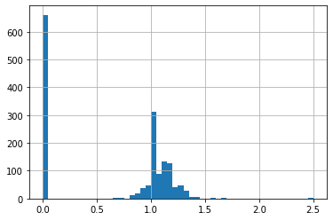
    


```python
df["y_A3"].hist()
```


    <AxesSubplot:>


    
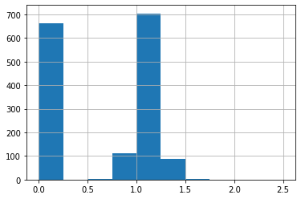
    


```python
df["y_A3"].value_counts(dropna=False)
```


    0.000000    661
    1.000000    215
    1.166667     40
    1.250000     32
    1.142857     31
               ... 
    1.094135      1
    1.311054      1
    1.080709      1
    1.290323      1
    1.210341      1
    Name: y_A3, Length: 457, dtype: int64


## Model B

### Wydarzenia optymalne

* Odsetek sprzedanych biletów w ofertowaniu pierwotnym wyniósł co najmniej 90%
* W obiegu wtórnym wolumen biletów oferowanych po cenach wyższych niż cena nominalna z okresu ofertowania pierwotnego, jest mniejszy niż 2% całości wolumenu w ofertowaniu pierwotnym


```python
# f1 = df.y_A1 > 0.9
# f2 = df.y_A2 < 0.02

def is_optimal(x):
    if (x.y_A1 > 0.9) & (x.y_A2 < 0.02):
        return True
    else:
        return False

df["y_B_Is_optimal"] = df[["y_A1","y_A2"]].apply(lambda x: is_optimal(x),axis=1)
df[:3]
```


<div>
<style scoped>
    .dataframe tbody tr th:only-of-type {
        vertical-align: middle;
    }

    .dataframe tbody tr th {
        vertical-align: top;
    }

    .dataframe thead th {
        text-align: right;
    }
</style>
<table border="1" class="dataframe">
  <thead>
    <tr style="text-align: right;">
      <th></th>
      <th>events_id</th>
      <th>Kamien_Milowy_Profil_Wydarzenia</th>
      <th>A1_categories_name</th>
      <th>A2_freq_label</th>
      <th>A3_Nazwa miejscowości</th>
      <th>A3_Rodzaj</th>
      <th>A3_Gmina</th>
      <th>A3_Powiat</th>
      <th>A3_Województwo</th>
      <th>A3_wielkosc_miejscowosci</th>
      <th>A4_event_czas_transmisji</th>
      <th>A5_size_label</th>
      <th>A6_planned_amount</th>
      <th>A6_obtained_amount</th>
      <th>B1_dorosly</th>
      <th>B1_dziecko-mlodziez</th>
      <th>B2_event_local</th>
      <th>B2_event_global</th>
      <th>B2_czas_trwania</th>
      <th>B2_kategoria_Inny</th>
      <th>B2_kategoria_Wystawa</th>
      <th>B2_kategoria_Spektakl_teatralny</th>
      <th>B2_kategoria_Koncert</th>
      <th>B2_kategoria_Festiwal</th>
      <th>B2_kategoria_Konferencja</th>
      <th>B2_kategoria_Sport</th>
      <th>B2_kategoria_Festiwal_muzyczny</th>
      <th>B2_kategoria_Targi_szkolenia</th>
      <th>B2_kategoria_Festiwal_filmowy</th>
      <th>B3_ave_hour_visit_events_mean_mean</th>
      <th>B3_ave_hour_visit_events_min_mean</th>
      <th>B3_ave_hour_visit_events_max_mean</th>
      <th>B4_czestotliwosc_odwiedzania_eventow</th>
      <th>B5_zasobnosc_portfela_klienta_max</th>
      <th>B5_zasobnosc_portfela_klienta_min</th>
      <th>B5_zasobnosc_portfela_klienta_sum</th>
      <th>B5_zasobnosc_portfela_klienta_mean</th>
      <th>C1_ticket_count_sum_event_users</th>
      <th>C1_ticket_count_OD_event_users</th>
      <th>C1_ticket_count_DO_event_users</th>
      <th>C2_global_ticket_count_sum_event_users</th>
      <th>C2_global_ticket_count_OD_event_users</th>
      <th>C2_global_ticket_count_DO_event_users</th>
      <th>C3_revenue_sum</th>
      <th>C3_revenue_min</th>
      <th>C3_revenue_max</th>
      <th>C3_revenue_mean</th>
      <th>C4_cena_rp_do_cena_rw</th>
      <th>C4_ilosc_rp_do_ilosc_rw</th>
      <th>D_ticket_price_sum</th>
      <th>D_ticket_count</th>
      <th>D_wielkosc_do_ilosci_uczestnikow</th>
      <th>D_wydarzenia_live_tylko_offline</th>
      <th>D_wydarzenia_live_tylko_online</th>
      <th>D_wydarzenia_live_online_i_offline</th>
      <th>D_wydarzenia_zruznicowane_w_udzialne_online_i_offline</th>
      <th>E_sum_cen_biletow_z_rynku_w</th>
      <th>E_srednia_cena_biletow_z_rynku_w</th>
      <th>E_liczba_biletow_z_rynku_w</th>
      <th>E_dostepne_sektory</th>
      <th>title</th>
      <th>user_id</th>
      <th>events_start_date</th>
      <th>city</th>
      <th>seat_available</th>
      <th>ticket_price_mean</th>
      <th>Date</th>
      <th>Time</th>
      <th>Day</th>
      <th>Week</th>
      <th>Month</th>
      <th>day_of_week</th>
      <th>Is_weekend</th>
      <th>Okazja</th>
      <th>Vacation</th>
      <th>seat_available_mean</th>
      <th>seat_available_max</th>
      <th>seat_available_mod</th>
      <th>D_ticket_count_mod</th>
      <th>seat_available_mod_2</th>
      <th>y_A1</th>
      <th>y_A1_mod</th>
      <th>y_A1_mod_2</th>
      <th>y_A2</th>
      <th>y_A2_mod</th>
      <th>y_A2_mod_2</th>
      <th>y_A3</th>
      <th>y_B_Is_optimal</th>
    </tr>
  </thead>
  <tbody>
    <tr>
      <th>0</th>
      <td>248895</td>
      <td>małe</td>
      <td>Wystawa</td>
      <td>jednorazowe</td>
      <td>wrocław</td>
      <td>miasto</td>
      <td>Wrocław</td>
      <td>Wrocław</td>
      <td>dolnośląskie</td>
      <td>Duże</td>
      <td>krótkotrwały do 2-3h</td>
      <td>do 100</td>
      <td>3571.0</td>
      <td>250.0</td>
      <td>0</td>
      <td>1</td>
      <td>NaN</td>
      <td>NaN</td>
      <td>NaN</td>
      <td>NaN</td>
      <td>NaN</td>
      <td>NaN</td>
      <td>NaN</td>
      <td>NaN</td>
      <td>NaN</td>
      <td>NaN</td>
      <td>NaN</td>
      <td>NaN</td>
      <td>NaN</td>
      <td>NaN</td>
      <td>NaN</td>
      <td>NaN</td>
      <td>NaN</td>
      <td>NaN</td>
      <td>NaN</td>
      <td>NaN</td>
      <td>NaN</td>
      <td>7623.0</td>
      <td>1.0</td>
      <td>98.0</td>
      <td>0.0</td>
      <td>0.0</td>
      <td>0.0</td>
      <td>267458.0</td>
      <td>30.0</td>
      <td>3612.0</td>
      <td>632.288416</td>
      <td>inf</td>
      <td>inf</td>
      <td>250.0</td>
      <td>7.0</td>
      <td>35.714286</td>
      <td>35.714286</td>
      <td>0</td>
      <td>0</td>
      <td>0</td>
      <td>0.0</td>
      <td>0.0</td>
      <td>0.0</td>
      <td>event bez numerowanych miejsc</td>
      <td>Wystawa Dali Warhol</td>
      <td>2111</td>
      <td>2018-06-10 09:00:00+00:00</td>
      <td>Wrocław</td>
      <td>100.0</td>
      <td>35.714286</td>
      <td>2018-06-10</td>
      <td>9</td>
      <td>10</td>
      <td>23</td>
      <td>6</td>
      <td>Sunday</td>
      <td>Weekend</td>
      <td>NaN</td>
      <td>NaN</td>
      <td>100.0</td>
      <td>100.0</td>
      <td>100.0</td>
      <td>7.0</td>
      <td>100.0</td>
      <td>0.07</td>
      <td>0.07</td>
      <td>0.07</td>
      <td>0.0</td>
      <td>0.0</td>
      <td>0.0</td>
      <td>0.0</td>
      <td>False</td>
    </tr>
    <tr>
      <th>1</th>
      <td>248896</td>
      <td>małe</td>
      <td>Wystawa</td>
      <td>jednorazowe</td>
      <td>wrocław</td>
      <td>miasto</td>
      <td>Wrocław</td>
      <td>Wrocław</td>
      <td>dolnośląskie</td>
      <td>Duże</td>
      <td>krótkotrwały do 2-3h</td>
      <td>do 100</td>
      <td>2964.0</td>
      <td>978.0</td>
      <td>0</td>
      <td>1</td>
      <td>NaN</td>
      <td>NaN</td>
      <td>NaN</td>
      <td>NaN</td>
      <td>NaN</td>
      <td>NaN</td>
      <td>NaN</td>
      <td>NaN</td>
      <td>NaN</td>
      <td>NaN</td>
      <td>NaN</td>
      <td>NaN</td>
      <td>NaN</td>
      <td>14.0</td>
      <td>14.0</td>
      <td>14.0</td>
      <td>NaN</td>
      <td>216.0</td>
      <td>216.0</td>
      <td>2592.0</td>
      <td>216.0</td>
      <td>7623.0</td>
      <td>1.0</td>
      <td>98.0</td>
      <td>0.0</td>
      <td>0.0</td>
      <td>0.0</td>
      <td>267458.0</td>
      <td>30.0</td>
      <td>3612.0</td>
      <td>632.288416</td>
      <td>inf</td>
      <td>inf</td>
      <td>978.0</td>
      <td>33.0</td>
      <td>29.636364</td>
      <td>29.636364</td>
      <td>0</td>
      <td>0</td>
      <td>0</td>
      <td>0.0</td>
      <td>0.0</td>
      <td>0.0</td>
      <td>event bez numerowanych miejsc</td>
      <td>Wystawa Dali Warhol</td>
      <td>2111</td>
      <td>2018-06-10 10:00:00+00:00</td>
      <td>Wrocław</td>
      <td>100.0</td>
      <td>29.636364</td>
      <td>2018-06-10</td>
      <td>10</td>
      <td>10</td>
      <td>23</td>
      <td>6</td>
      <td>Sunday</td>
      <td>Weekend</td>
      <td>NaN</td>
      <td>NaN</td>
      <td>100.0</td>
      <td>100.0</td>
      <td>100.0</td>
      <td>33.0</td>
      <td>100.0</td>
      <td>0.33</td>
      <td>0.33</td>
      <td>0.33</td>
      <td>0.0</td>
      <td>0.0</td>
      <td>0.0</td>
      <td>0.0</td>
      <td>False</td>
    </tr>
    <tr>
      <th>2</th>
      <td>248897</td>
      <td>małe</td>
      <td>Wystawa</td>
      <td>cykliczne co 6mc</td>
      <td>wrocław</td>
      <td>miasto</td>
      <td>Wrocław</td>
      <td>Wrocław</td>
      <td>dolnośląskie</td>
      <td>Duże</td>
      <td>krótkotrwały do 2-3h</td>
      <td>do 100</td>
      <td>4000.0</td>
      <td>480.0</td>
      <td>0</td>
      <td>1</td>
      <td>NaN</td>
      <td>NaN</td>
      <td>NaN</td>
      <td>NaN</td>
      <td>NaN</td>
      <td>NaN</td>
      <td>NaN</td>
      <td>NaN</td>
      <td>NaN</td>
      <td>NaN</td>
      <td>NaN</td>
      <td>NaN</td>
      <td>NaN</td>
      <td>NaN</td>
      <td>NaN</td>
      <td>NaN</td>
      <td>NaN</td>
      <td>NaN</td>
      <td>NaN</td>
      <td>NaN</td>
      <td>NaN</td>
      <td>7623.0</td>
      <td>1.0</td>
      <td>98.0</td>
      <td>0.0</td>
      <td>0.0</td>
      <td>0.0</td>
      <td>267458.0</td>
      <td>30.0</td>
      <td>3612.0</td>
      <td>632.288416</td>
      <td>inf</td>
      <td>inf</td>
      <td>480.0</td>
      <td>12.0</td>
      <td>40.000000</td>
      <td>40.000000</td>
      <td>0</td>
      <td>0</td>
      <td>0</td>
      <td>0.0</td>
      <td>0.0</td>
      <td>0.0</td>
      <td>event bez numerowanych miejsc</td>
      <td>Wystawa Dali Warhol</td>
      <td>2111</td>
      <td>2018-06-10 11:00:00+00:00</td>
      <td>Wrocław</td>
      <td>100.0</td>
      <td>40.000000</td>
      <td>2018-06-10</td>
      <td>11</td>
      <td>10</td>
      <td>23</td>
      <td>6</td>
      <td>Sunday</td>
      <td>Weekend</td>
      <td>NaN</td>
      <td>NaN</td>
      <td>100.0</td>
      <td>100.0</td>
      <td>100.0</td>
      <td>12.0</td>
      <td>100.0</td>
      <td>0.12</td>
      <td>0.12</td>
      <td>0.12</td>
      <td>0.0</td>
      <td>0.0</td>
      <td>0.0</td>
      <td>0.0</td>
      <td>False</td>
    </tr>
  </tbody>
</table>
</div>


```python
df[df.y_B_Is_optimal == True]
```


<div>
<style scoped>
    .dataframe tbody tr th:only-of-type {
        vertical-align: middle;
    }

    .dataframe tbody tr th {
        vertical-align: top;
    }

    .dataframe thead th {
        text-align: right;
    }
</style>
<table border="1" class="dataframe">
  <thead>
    <tr style="text-align: right;">
      <th></th>
      <th>events_id</th>
      <th>Kamien_Milowy_Profil_Wydarzenia</th>
      <th>A1_categories_name</th>
      <th>A2_freq_label</th>
      <th>A3_Nazwa miejscowości</th>
      <th>A3_Rodzaj</th>
      <th>A3_Gmina</th>
      <th>A3_Powiat</th>
      <th>A3_Województwo</th>
      <th>A3_wielkosc_miejscowosci</th>
      <th>A4_event_czas_transmisji</th>
      <th>A5_size_label</th>
      <th>A6_planned_amount</th>
      <th>A6_obtained_amount</th>
      <th>B1_dorosly</th>
      <th>B1_dziecko-mlodziez</th>
      <th>B2_event_local</th>
      <th>B2_event_global</th>
      <th>B2_czas_trwania</th>
      <th>B2_kategoria_Inny</th>
      <th>B2_kategoria_Wystawa</th>
      <th>B2_kategoria_Spektakl_teatralny</th>
      <th>B2_kategoria_Koncert</th>
      <th>B2_kategoria_Festiwal</th>
      <th>B2_kategoria_Konferencja</th>
      <th>B2_kategoria_Sport</th>
      <th>B2_kategoria_Festiwal_muzyczny</th>
      <th>B2_kategoria_Targi_szkolenia</th>
      <th>B2_kategoria_Festiwal_filmowy</th>
      <th>B3_ave_hour_visit_events_mean_mean</th>
      <th>B3_ave_hour_visit_events_min_mean</th>
      <th>B3_ave_hour_visit_events_max_mean</th>
      <th>B4_czestotliwosc_odwiedzania_eventow</th>
      <th>B5_zasobnosc_portfela_klienta_max</th>
      <th>B5_zasobnosc_portfela_klienta_min</th>
      <th>B5_zasobnosc_portfela_klienta_sum</th>
      <th>B5_zasobnosc_portfela_klienta_mean</th>
      <th>C1_ticket_count_sum_event_users</th>
      <th>C1_ticket_count_OD_event_users</th>
      <th>C1_ticket_count_DO_event_users</th>
      <th>C2_global_ticket_count_sum_event_users</th>
      <th>C2_global_ticket_count_OD_event_users</th>
      <th>C2_global_ticket_count_DO_event_users</th>
      <th>C3_revenue_sum</th>
      <th>C3_revenue_min</th>
      <th>C3_revenue_max</th>
      <th>C3_revenue_mean</th>
      <th>C4_cena_rp_do_cena_rw</th>
      <th>C4_ilosc_rp_do_ilosc_rw</th>
      <th>D_ticket_price_sum</th>
      <th>D_ticket_count</th>
      <th>D_wielkosc_do_ilosci_uczestnikow</th>
      <th>D_wydarzenia_live_tylko_offline</th>
      <th>D_wydarzenia_live_tylko_online</th>
      <th>D_wydarzenia_live_online_i_offline</th>
      <th>D_wydarzenia_zruznicowane_w_udzialne_online_i_offline</th>
      <th>E_sum_cen_biletow_z_rynku_w</th>
      <th>E_srednia_cena_biletow_z_rynku_w</th>
      <th>E_liczba_biletow_z_rynku_w</th>
      <th>E_dostepne_sektory</th>
      <th>title</th>
      <th>user_id</th>
      <th>events_start_date</th>
      <th>city</th>
      <th>seat_available</th>
      <th>ticket_price_mean</th>
      <th>Date</th>
      <th>Time</th>
      <th>Day</th>
      <th>Week</th>
      <th>Month</th>
      <th>day_of_week</th>
      <th>Is_weekend</th>
      <th>Okazja</th>
      <th>Vacation</th>
      <th>seat_available_mean</th>
      <th>seat_available_max</th>
      <th>seat_available_mod</th>
      <th>D_ticket_count_mod</th>
      <th>seat_available_mod_2</th>
      <th>y_A1</th>
      <th>y_A1_mod</th>
      <th>y_A1_mod_2</th>
      <th>y_A2</th>
      <th>y_A2_mod</th>
      <th>y_A2_mod_2</th>
      <th>y_A3</th>
      <th>y_B_Is_optimal</th>
    </tr>
  </thead>
  <tbody>
  </tbody>
</table>
</div>


```python
f1 = df.y_A1 > 0.9
f2 = df.y_A2 < 0.02
print(df[f1 & f2].shape)
df[f1 & f2]
```

    (0, 88)
    


<div>
<style scoped>
    .dataframe tbody tr th:only-of-type {
        vertical-align: middle;
    }

    .dataframe tbody tr th {
        vertical-align: top;
    }

    .dataframe thead th {
        text-align: right;
    }
</style>
<table border="1" class="dataframe">
  <thead>
    <tr style="text-align: right;">
      <th></th>
      <th>events_id</th>
      <th>Kamien_Milowy_Profil_Wydarzenia</th>
      <th>A1_categories_name</th>
      <th>A2_freq_label</th>
      <th>A3_Nazwa miejscowości</th>
      <th>A3_Rodzaj</th>
      <th>A3_Gmina</th>
      <th>A3_Powiat</th>
      <th>A3_Województwo</th>
      <th>A3_wielkosc_miejscowosci</th>
      <th>A4_event_czas_transmisji</th>
      <th>A5_size_label</th>
      <th>A6_planned_amount</th>
      <th>A6_obtained_amount</th>
      <th>B1_dorosly</th>
      <th>B1_dziecko-mlodziez</th>
      <th>B2_event_local</th>
      <th>B2_event_global</th>
      <th>B2_czas_trwania</th>
      <th>B2_kategoria_Inny</th>
      <th>B2_kategoria_Wystawa</th>
      <th>B2_kategoria_Spektakl_teatralny</th>
      <th>B2_kategoria_Koncert</th>
      <th>B2_kategoria_Festiwal</th>
      <th>B2_kategoria_Konferencja</th>
      <th>B2_kategoria_Sport</th>
      <th>B2_kategoria_Festiwal_muzyczny</th>
      <th>B2_kategoria_Targi_szkolenia</th>
      <th>B2_kategoria_Festiwal_filmowy</th>
      <th>B3_ave_hour_visit_events_mean_mean</th>
      <th>B3_ave_hour_visit_events_min_mean</th>
      <th>B3_ave_hour_visit_events_max_mean</th>
      <th>B4_czestotliwosc_odwiedzania_eventow</th>
      <th>B5_zasobnosc_portfela_klienta_max</th>
      <th>B5_zasobnosc_portfela_klienta_min</th>
      <th>B5_zasobnosc_portfela_klienta_sum</th>
      <th>B5_zasobnosc_portfela_klienta_mean</th>
      <th>C1_ticket_count_sum_event_users</th>
      <th>C1_ticket_count_OD_event_users</th>
      <th>C1_ticket_count_DO_event_users</th>
      <th>C2_global_ticket_count_sum_event_users</th>
      <th>C2_global_ticket_count_OD_event_users</th>
      <th>C2_global_ticket_count_DO_event_users</th>
      <th>C3_revenue_sum</th>
      <th>C3_revenue_min</th>
      <th>C3_revenue_max</th>
      <th>C3_revenue_mean</th>
      <th>C4_cena_rp_do_cena_rw</th>
      <th>C4_ilosc_rp_do_ilosc_rw</th>
      <th>D_ticket_price_sum</th>
      <th>D_ticket_count</th>
      <th>D_wielkosc_do_ilosci_uczestnikow</th>
      <th>D_wydarzenia_live_tylko_offline</th>
      <th>D_wydarzenia_live_tylko_online</th>
      <th>D_wydarzenia_live_online_i_offline</th>
      <th>D_wydarzenia_zruznicowane_w_udzialne_online_i_offline</th>
      <th>E_sum_cen_biletow_z_rynku_w</th>
      <th>E_srednia_cena_biletow_z_rynku_w</th>
      <th>E_liczba_biletow_z_rynku_w</th>
      <th>E_dostepne_sektory</th>
      <th>title</th>
      <th>user_id</th>
      <th>events_start_date</th>
      <th>city</th>
      <th>seat_available</th>
      <th>ticket_price_mean</th>
      <th>Date</th>
      <th>Time</th>
      <th>Day</th>
      <th>Week</th>
      <th>Month</th>
      <th>day_of_week</th>
      <th>Is_weekend</th>
      <th>Okazja</th>
      <th>Vacation</th>
      <th>seat_available_mean</th>
      <th>seat_available_max</th>
      <th>seat_available_mod</th>
      <th>D_ticket_count_mod</th>
      <th>seat_available_mod_2</th>
      <th>y_A1</th>
      <th>y_A1_mod</th>
      <th>y_A1_mod_2</th>
      <th>y_A2</th>
      <th>y_A2_mod</th>
      <th>y_A2_mod_2</th>
      <th>y_A3</th>
      <th>y_B_Is_optimal</th>
    </tr>
  </thead>
  <tbody>
  </tbody>
</table>
</div>


###  Wydarzenia optymalne MOD


```python
f1 = df.y_A1_mod > 0.9
f2 = df.y_A2_mod < 0.02
print(df[f1 & f2].shape)
df[f1 & f2]
```

    (0, 88)
    


<div>
<style scoped>
    .dataframe tbody tr th:only-of-type {
        vertical-align: middle;
    }

    .dataframe tbody tr th {
        vertical-align: top;
    }

    .dataframe thead th {
        text-align: right;
    }
</style>
<table border="1" class="dataframe">
  <thead>
    <tr style="text-align: right;">
      <th></th>
      <th>events_id</th>
      <th>Kamien_Milowy_Profil_Wydarzenia</th>
      <th>A1_categories_name</th>
      <th>A2_freq_label</th>
      <th>A3_Nazwa miejscowości</th>
      <th>A3_Rodzaj</th>
      <th>A3_Gmina</th>
      <th>A3_Powiat</th>
      <th>A3_Województwo</th>
      <th>A3_wielkosc_miejscowosci</th>
      <th>A4_event_czas_transmisji</th>
      <th>A5_size_label</th>
      <th>A6_planned_amount</th>
      <th>A6_obtained_amount</th>
      <th>B1_dorosly</th>
      <th>B1_dziecko-mlodziez</th>
      <th>B2_event_local</th>
      <th>B2_event_global</th>
      <th>B2_czas_trwania</th>
      <th>B2_kategoria_Inny</th>
      <th>B2_kategoria_Wystawa</th>
      <th>B2_kategoria_Spektakl_teatralny</th>
      <th>B2_kategoria_Koncert</th>
      <th>B2_kategoria_Festiwal</th>
      <th>B2_kategoria_Konferencja</th>
      <th>B2_kategoria_Sport</th>
      <th>B2_kategoria_Festiwal_muzyczny</th>
      <th>B2_kategoria_Targi_szkolenia</th>
      <th>B2_kategoria_Festiwal_filmowy</th>
      <th>B3_ave_hour_visit_events_mean_mean</th>
      <th>B3_ave_hour_visit_events_min_mean</th>
      <th>B3_ave_hour_visit_events_max_mean</th>
      <th>B4_czestotliwosc_odwiedzania_eventow</th>
      <th>B5_zasobnosc_portfela_klienta_max</th>
      <th>B5_zasobnosc_portfela_klienta_min</th>
      <th>B5_zasobnosc_portfela_klienta_sum</th>
      <th>B5_zasobnosc_portfela_klienta_mean</th>
      <th>C1_ticket_count_sum_event_users</th>
      <th>C1_ticket_count_OD_event_users</th>
      <th>C1_ticket_count_DO_event_users</th>
      <th>C2_global_ticket_count_sum_event_users</th>
      <th>C2_global_ticket_count_OD_event_users</th>
      <th>C2_global_ticket_count_DO_event_users</th>
      <th>C3_revenue_sum</th>
      <th>C3_revenue_min</th>
      <th>C3_revenue_max</th>
      <th>C3_revenue_mean</th>
      <th>C4_cena_rp_do_cena_rw</th>
      <th>C4_ilosc_rp_do_ilosc_rw</th>
      <th>D_ticket_price_sum</th>
      <th>D_ticket_count</th>
      <th>D_wielkosc_do_ilosci_uczestnikow</th>
      <th>D_wydarzenia_live_tylko_offline</th>
      <th>D_wydarzenia_live_tylko_online</th>
      <th>D_wydarzenia_live_online_i_offline</th>
      <th>D_wydarzenia_zruznicowane_w_udzialne_online_i_offline</th>
      <th>E_sum_cen_biletow_z_rynku_w</th>
      <th>E_srednia_cena_biletow_z_rynku_w</th>
      <th>E_liczba_biletow_z_rynku_w</th>
      <th>E_dostepne_sektory</th>
      <th>title</th>
      <th>user_id</th>
      <th>events_start_date</th>
      <th>city</th>
      <th>seat_available</th>
      <th>ticket_price_mean</th>
      <th>Date</th>
      <th>Time</th>
      <th>Day</th>
      <th>Week</th>
      <th>Month</th>
      <th>day_of_week</th>
      <th>Is_weekend</th>
      <th>Okazja</th>
      <th>Vacation</th>
      <th>seat_available_mean</th>
      <th>seat_available_max</th>
      <th>seat_available_mod</th>
      <th>D_ticket_count_mod</th>
      <th>seat_available_mod_2</th>
      <th>y_A1</th>
      <th>y_A1_mod</th>
      <th>y_A1_mod_2</th>
      <th>y_A2</th>
      <th>y_A2_mod</th>
      <th>y_A2_mod_2</th>
      <th>y_A3</th>
      <th>y_B_Is_optimal</th>
    </tr>
  </thead>
  <tbody>
  </tbody>
</table>
</div>


```python

```

# do naprawy

przed obliczeniem y trzeba je naprawic 

Skrót:
* chyba musisz znalezc  tabele zawierająca id user i seat_available
* pogrupuj wyniki i daj max ( dzieki czemu mam srednia maxa organizatora
* połacz z obacna tabela i wez info o mean i max
* zastosowanie filtra ?!?
* utworzenie seat_available_mod
* utwrozenie D_ticket_count_mod
* kolejna seat_available_mod ale inaczej liczona ?!?


Warunek 1:

aggregat wszystkich eventów wg id usera -> MEAN , MAX,  dla  seat_available (max jako rezerwa bo mean może być do zakłamany, jeżeli mean będzie 

join z eventami (nowa cecha mean i max) średnia dla danego organizatora

to co w warunke 2 
df["seat_available_mod"] = df.apply(lambda x: max(x[(nowa cecha MAX )],x["seat_available"]) if x["seat_available"] < 30 lub 50 else x["seat_available"] ,axis=1) 

spradz rozklad, czy wzrostła ilość eventów z prowadzonymi danymi


WARUNEK 2
jeżeli RP jest mniejszy RW to zamień TWORZE nowy RP_MOD i jego wartośc = RW
df["D_ticket_count_mod"] = df.apply(lambda x: max(x["D_ticket_count"],x["E_liczba_biletow_z_rynku_w"]) ,axis=1)


Warunek 3:

liczba biletów sprzedancych nie może być wieksza niż liczba dostępnych biletów

Jeżeli zostało sprzedanych wiecej to włąsnie tyle było dostępnych biletów (czyli 100% wydrzedaż)
df["seat_available_mod"] = df.apply(lambda x: max(x["D_ticket_count_mod"],x["seat_available"]) ,axis=1)

MODEL A1:

df["y_A1_mod"] = df["D_ticket_count_mod"] / df["seat_available_mod"]


MODEL A2:

df["y_A2_mod"] = df["E_liczba_biletow_z_rynku_w"] / df["seat_available_mod"]

MODEL B :

powiniene działać 

sprawdzić rozkłądy


```python

```

# Zapisanie nowych cech do pliku


```python
df.to_pickle("df_new_features.pkl")
```


```python

```


```python

```
